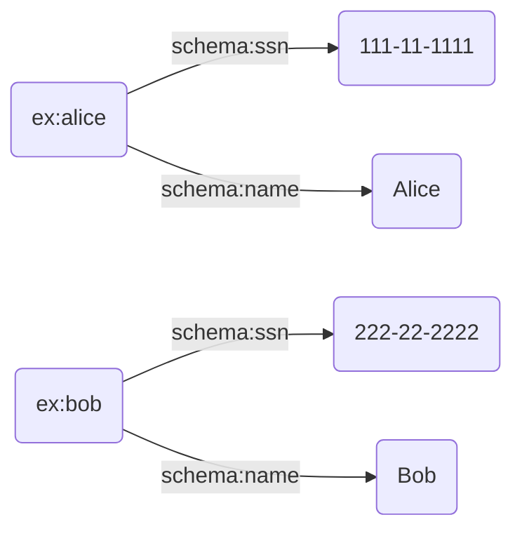
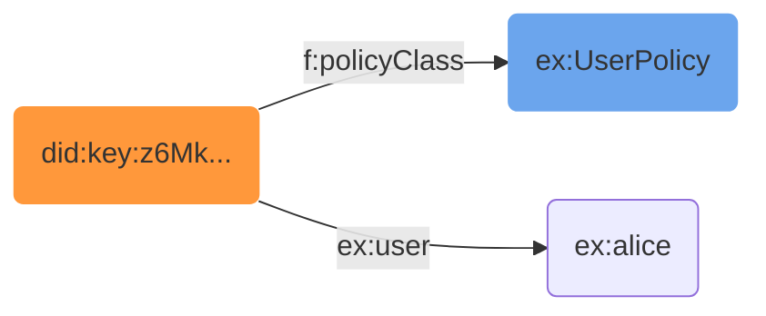
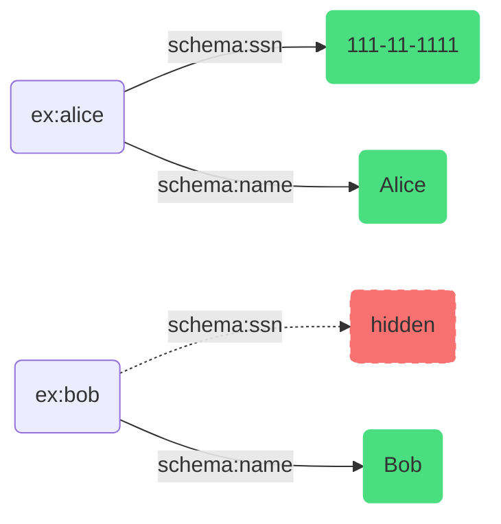
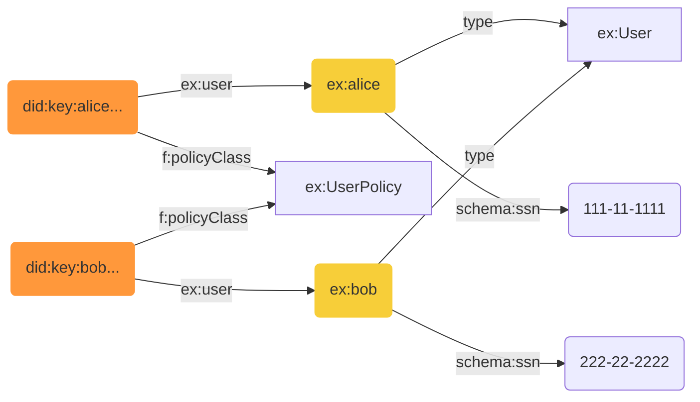

import Admonition from '@theme/Admonition';

# Data Access Control

Fluree's _data access control_ (DAC) system governs what data can be transacted
and queried by users. It gives you very fine-grained control, down to policies
like "admins can modify all values except other users' social security numbers"
and "root users can modify all values, including social security number."

Let's walk through an example to see how this works.

### Step 1: The Data

Imagine your database contains user records with sensitive information like
social security numbers:



### Step 2: Identity Linkage

Alice authenticates with a DID (Decentralized Identifier). In the database, her
DID is linked to a policy class and to her user record:



The policy class `ex:UserPolicy` contains rules that determine what Alice can
access.

### Step 3: Policy-Filtered View

With a policy that says "users can only see their own SSN," here's what Alice
sees when she queries for all users:



Alice can see all names, but Bob's SSN is filtered out (_**in the diagram above, it appears to be present but redacted--in reality, it would appear as if no data even existed for Bob on the `ssn` property**_). She can only see her own
SSN because the policy checks for a relationship between her identity and the
data.

## Why Policy as Data Matters

Fluree's access control model is fundamentally different from traditional
systems. In Fluree, **policies are data** — they live alongside your domain data
as RDF, subject to the same query and transact operations. This architectural
choice enables two powerful capabilities:

### Data-Centric Security

Traditional security models rely on application perimeters: APIs, firewalls, and
middleware that sit between users and data. If that perimeter is breached, the
data is exposed. The data itself has no defenses.

In Fluree, **the data defends itself**. Access policies are evaluated at the
data layer, not the application layer. There is no perimeter to breach that
would afford ungoverned access to the database.

This has profound implications for how data can be shared and reused:

- Data can move "closer" to applications that produce and consume it
- Data can be safely shared across an open ecosystem of applications
- You don't rely on app-centric APIs and application perimeters to enforce
  security
- Multiple applications can interact with the same data, each governed by the
  same embedded policies

### Real-Time, Context-Aware Enforcement

Because policies can query the current state of the data, the conditions you can
express become extraordinarily powerful. **Anything your data can express as a
condition can be part of how you govern access.**

Consider a policy that says "managers can see the SSN of anyone who reports to
them":

```json
{
  "f:query": {
    "@type": "@json",
    "@value": {
      "where": {
        "@id": "?$this",
        "ex:reportsTo": { "@id": "?$identity" }
      }
    }
  }
}
```

This policy doesn't check a static role or permission table — it queries the
live `ex:reportsTo` relationship in your data. If Bob reported to Alice five
seconds ago, Alice could see Bob's SSN. If a transaction just changed Bob's
reporting line to Carol, Alice _instantly_ loses access to Bob's SSN, and Carol
gains it.

This means:

- **Relationships drive access**: Org charts, team memberships, project
  assignments — any relationship in your data can govern access
- **Aggregates and conditions**: Policies can check counts, dates, statuses, or
  any queryable condition
- **Instant consistency**: Access changes the moment the underlying data
  changes, with no cache invalidation or sync delays

---

This guide will show you how to make full use of the data access control system.
By the end of this guide, you will understand:

- How _data access policies_ specify the scope of operations that a user can
  perform
- The elements that compose a data access policy
- How to create and modify policies
- How identities are linked to policies through _policy classes_

## Data Access Control Overview

_Data access control_ is a general term for the methods data management systems
use to determine the allowed scope of a user's read and write operations.
Different systems combine different tools and entities to define access. For
example, with a file system you specify what user and group a file belongs to,
along with read/write permissions at the user, group, and world levels.

With Fluree, you define _data access policies_ (or just _policies_) that specify
rules for what data can be transacted and what data can be returned by queries.
These policies are evaluated based on the _Request Identity_ — the authenticated
user making the query or transaction.

### Key Concepts

Fluree's DAC system is built around these core concepts:

- **Access Policies**: RDF objects that define what actions can be performed on
  what data
- **Policy Classes**: A way to group related policies together (e.g.,
  `ex:EmployeePolicy`, `ex:AdminPolicy`)
- **Request Identity**: The DID (Decentralized Identifier) of the user making a
  request
- **Policy Queries**: Conditional logic that determines if access is granted
  based on relationships in the data

### How Policies Work

Policies are "just data" — they're RDF objects that you transact into your
ledger like any other data. Fluree's DAC processor recognizes policies by their
`f:AccessPolicy` type and uses them to filter query results and authorize
transactions.

Here's a simple example of a policy that allows viewing all data:

```json
{
  "@context": {
    "f": "https://ns.flur.ee/ledger#",
    "ex": "http://example.org/ns/"
  },
  "@id": "ex:openViewPolicy",
  "@type": ["f:AccessPolicy", "ex:OpenPolicy"],
  "f:action": { "@id": "f:view" },
  "f:allow": true
}
```

This policy:

- Has type `f:AccessPolicy` (required for all policies)
- Belongs to the `ex:OpenPolicy` policy class
- Applies to the `f:view` action (reading data)
- Uses `f:allow: true` to unconditionally allow access

## How to Specify Request Identity

The DAC processor uses the Request Identity to determine which policies apply
and how to evaluate them. There are several ways to specify identity:

### Using `opts.did`

The simplest way to specify identity is by including a `did` in the `opts` of
your query or transaction:

```json
{
  "@context": { "ex": "http://example.org/ns/" },
  "from": "my-ledger",
  "select": { "?s": ["*"] },
  "where": { "@id": "?s", "@type": "ex:User" },
  "opts": {
    "did": "did:key:z6MkmbNqfM3ANYZnzDp9YDfa62pHggKosBkCyVdgQtgEKkGQ"
  }
}
```

When you specify a DID, Fluree looks up that identity in the database to find
its associated policy classes (via `f:policyClass`), then applies all policies
belonging to those classes.

### Using `opts.policyClass`

You can directly specify which policy class(es) to apply without requiring a DID
lookup:

```json
{
  "@context": { "ex": "http://example.org/ns/" },
  "from": "my-ledger",
  "select": { "?s": ["*"] },
  "where": { "@id": "?s", "@type": "ex:User" },
  "opts": {
    "policyClass": "ex:EmployeePolicy"
  }
}
```

This applies all policies that have `ex:EmployeePolicy` in their `@type`, without
looking up any identity in the database.

When using `opts.policyClass`, you'll often need to provide `policyValues` to
bind the `?$identity` variable for policies that check identity relationships:

```json
{
  "@context": { "ex": "http://example.org/ns/" },
  "from": "my-ledger",
  "select": { "?s": ["*"] },
  "where": { "@id": "?s", "@type": "ex:User" },
  "opts": {
    "policyClass": "ex:EmployeePolicy",
    "policyValues": ["?$identity", [{ "@type": "@id", "@value": "ex:alice" }]]
  }
}
```

**When to use `opts.policyClass`:**

This approach is ideal when users don't sign their own queries/transactions, or
when users don't have direct identities with associated policy classes stored in
the ledger. In this architecture, an external application or service determines
the correct policy class for a given user based on some external identity
attribution (e.g., your existing auth system, SSO provider, or API gateway).
The service then proxies the query or transaction on the user's behalf with the
appropriate `opts.policyClass`.

This pattern gives you the power of data-centric access control without
requiring you to replicate or manage user identities within the dataset itself.

### Using `opts.policy`

You can also inject policy definitions directly into a request, bypassing any
policy lookup entirely:

```json
{
  "@context": { "ex": "http://example.org/ns/" },
  "from": "my-ledger",
  "select": { "?s": ["*"] },
  "where": { "@id": "?s", "@type": "ex:User" },
  "opts": {
    "policy": {
      "@id": "ex:injectedPolicy",
      "@type": "f:AccessPolicy",
      "f:action": { "@id": "f:view" },
      "f:onProperty": [{ "@id": "schema:ssn" }],
      "f:required": true,
      "f:query": {
        "@type": "@json",
        "@value": {
          "where": { "@id": "?$identity", "ex:user": { "@id": "?$this" } }
        }
      }
    },
    "policyValues": ["?$identity", [{ "@type": "@id", "@value": "ex:alice" }]]
  }
}
```

**When to use `opts.policy`:**

This approach is useful when policies themselves live in an external ledger or
dataset, designed for reuse across multiple ledgers. Like `opts.policyClass`,
this pattern supports architectures where an external service proxies requests
on behalf of users. However, in this case, the policies can't be referenced by
their policy class names within the target ledger (because the policies don't
exist there). Instead, the proxying service fetches the appropriate policies
from wherever they're stored and injects them directly into each request.

This enables centralized policy management across a fleet of ledgers while still
getting data-centric access control at query time.

### Signed Requests

For production systems, you'll typically use cryptographically signed requests
rather than plain `opts.did`. Fluree supports:

- **JWS (JSON Web Signature)**: Compact signed format for requests
- **Verifiable Credentials**: W3C standard for signed credential documents

<Admonition type='note'>
  A comprehensive guide to signed requests and credential verification is
  forthcoming. For now, see the server integration tests for examples of signed
  request patterns.
</Admonition>

### Linking Identities to Policy Classes

For the DAC processor to know which policies apply to an identity, you must
create a relationship between the DID and one or more policy classes using
`f:policyClass`:

```json
{
  "@context": {
    "f": "https://ns.flur.ee/ledger#",
    "ex": "http://example.org/ns/"
  },
  "@id": "did:key:z6MkmbNqfM3ANYZnzDp9YDfa62pHggKosBkCyVdgQtgEKkGQ",
  "f:policyClass": [{ "@id": "ex:EmployeePolicy" }],
  "ex:user": { "@id": "ex:alice" }
}
```

This transaction:

1. Links the DID to the `ex:EmployeePolicy` policy class
2. Creates an `ex:user` relationship to the `ex:alice` user record

When this identity makes a request, all policies with `@type` including
`ex:EmployeePolicy` will be applied.

### Interactions without Identity

When run in its default mode (we often refer to this as _Open Mode_ or _Dev Mode_), Fluree will accept queries or transactions that do not specify any Request Identity (e.g. the request is neither signed by a certain identity nor does it include an `opts.did` reference identity). Those unidentified requests will function effectively with root access--deliberately, to facilitate ease of development and testing.

In production environments, however, it is strongly recommended to either, (1) **configure the server to operate in _Closed Mode_** (wherein any unsigned requests are rejected outright), or (2) **ensure that the Fluree server is behind a conventional application perimeter**, within which you might have an identity service which aligns your external identities to policy classes or DIDs within your Fluree ledger.

<Admonition type='note'>
  For more information on Open vs Closed modes and configuring a server for
  Closed Mode, see the Server Configuration guide (coming soon).
</Admonition>

## How to Write a Data Access Policy

Every data access policy must include:

- **Basic metadata**: `@id` and `@type` (must include `f:AccessPolicy`)
- **Action**: `f:action` specifying `f:view` and/or `f:modify`
- **Permission logic**: Either `f:allow` (boolean) or `f:query` (conditional)

Policies can optionally include:

- **Targeting**: `f:onClass` or `f:onProperty` to restrict scope
- **Error messages**: `f:exMessage` for custom denial messages
- **Required flag**: `f:required` to short-circuit policy evaluation and elevate the policy's importance

### Basic Metadata

Every policy must have an `@id` and include `f:AccessPolicy` in its `@type`:

```json
{
  "@context": {
    "f": "https://ns.flur.ee/ledger#",
    "ex": "http://example.org/ns/"
  },
  "@id": "ex:myPolicy",
  "@type": ["f:AccessPolicy", "ex:MyPolicyClass"]
}
```

The `@type` array should include:

- `f:AccessPolicy` (required — this is how Fluree identifies policies)
- One or more policy class IRIs (e.g., `ex:MyPolicyClass`) to group related
  policies

### Actions

The `f:action` property specifies what operations this policy governs:

- `f:view` — Reading/querying data
- `f:modify` — Creating, updating, or deleting data

You can specify one or both:

```json
{
  "f:action": { "@id": "f:view" }
}
```

```json
{
  "f:action": [{ "@id": "f:view" }, { "@id": "f:modify" }]
}
```

<Admonition type='info'>
  When a policy is enforced (i.e. the evaluation does not pass and applies a
  restriction), if the action is a _**query**_, then the targeted data will be
  filtered out of the result set. If the action is a _**transaction**_, then the
  transaction will be rejected with a policy-related error message.
</Admonition>

### Permission Logic

There are two ways to define whether access is granted:

#### `f:allow` (Boolean)

Use `f:allow` for unconditional allow or deny. This takes precedence over
`f:query`:

```json
{
  "@id": "ex:allowAllViews",
  "@type": ["f:AccessPolicy", "ex:OpenPolicy"],
  "f:action": { "@id": "f:view" },
  "f:allow": true
}
```

```json
{
  "@id": "ex:denyAllSSN",
  "@type": ["f:AccessPolicy", "ex:RestrictedPolicy"],
  "f:onProperty": { "@id": "schema:ssn" },
  "f:action": { "@id": "f:view" },
  "f:required": true,
  "f:allow": false
}
```

#### `f:query` (Conditional)

Use `f:query` for conditional access based on relationships in the data. The
query is a JSON-LD encoded query that returns true (access granted) or false
(access denied):

```json
{
  "@id": "ex:ownDataOnly",
  "@type": ["f:AccessPolicy", "ex:UserPolicy"],
  "f:action": [{ "@id": "f:view" }],
  "f:onProperty": [{ "@id": "schema:ssn" }],
  "f:query": {
    "@type": "@json",
    "@value": {
      "where": {
        "@id": "?$identity",
        "ex:user": { "@id": "?$this" }
      }
    }
  }
}
```

In the policy above, a user can view values on the `schema:ssn` only if the property exists on a subject related to the identity via the `ex:user` relationship. If Alice is querying, and we assume her identity record has `ex:user --> ex:alice`, then she can view the `schema:ssn` property on `ex:alice` but not on any other user.

<Admonition type='info'>
  It is important that the value of `f:query` be `"@type": "@json"`, as that
  specifies that the access policy query information is JSON data--namely, a
  query object--and not intended to represent a series of related children
  nodes.
</Admonition>

### Targeting

By default, a policy applies to all data. Use targeting properties to restrict
scope:

#### `f:onClass`

Restricts the policy to subjects of a specific class:

```json
{
  "@id": "ex:payrollRestriction",
  "@type": ["f:AccessPolicy", "ex:RestrictedPolicy"],
  "f:onClass": { "@id": "ex:PayrollEntry" },
  "f:action": { "@id": "f:view" },
  "f:allow": false,
  "f:required": true
}
```

This policy prevents any users of the `ex:RestrictedPolicy` policy group from viewing any subjects (or their triples) if those subjects are of type `ex:PayrollEntry`.

```json
{
  "@id": "ex:userRestriction",
  "@type": ["f:AccessPolicy", "ex:RestrictedPolicy"],
  "f:onClass": { "@id": "ex:User" },
  "f:action": { "@id": "f:view" },
  "f:required": true,
  "f:query": {
    "@type": "@json",
    "@value": {
      "where": { "@id": "?$this", "ex:verified": true }
    }
  }
}
```

This policy only allows viewing `ex:User` subjects (or their triples) if those subjects have `ex:verified: true`.

#### `f:onProperty`

Restricts the policy to specific properties:

```json
{
  "@id": "ex:ssnRestriction",
  "@type": ["f:AccessPolicy", "ex:EmployeePolicy"],
  "f:onProperty": [{ "@id": "schema:ssn" }],
  "f:action": [{ "@id": "f:view" }],
  "f:required": true,
  "f:query": {
    "@type": "@json",
    "@value": {
      "where": {
        "@id": "?$identity",
        "ex:user": { "@id": "?$this" }
      }
    }
  }
}
```

This policy restricts access to `schema:ssn` — only allowing access when the
identity's `ex:user` relationship points to the subject being accessed.

<Admonition type='tip'>
  `f:onProperty` can also accept a query to dynamically determine which
  properties are restricted. See the advanced examples section.
</Admonition>

### The `f:required` Flag

When `f:required` is `true`, this policy MUST pass, even if other policies apply to the identity or to the target data and even if those policies pass as `true`.

```json
{
  "@id": "ex:ssnRestriction",
  "@type": ["f:AccessPolicy", "ex:EmployeePolicy"],
  "f:onProperty": [{ "@id": "schema:ssn" }],
  "f:action": { "@id": "f:view" },
  "f:required": true,
  "f:query": { ... }
}
```

You can think of this as a kind of _**OR**_ vs _**AND**_ logic: _without **`f:required: true`**, multiple policies may apply to a particular request, and even to the same data being accessed. In those scenarios, if even a single policy evaluates to `true` (i.e., allows access), then access is granted_.

However, when `f:required: true` is set on a policy, that policy MUST evaluate to `true` in order for access to be granted, regardless of the results of any other applicable policies.

If we imagine 3 policies applying to an attempt to query for Alice's SSN:

1. Can see all data
2. Can see all data of User class
3. Can see own SSN only

If the 3rd policy (`Can see own SSN only`) does NOT have `f:required: true`, then Alice would be able to see Bob's SSN, because one of the two other policies would allow access. You can think of this as

```
!!(Policy 1) || !!(Policy 2) || !!(Policy 3)
```

If instead we have the following (which we'd likely want for sensitive data like SSNs):

1. Can see all data
2. Can see all data of User class
3. Can see own SSN only, **with `f:required: true`**

Then Alice would NOT be able to see Bob's SSN, because the 3rd policy MUST pass for access to be granted. You can think of this as

```
(!!(Policy 1) || !!(Policy 2)) && !!(Policy 3)
```

which, in turn, can really be simplified to just the following, since the 3rd policy is the gatekeeper--it either passes, and the other `OR` policies need not be evaluated, or it fails, and access is denied outright:

```
!!(Policy 3)
```

### Custom Error Messages

Use `f:exMessage` to provide a user-friendly error message when a policy denies
access. `f:exMessage` error messages will only appear in error responses. Since queries simply silently filter out inaccessible data, `f:exMessage` is only relevant when used for `f:modify` (i.e. _**transactional**_) actions.

```json
{
  "@id": "ex:wishlistCreatePolicy",
  "@type": ["f:AccessPolicy", "ex:WishlistPolicy"],
  "f:action": { "@id": "f:modify" },
  "f:required": true,
  "f:exMessage": "User can only create a wishlist linked to their own identity.",
  "f:onProperty": [{ "@id": "ex:wishlist" }],
  "f:query": {
    "@type": "@json",
    "@value": {
      "where": [["filter", "(= ?$this ?$identity)"]]
    }
  }
}
```

## Special Variables in Policy Queries

Policy queries can use special variables that Fluree binds automatically:

### `?$identity`

The DID of the authenticated user making the request. Use this to check
relationships between the user and the data:

```json
{
  "where": {
    "@id": "?$identity",
    "ex:user": { "@id": "?$this" }
  }
}
```

This checks: "Does the identity of the querying/transacting user have an `ex:user` relationship to the subject
being accessed?"

### `?$this`

The current subject being evaluated for access. In property-level
policies, this is the subject that owns the property. You can also use it in
filter expressions:

```json
{
  "where": [["filter", "(= ?$this ?$identity)"]]
}
```

This checks: "Is the subject being accessed the same as the identity?"

### `?$target`

Used with `f:targetSubject` for advanced subject-targeting queries (used to
identify which subjects a policy applies to).

## Policy Examples

### Root/Admin Policy

A policy that grants full access to all data:

```json
{
  "@context": {
    "f": "https://ns.flur.ee/ledger#",
    "ex": "http://example.org/ns/"
  },
  "@id": "ex:rootPolicy",
  "@type": ["f:AccessPolicy", "ex:AdminPolicy"],
  "f:action": [{ "@id": "f:view" }, { "@id": "f:modify" }],
  "f:allow": true
}
```

### Own-Data-Only Policy

Users can only view and modify their own records:

```json
[
  {
    "@id": "ex:ownDataRestriction",
    "@type": ["f:AccessPolicy", "ex:UserPolicy"],
    "f:onClass": { "@id": "ex:User" },
    "f:action": [{ "@id": "f:view" }, { "@id": "f:modify" }],
    "f:required": true,
    "f:query": {
      "@type": "@json",
      "@value": {
        "where": {
          "@id": "?$identity",
          "ex:user": { "@id": "?$this" }
        }
      }
    }
  },
  {
    "@id": "ex:defaultAllowView",
    "@type": ["f:AccessPolicy", "ex:UserPolicy"],
    "f:action": { "@id": "f:view" },
    "f:query": { "@type": "@json", "@value": {} }
  }
]
```

### Property Restriction (SSN Example)

Users can view all user data, but can only see their own SSN:

```json
[
  {
    "@id": "ex:ssnRestriction",
    "@type": ["f:AccessPolicy", "ex:EmployeePolicy"],
    "f:onProperty": [{ "@id": "schema:ssn" }],
    "f:action": [{ "@id": "f:view" }, { "@id": "f:modify" }],
    "f:required": true,
    "f:query": {
      "@type": "@json",
      "@value": {
        "@context": { "ex": "http://example.org/ns/" },
        "where": {
          "@id": "?$identity",
          "ex:user": { "@id": "?$this" }
        }
      }
    }
  },
  {
    "@id": "ex:defaultAllowView",
    "@type": ["f:AccessPolicy", "ex:EmployeePolicy"],
    "f:action": { "@id": "f:view" },
    "f:query": { "@type": "@json", "@value": {} }
  }
]
```

### Class-Based Restriction

Hide all data of a certain class (e.g., internal users hidden from external portal):

```json
[
  {
    "@id": "ex:denyInternalUsers",
    "@type": ["f:AccessPolicy", "ex:ExternalPortalPolicy"],
    "f:onClass": { "@id": "ex:InternalUser" },
    "f:action": { "@id": "f:view" },
    "f:required": true,
    "f:allow": false
  },
  {
    "@id": "ex:defaultAllow",
    "@type": ["f:AccessPolicy", "ex:ExternalPortalPolicy"],
    "f:action": { "@id": "f:view" },
    "f:allow": true
  }
]
```

## Relationship-Based Access Control (RelBAC)

Here at Fluree HQ we say that Fluree provides _relationship-based access
control_. Policy queries can stipulate the relationships that must hold between
the Request Identity and target nodes.

This means that two users with the same policies can have different,
user-specific access permissions to the same data. Consider this scenario:



Both `did:key:alice...` and `did:key:bob...` have the `ex:UserPolicy` policy
class. With the SSN restriction policy from earlier, each user can only see
their own SSN:

- Alice can see `111-11-1111` but not `222-22-2222`
- Bob can see `222-22-2222` but not `111-11-1111`

The policy query `{"@id": "?$identity", "ex:user": {"@id": "?$this"}}` creates
this relationship-based restriction by checking if the authenticated identity
has an `ex:user` relationship to the subject whose SSN is being accessed.

## Advanced Topics

### Policy Metadata Tracking

You can get detailed information about policy execution by adding
`"meta": true` to your request opts:

```json
{
  "@context": { "ex": "http://example.org/ns/" },
  "from": "my-ledger",
  "select": { "?s": ["*"] },
  "where": { "@id": "?s", "@type": "ex:User" },
  "opts": {
    "did": "did:key:z6Mk...",
    "meta": true
  }
}
```

The response will include policy execution statistics:

```json
{
  "result": [...],
  "policy": {
    "http://example.org/ns/ssnRestriction": { "executed": 2, "allowed": 1 },
    "http://example.org/ns/defaultAllowView": { "executed": 5, "allowed": 5 }
  },
  "fuel": 8
}
```

This shows:

- **executed**: How many times the policy was evaluated
- **allowed**: How many times the policy granted access
- **fuel**: Total computational cost of policy evaluation

### Dynamic Property Restriction

`f:onProperty` can accept a query to dynamically determine which properties are
restricted. This is useful when you want to mark certain properties as
"sensitive" via metadata:

```json
{
  "@id": "ex:sensitivePropertyPolicy",
  "@type": ["f:AccessPolicy", "ex:SensitivePolicy"],
  "f:action": { "@id": "f:view" },
  "f:required": true,
  "f:onProperty": {
    "@type": "@json",
    "@value": {
      "@context": { "ex": "http://example.org/ns/" },
      "where": { "@id": "?$this", "ex:isSensitive": true }
    }
  },
  "f:allow": false
}
```

With this policy, any property marked with `ex:isSensitive: true` will be
hidden:

```json
{ "@id": "schema:ssn", "ex:isSensitive": true }
{ "@id": "schema:email", "ex:isSensitive": true }
```

### Combining Multiple Policies

Policies are evaluated in combination. The general pattern is:

1. Use `f:required: true` with restrictive policies for sensitive data
2. Use a "default allow" policy with an empty query for general access

```json
[
  {
    "@id": "ex:restrictive",
    "@type": ["f:AccessPolicy", "ex:MyPolicy"],
    "f:onProperty": [{ "@id": "schema:ssn" }],
    "f:action": { "@id": "f:view" },
    "f:required": true,
    "f:query": { "..." }
  },
  {
    "@id": "ex:defaultAllow",
    "@type": ["f:AccessPolicy", "ex:MyPolicy"],
    "f:action": { "@id": "f:view" },
    "f:query": { "@type": "@json", "@value": {} }
  }
]
```

### Per-Ledger Policy Classes

When querying across multiple ledgers, you can specify different policy classes
for each ledger:

```json
{
  "@context": { "ex": "https://example.com/" },
  "from": ["ledger/personnel", "ledger/products"],
  "select": ["?s", "?name"],
  "where": { "@id": "?s", "ex:name": "?name" }
}
```

With per-ledger policy configuration in the API call:

```clojure
{
  "ledger/personnel" {:policy-class ["https://example.com/AuthenticatedPolicy"]}
  "ledger/products"  {:policy-class ["https://example.com/PublicPolicy"]}
}
```
