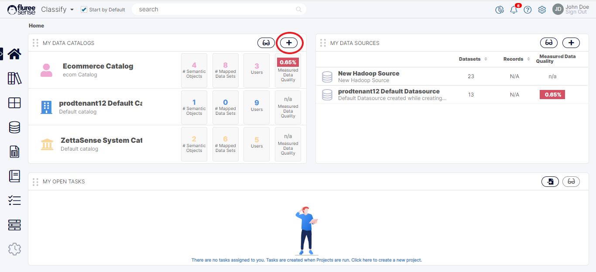
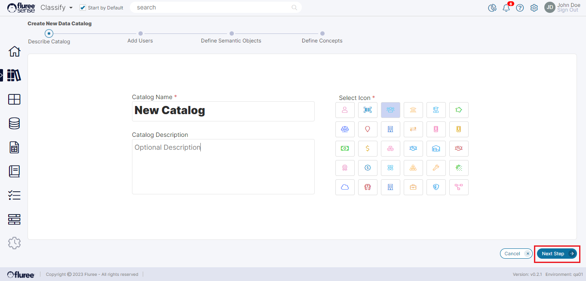
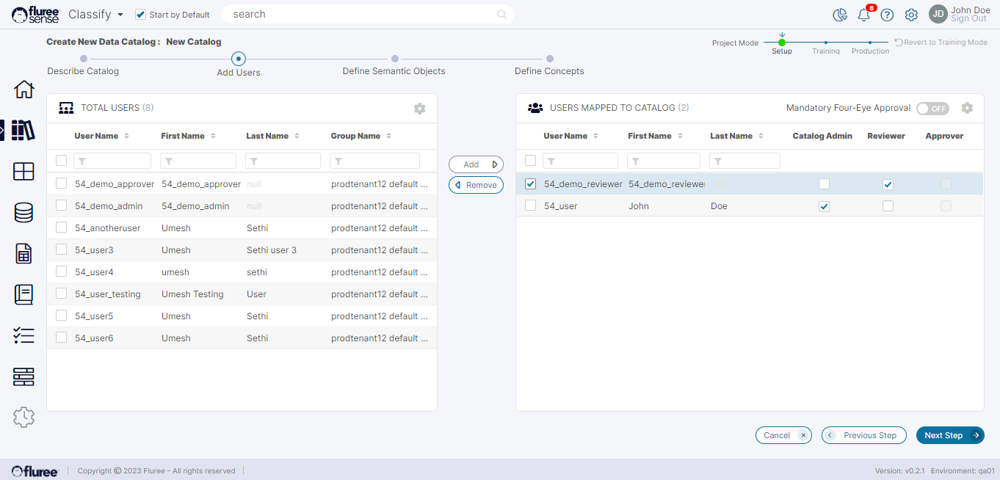
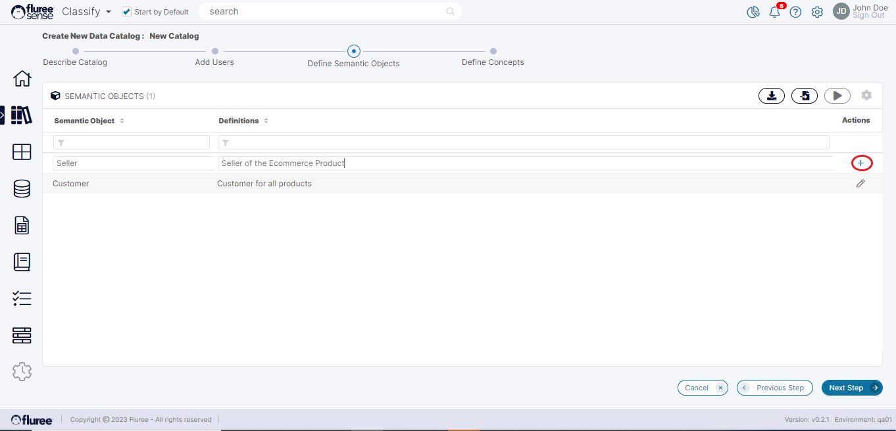
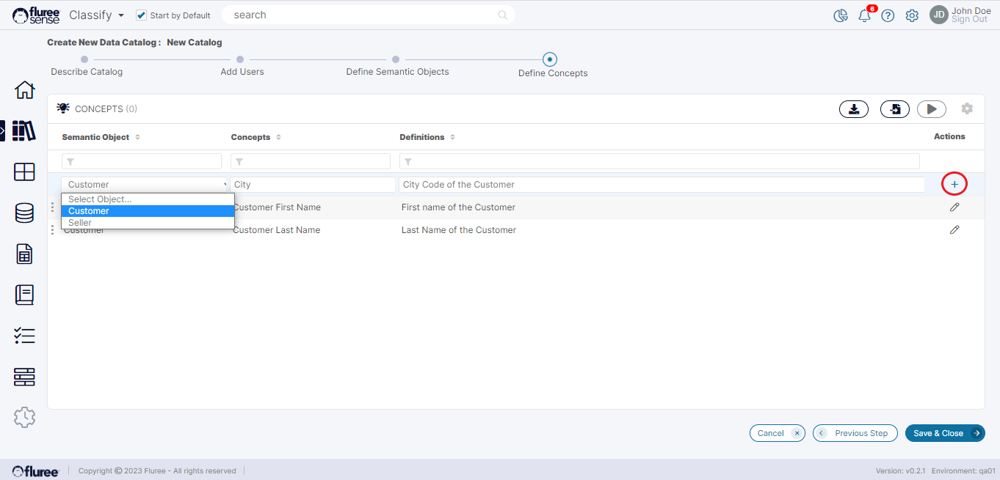
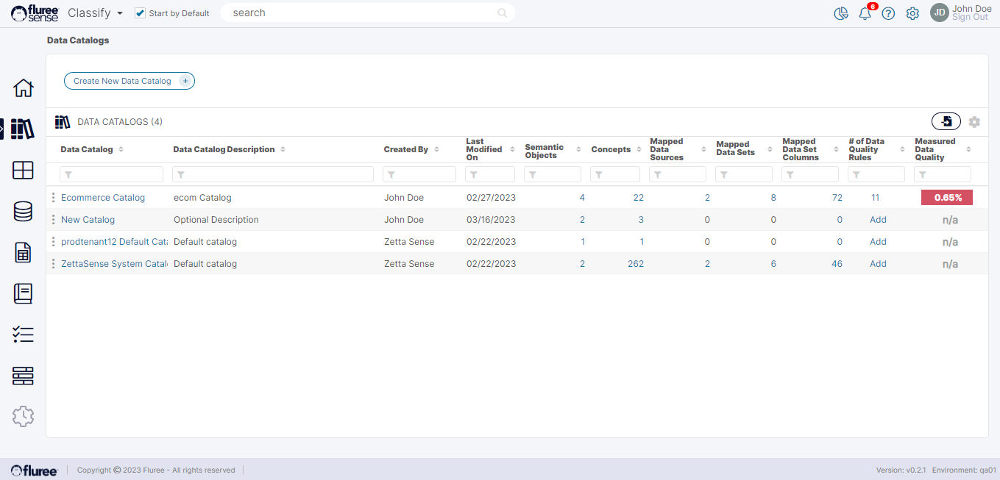

A user can create a new _Catalog_ from the _My Data Catalog_ section that appears on the _Classify_ home screen, as shown below. They can also create a new _Catalog_ from the _Catalog List_ screen accessed from the left nav menu by clicking the “Create New Data Catalog” button.  
  
As we will see later, a more practical way for creating larger _Catalogs_ is to import the _Catalog_ details such as the _Semantic Objects_ and concepts.

Once you perform either of these actions, you’re redirected to the Describe Catalog screen from where the workflow for Catalog creation begins.

**Step 1 - Describe Catalog:**  
Enter the name of the _Catalog_ and select an icon that best describes the _Catalog_ that you are trying to create. You can optionally add a description so that someone who is added to the _Catalog_ understands the scope of this data dictionary (for example, which lines of business use this _Catalog_).

Once a unique name is entered and an icon is selected, then the Next Step button gets enabled, and you can continue.

**System Validations**

1. _Catalog_ Name and Icon are required for the Next Step button to be enabled.

3. If you enter the name of a _Catalog_ that already exists, the system will prompt you to enter a new unique name to continue.

**Step 2 - Define User Role(s) for the Catalog:**  
Fluree Sense recognizes the need for fine-grained user roles for _Catalog_ management. The following roles are available in this screen:

1. _Catalog_ Admin

3. _Catalog_ Reviewer

5. _Catalog_ Approver

The significance of these _Catalog_ roles and Entitlements has already been explained in the earlier [section](/docs/sense/Classify%20Module/Catalogs/Catalog%20Object%20Entitlements/index.md)

**System Validations**

1. If the Four-eyes Check is OFF, the System requires at least 1 reviewer and 1 admin to enable the Next Step. There can of course be more admins and reviewers.

3. If the Four-eyes Check is ON, the system requires at least 1 reviewer, 1 admin and 1 approver to enable the Next Step. There can of course be more users with any of these roles.

**Step 3 - Define Semantic Object(s) for the Catalog:**  
Enter the names of the Semantic Objects and an optional definition for each. These Objects will act as an entity or subject area for your _Catalog_. You add each object by typing in the names and then by clicking on the “Plus” button on the right side.

After you are done creating the objects, the user can click the Next Step button at the bottom of the page.

**Step 4 - Defining Concepts for each Semantic Object:**  
In this screen you will define concepts that correspond to a specific _Semantic Object_ created in Step 3. This screen is very similar to the previous screen, however the user will be able to choose which object the concept is specifically for. These concepts can be considered as the specific attributes for each of the corresponding objects that have previously been created for this catalog. For example suppose there is a _Semantic Object_ titled Customer. This object can have attributes such as Customer First Name, Customer Last Name, Customer Id, Age, Gender etc.

There is a dropdown window containing every object that was previously defined. You can select the object that you want to work on using the dropdown menu. The user can now enter a _Concept_ name and an optional definition and then click the ‘Plus’ button to add that _Concept_ to that object.  
  
In this case above, 2 concepts are already there and a 3rd “City” is in process of being added.  
  
After the user is done, they can click save and close on the bottom right of the screen.

Once the _Catalog_ is completed The user will be able to see it on the list of catalogs in the _Catalog_ homepage, as shown above.
