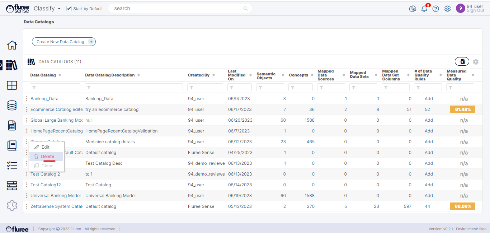

You can Delete a _Catalog_ that you are the _Catalog Admin_ of through the ellipsis menu in the _Catalog_ List appearing for each _Catalog_. Clicking on _Delete Catalog_ will immediately soft-delete the _Catalog_ with a green top-hat notification. Any _Concepts_ and _Semantic Objects_ inside it will also get soft-deleted.

The _Catalog_ will disappear from the screen and not be available for _Classification_ or other related Jobs. The concepts of the _Catalog_, if mapped to any Data Set will also disappear by the next _Classification_ run.  
  
You can also delete specific concepts if incorrectly created by the same ellipsis side menu against them.

