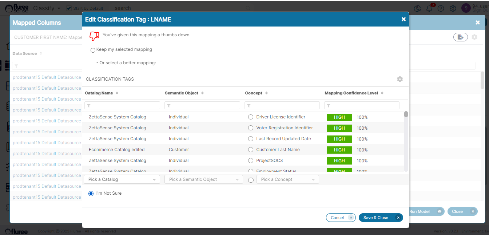
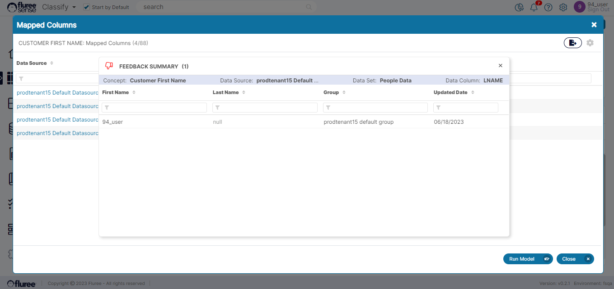

Now that we have seen what ad-hoc mappings look like in the earlier section, let's check out how we can give feedback to these mappings. The process of feedback is almost the same at both the _Semantic Object_ and _Concept_ level. The only difference is that the feedback at _Semantic Object_ is being given to Data Set mappings whereas at Concept Level is being given to Data Set column mappings.  
  
By giving feedback, the user is essentially confirming whether the said Data Set is an accurate representation of that Object, or the said column is an accurate representation of the _Concept_ \- based on the data it contains. This is quite similar to how we gave feedback in the case of Data Sets by Data Set Classification, here we’re just doing it from the point of view of the business data dictionary i.e., the _Catalog_ which contains the _Semantic Objects_ and _Concepts_.  
  
As an example, we can just take the case of a concept following through from the last section where we had discovered concept mappings to the _Concept_: ‘Customer First Name,’ as in the screen below.

<figure>

<figcaption>

Screen: Ad-hoc Mappings at Concept Level

</figcaption>

</figure>

As can be seen, we have some fairly accurate mappings, but the LNAME is known by the user to be out of place and incorrect. In this case, the user can click on the red downvote and downvote it. As in the case of feedback during _Data Set Classification_, the user will have multiple options when the pop-up opens upon clicking the downvote icon:

1. Change their mind and keep the existing mapping.

2. Downvote the current and suggest an alternative (which is counted as an up-vote)

3. Just downvote the current when they are not sure of an alternative.

**Multi-User Feedback**

Let us also understand the counts we see next to the percentage figure. These counts, as in the case of Data Set attributes or Data Set classification mappings, indicate the no. of users who manually upvoted or agreed with the given mapping. The **score** which is the confidence of the mapping is calculated as the: Latest Unique Upvotes / Latest Total Votes OR the system-generated score when no feedback is given yet.  
  
Getting back to the downvoting aspect, the screen below shows how a user can downvote an ad-hoc mapping.

The net impact of this specific downvote which corresponds to option 3 mentioned above (i.e., no alternative is chosen) will be to take the score down to zero for this specific prediction, mark the downvote by coloring it and increment the down-vote count for the mapping by 1.

The user can also see the history of all those (including themselves) who voted for the specific mapping by clicking the counts next to the votes. In the screen below, the user has clicked on the counter next to the downvote icon against ‘LNAME,’ which has been downvoted in the screen above.

Finally, you may also notice the ‘Run Model’ button in the footer of the screen: ‘Ad-hoc Mappings at _Concept_ Level.’ Once the user has given the requisite feedback, pressing Run Model will run the _Tenant_ Classification to incorporate any pending feedback in the system and re-predict the complete mappings across the system.

It is at this stage that the downvoted mappings will fall off- both from _Concepts_ and _Semantic Objects_.
