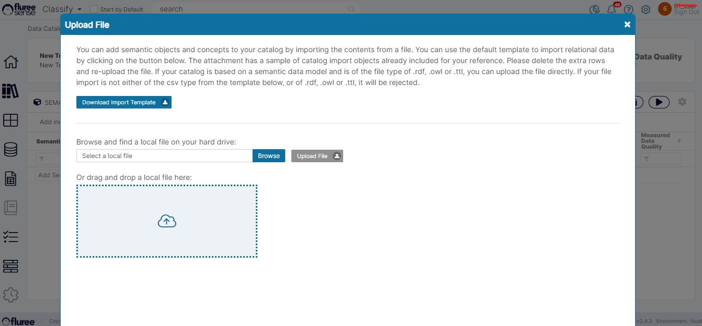
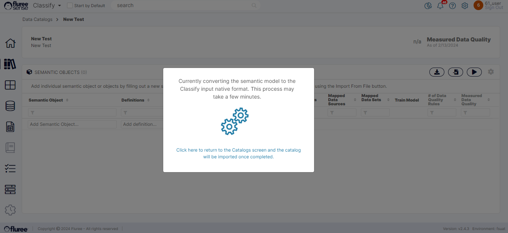

Fluree Sense is continuously adding features to allow Data Teams to bring in Data in a variety of formats to solve complex problems requiring Machine Learning & AI. In this endeavor , we've added the ability to import Semantic graph format files to create a Data Catalog.

These adds on to the previous functionality where a Data Catalog could be imported as a CSV file. Let us look at the steps below on how to use the feature:

**Step 1**: Open the Import pop-up which has been modified to provide this feature

The Import popup can be opened from the Semantic Object list screen as well as from the Concept list screen by clicking the ‘Import File’ icon. These screens are available through Edit as well as the 'Create' flow for Catalogs. The Import pop-up has been modified to allow the user to upload a valid Semantic Graph format Catalog - without any need of download the csv Template. The user can now choose from a) CSV (and use the template as explained [here](/docs/sense/Classify%20Module/Catalogs/Importing%20Catalog%20Structure/index.md) ) or b) RDF, c) TTL and d) OWL format directly uploading the schema file. Note the changes reflected in the instruction text.

**Step 2**: Upload the Semantic Graph format schema file from your local directory.

On adding the file, pressing "Upload File" and closing the pop-up , a new pop-up as seen above will be shown. This indicates an ad-hoc job is running. Please note that while the processing of the file may take a few seconds, contacting and waking up the cluster may take time so the whole process could take up-to 5 to 10 minutes.

**Step 3**: Wait for the process to complete (Have a cup of coffee :) )

As explained above, the processing takes a little time. However you are not blocked and can click on the link to return to the Catalog list screen or move around in the application doing other tasks. Till the time, the processing is in progress, the pop-up will remain in these screens.

**Step 4**: Review the uploaded list of Semantic Objects and Concepts

Once the processing is complete, IF the Catalog structure is valid , the file will get processed and the Semantic Object list will show all the Semantic objects processed whereas the Concept list will show all the concepts for that Semantic Object. So please review against the master file.

Note: In Semantic nomenclature: Semantic Objects are classes and the Concepts its properties, therefore after a successful upload, the imported classes and properties should display in the screen.

**System Validations**

1. The 'Upload File' button will remain disabled till a file is added.

2. IF a file other than CSV, RDF, TTL or OWL type is tried to be uploaded, the user will not be allowed to proceed further and an information popup will indicate that an Invalid file type is being uploaded.

3. More validations are expected to be added in future for displaying more user friendly errors , if any , on completion of processing.
