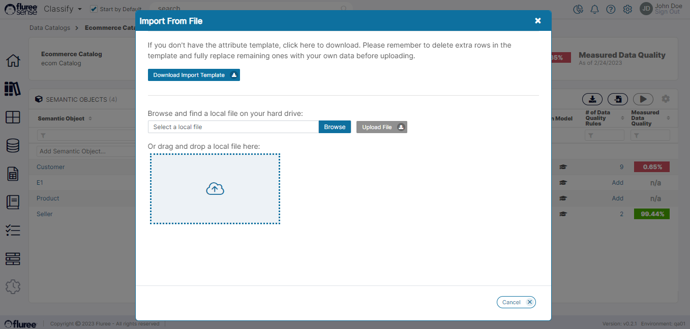
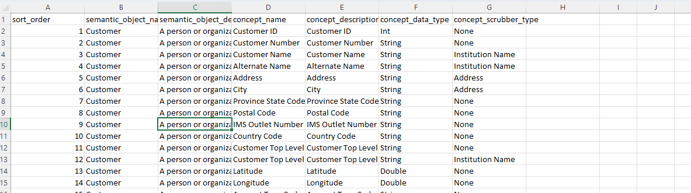

The user is also able to import complete _Catalogs_ from a file. This may be a more practical way to create large _Catalogs_.  
  
Steps 1 and 2 of the 'Create Catalog' flow are the same even when creating a _Catalog_ through import. But once they are complete, the _Catalog_ Admin can add _Semantic Objects_ and _Concepts_ in bulk through the Import Feature at any point in time. Let’s take a look at how that works.

**Step 3. Open Import Popup:**  
  
The Import popup can be opened from the Semantic Object list screen as well as from the Concept list screen by clicking the ‘Import File’ icon. The popup will be the same one which allows the user to add new _Semantic Objects_ and _Concepts_ (of those Semantic objects) into the _Catalog_ in either case.

**Step 4. Update Catalog Template & Upload:**  
  
In this step, the user can first download the template, in case it is not already with them. After that, they can edit the template (except the first row) removing any example rows and adding their own data such as _Semantic Object_ Names, _Concept_ Names etc. Naturally, the user needs to be careful with spelling. Once the template is edited, it is ready to be uploaded as a normal file upload.

Above is an example of a template. Most of the fields are self-explanatory. But let’s just talk about the data\_type field. It can be kept blank if the concept data type is not known. But if it is known, please enter one of the following: Int, String, Date, DateTime, Double, Float, Boolean exactly as spelt.

Another column- 'concept\_scrubber\_type,' which is a kind of cleaner/ validator function is available in OOB and can be applied if the attribute is of a specific type. For example, if the scrubber type = Date is used, it’ll try to standardize all the data for that attribute into a valid Date format.

**System Validations**

1. Import Rights: We mentioned in the previous section that only a _Catalog Admin_ can add a _Semantic Object_ or Concept. Likewise, only a _Catalog Admin_ can import Semantic Objects and Concepts into the Catalog. Otherwise, the Import option will be disabled.

3. Duplicate Values: The system will ignore duplicate values of _Semantic Objects_ or _Concepts_ in the file and the remaining will be uploaded. For a duplicate _Semantic Object_, none of the _Concepts_ will be uploaded.

5. Required Values: The system will display errors in the popup on upload if there are missing values for _Concept_ Name or _Semantic Object_ Name in a row.
