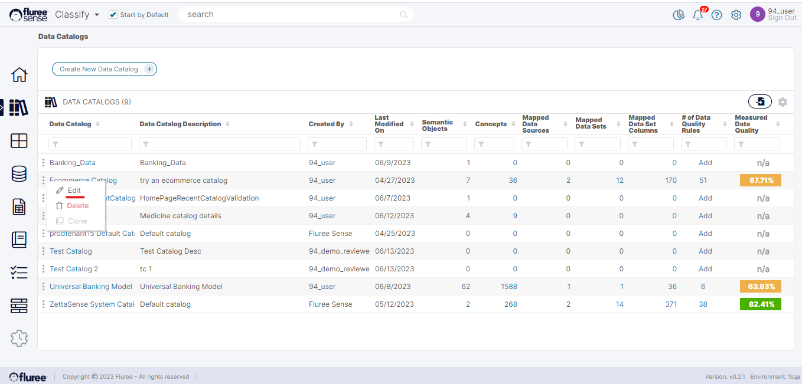
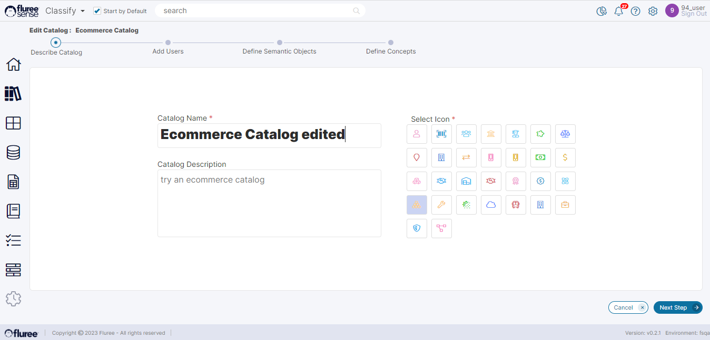
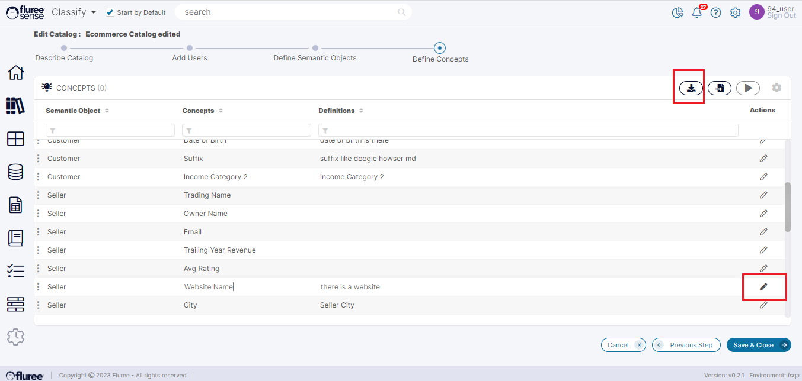

Once a Catalog is created, it can be edited as required by any user with a Catalog Admin role. _Catalog_ Management provides for the following functionality:

1. Edit Catalog Name, Description and Other Details

3. Manage Catalog Rights

5. Add or Remove Semantic Objects & Concepts

If you are a user who has _Catalog_ Admin Rights to that _Catalog_, you can edit it through the below steps. It should be noted that all the steps are optional – you just need to complete the ones you require.

**Useful Note:** In most workflow screens, when we click the Next Step button, the progress gets saved. Exceptions to this convention are the screens where the ‘Apply Changes’ button or specific edit icons are present. There, we need to click on the Apply Changes button or edit something using the pencil icon to Save.

Here’s how you can manage or edit a Catalog:

**Step 1:** Click on the edit link in the ellipsis menu next to the _Catalog_ name in the _Catalog_ List screen.

**Step 2:** Edit the _Catalog_ name, description or even the Icon on the first screen which opens up. The existing values will display in editable mode. You will need to provide a unique _Catalog_ name.

**Step 3:** Edit the users entitled to the _Catalog_ adding or removing any users. We’ve already discussed what roles are available for entitlements in an earlier section. You will need to press the Next button to save the changed users. The significance of specific entitlements has already been explained in the section on _Catalog_.

**Step 4:** Edit the _Semantic Objects_ and/or Concepts as shown in the image from the ‘Define Semantic Objects’ and ‘Define Concepts’ screens. You can also edit by adding new concepts/ updating existing concepts in bulk through the Import method described in an earlier [section](/docs/sense/Classify%20Module/Catalogs/Importing%20Catalog%20Structure/index.md).

The above screen shows editing at _Semantic Object’s_ level while the one below shows the same at the _Concept_ level.

