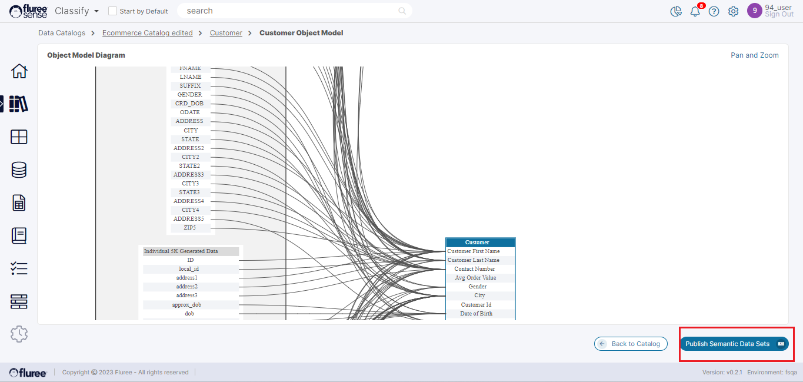
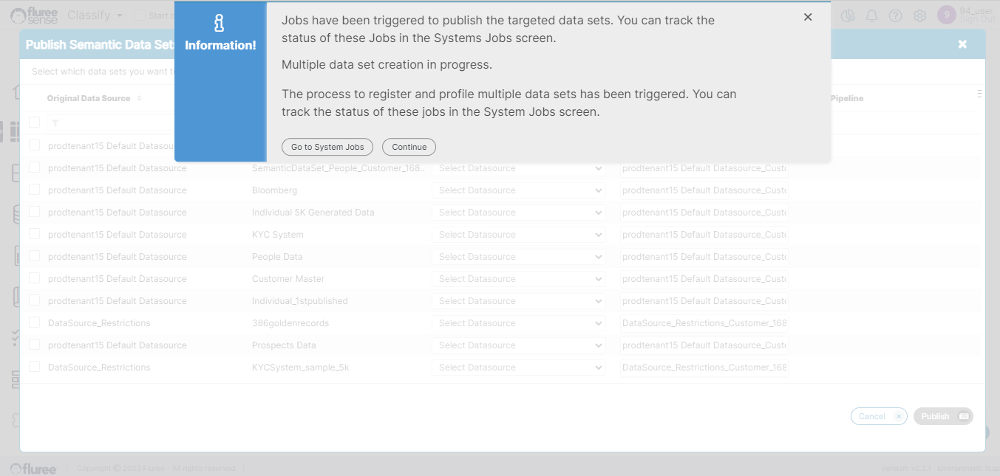

Once the user has run through _Catalog Classification_, they can Publish the ‘_Semantic Data Set_’ to get the benefit of their exercise. Let us understand this concept through an example.

**Example/ Use Case:** Let us assume that your customer, account, product, and sales data is scattered throughout multiple systems, data sources, formats, and tables. Your goal is to discover the Customer specific data and get a collated view / Data Set of that data from all of these.  
  
Using the _Classify_ system and the power of AI & Machine Learning, once you’re able to discover this data, and its relationship mappings to your ideal ‘Customer’ business object, the next logical step will be to publish this into a Data Set you can use, work with, query on, analyze and feed into downstream business applications. This ‘Customer’ here is the _Semantic Object_.

So, as a _Catalog Admin_, you can publish the Semantic Data Sets for the corresponding Semantic Object of that _Catalog_, from the View Object Model screen as seen below.

On Clicking the ‘Publish Semantic Data Sets’ button, a pop-up will open providing you with the choice of Data Sources, and pre-generated but editable names of Data Sets from which you can choose the ones to generate.

After selecting the Target Data Source where the Data Sets will be published. You can optionally edit the Target Data Set names and choose a pipeline (upcoming beta feature) for regular Data updates.  
  
Finally, press the ‘Publish’ button to trigger the Data Set job for these target Data Sets. This Data Set job progresses like any other Data Set job and can be viewed in the jobs screen accessible from the left menu.

**System Validations**

1. Click on the checkbox to choose the rows which you wish to include as Target Data Set.

3. The Publish button will only get enabled after you’ve provided a Target Data Source and a valid non-blank Data Target Data Set name is present for the chosen rows.

5. The ‘_Publish Semantic Data Sets_’ button will be enabled only for the Catalog Admins of the parent Catalog of the _Semantic Object_ in question.

**Useful Note:** It is advisable to Publish the Data Sets once you’ve completed your data discovery through ad-hoc classification or _Catalog Training_.
