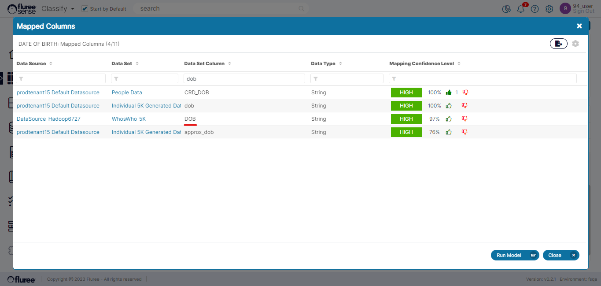
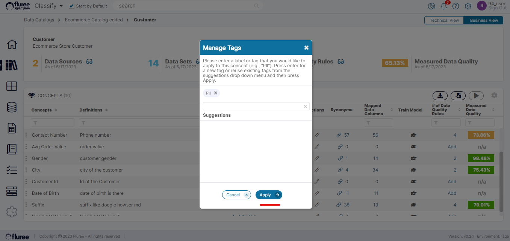
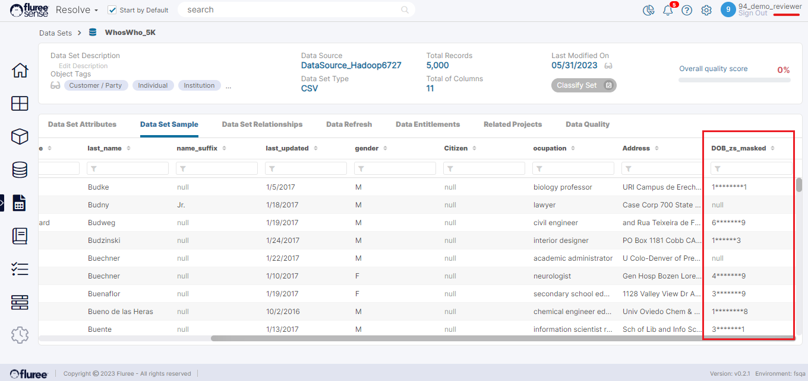

There are two types of Tagging we need to know about as a user:

1. **Tagging (or Mapping) of Data Sets/ Columns to specific Semantic Objects or Concepts**  
      
    Tagging of a Data Set or Data Column is an indication (with a specific degree of confidence) that the Data Set or Data Column identifies with or represents a specific Business Object or Attribute.  
      
    This is done automatically based on Machine Learning and has been explained in the section above on [Catalog Mappings](/docs/sense/Classify%20Module/Catalogs/Viewing%20Ad%20Hoc%20Mappings%20To%20Catalogs/index.md). So, we will be focusing on the 2nd type of tagging in this section.  
      
    

2. **Tagging of Concepts through User Defined Tags, including Privacy Tags**  
      
    A user can also tag a _Concept_ with a custom tag which is NOT the same as mapping it to a Dataset Column etc., but marking it with important searchable terms such as “PII,” “PHI,” etc. PII is in fact a system-provided Tag which has the special purpose of masking any data mapped to that _Concept_ once the user tags it as such. Let us look at this in detail below.  
      
    As an example, let’s assume that the Customer’s Date of Birth is a PII field. Going one by one and applying this field to various Data Set columns which may or may not have a relevant name or may have a not-so-obvious nomenclature will just defeat the purpose. Here, _Classify_ comes to our rescue where we simply tag the appropriate _Concept_ for Customer object with PII i.e. Date of Birth.

Observe the _Concept_, Date of Birth which is mapped to a column DOB in Data Set: WhosWho\_5K, among many other columns. Let us apply a PII tag to this concept.

**Result of the special ‘PII’ tag on a _Concept_**

For any Data Set that is associated with a concept having a PII tag, any user with just the ‘Read Only’ entitlements won’t see the complete value of the column that is mapped with that PII-tagged concept. This happens when such a user with viewing limitations accesses the:

- Data Set Sample (whether in pop-ups or the Data Set Sample tab)

- Profiler information containing values such as Max, Min, Least Frequent, Most Frequent

In all these areas, the values will be masked by some special characters. Data Set Admin or users with Data Set Read/Write entitlement can still see the complete value.

To illustrate this, let's take a look at the screen below continuing from our ‘WhosWho\_5k’ Data Set.

As we can see, the 94\_demo\_reviewer is having a Read Only entitlement here. Below is how the Data Set sample will look for this user for the DOB column. As you can see the value for DOB\_zs\_masked is not complete and is masked.

Similarly, there is a difference when we click on the DOB column in the attribute tab, to view the profiler information.

