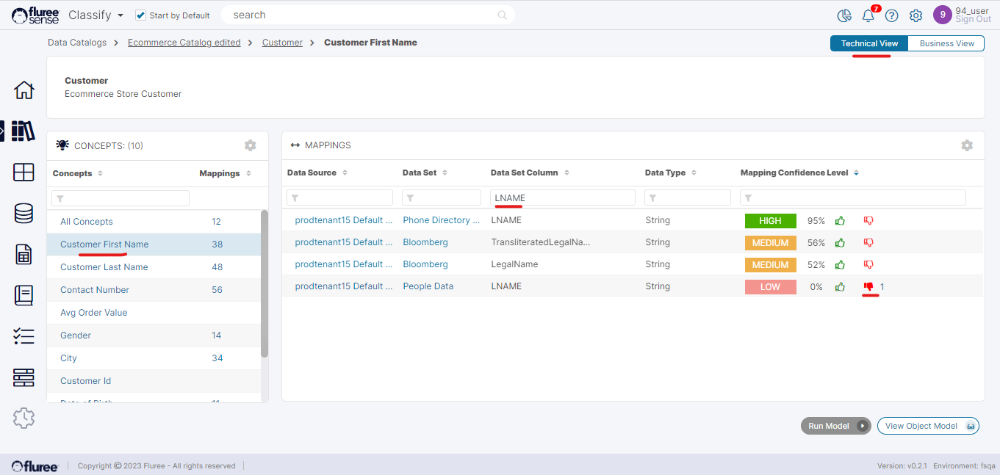
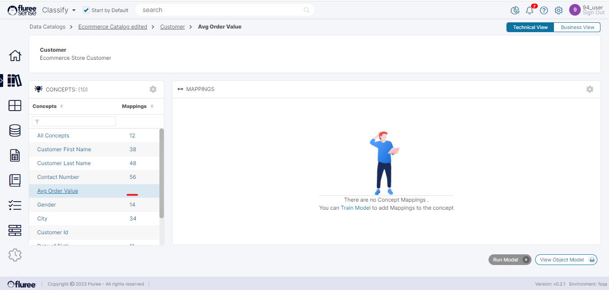

The Classify System provides users with the flexibility to examine their Business Objects in a Technical View as well. As the name suggests, this view focuses more on Data to Column relationships.

To access the Technical View of a Semantic Object:

**Step 1**: Click on the “Technical View” toggle on the top-right corner of a _Semantic Object_ screen.  
**Step 2**: Click on any _Concept_ to view Column mappings or ‘All Concepts’ to view Data Set mappings.

As can be seen in the screen above, on the left panel you’ll find the Concepts listed with counts against them and on the right side we see the mappings for these concepts.

If you’ve followed the earlier sections, you will remember we had downvoted LNAME for People Data as an Ad-Hoc Mapping. We can see the same mapping here showing the downvote which confirms that this is just a different mapping view and can be used for feedback like the way we used the Business View in ad-hoc mappings.

A special case can be seen in the screen below, for this specific concept we don’t have any mappings (High Confidence or otherwise). In such a case, a placeholder image with instructions will show on the main panel. Clicking the link in the instructions will lead the user straight to the ‘Train Model’ workflow of that _Concept_. We’ll study the model training for _Catalogs_ more in detail in another section.

