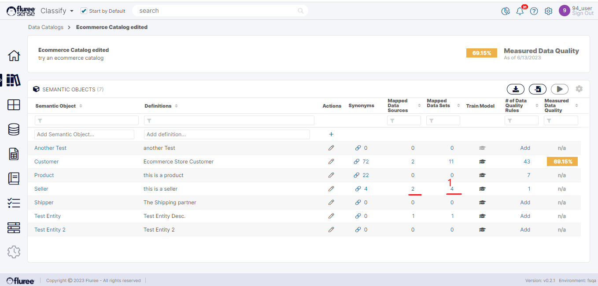
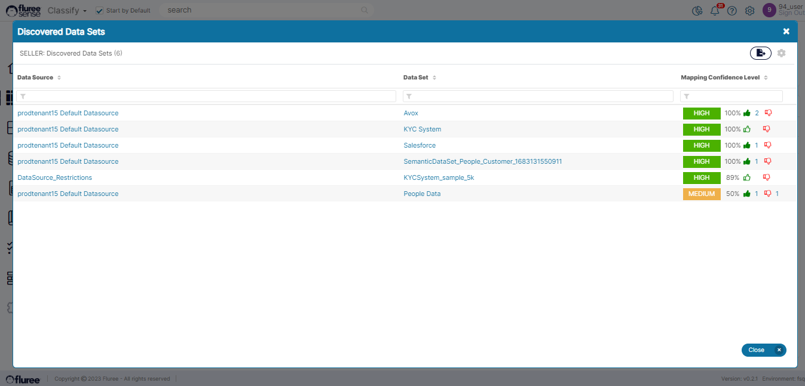
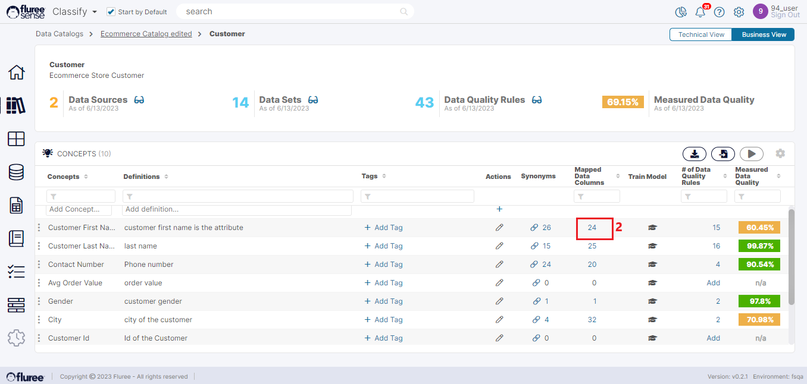
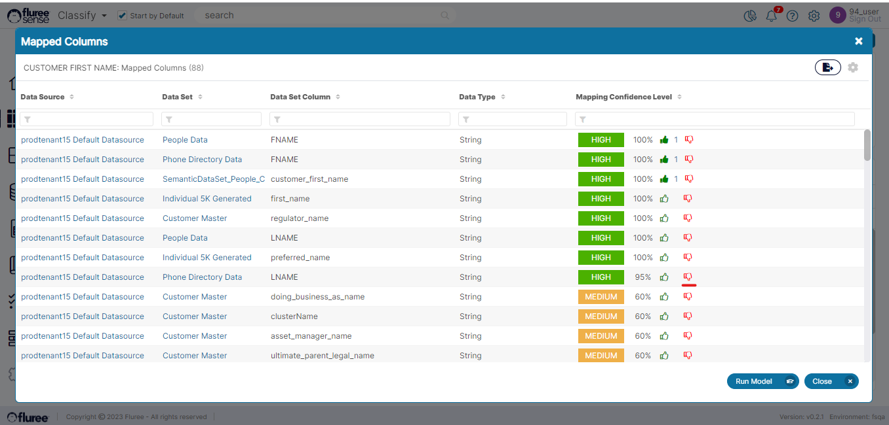
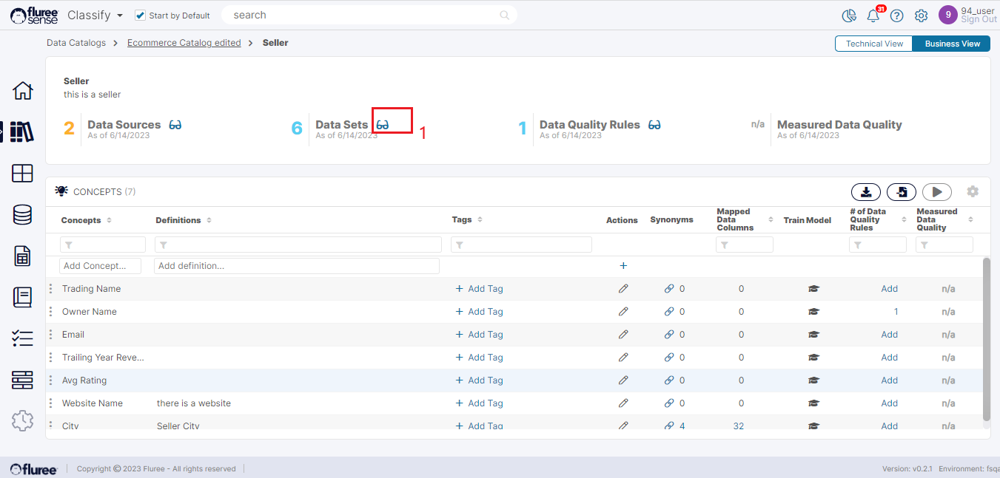

The whole purpose of creating a _Catalog_ is the intelligent discovery of data and underlying relationships to match our business dictionary. So, let’s look at that at the simplest level. As a _Classify_ user, you can look at existing ad-hoc mappings to your Data at:

- The _Semantic Object level_ and

- The _Concept_ Level

Click on your _Catalog_ to get started and view these ‘ad-hoc’ mappings or predictions. We are using the term ‘ad-hoc’ to differentiate between mappings provided specifically for training by the systems vs. predictions generated by the system based on _Tenant_\-wide classification which may not be as accurate or useful. The third type of mappings is manual mappings which are created when a user upvotes or manually links a _Concept / Semantic Objec_t to a column / Data Set.

**Pre-Requisites for Data Discovery**

We'll be talking about Data Discovery in a Catalog at Semantic Object and Concept level in this section, but it is important to note that these views show manually applied or predicted mappings which is only possible after Classification has been run on Tenant. The first time around when you've set up your Data Sources, Data Sets and run Data Set Registration you will not see Discovered Mappings immediately.

The way to generate mappings the first time around is to do that through the Train Concept / Train Semantic Object workflow. Please check that out in the section on Classification if you'd like to study that first.

**Data Discovery at the Semantic Object Level**  
  
Once the user is inside their _Catalog_, they can browse the list of _Semantic Objects_ and Click on the count of mapped Datasets to view the Data Sets mapped or tagged to that _Object_. This count can be zero as well and yet you may find some Data Sets in the popup opened. This is because this count (marked 1 in the screen below) is updated every time the _Classification_ Model runs which maps the Data relationships.

So, on click of the count (marked 1 in the image above), the pop-up below opens up.

Additionally, the user can view the Discovered Data Sources by clicking on the counts in the ‘Mapped Data Sources’ column in the Catalogs List screen. This opens a pop-up which displays the various Data Sources OR the Data Sets whose Data is mapped/tagged to the whole Catalog.

To recap, users can view Discovered Data Sources, and Data Sets both at the _Semantic Object_ level either from the summary header or one of the counts in the list columns. They can also view these at the Catalog level in the Catalogs list screen.

**Data Discovery at the Concept Level**

A user can browse the list of Concepts inside a Semantic Object and Click on the Count of “Mapped Data Columns” tagged to that _Concept_ (#2 in the image below). This count can be zero as well and yet you may find some Data Set Columns in the popup opened. This is because this count is updated every time the _Classification_ Model runs which maps the Data relationships.

The corresponding pop-up which opens can be seen below. The Main change is that here obviously the mapping rows show the Data Set Columns.

**Useful Note:** The count shown in the Concept’s list screen will not necessarily match the actual count of the Data Set Columns in the popup. This is by design because the first count indicates only the ‘High’ Confidence mapped columns whereas the popup count is of all the mapped Data Sets: High, Medium or Low.

The eyeglasses on the _Semantic Object_ screen, which is the parent screen of the above pop-up are all clickable and display the Data Sources, Data Sets for that object or the Data Quality Rules at that level.

