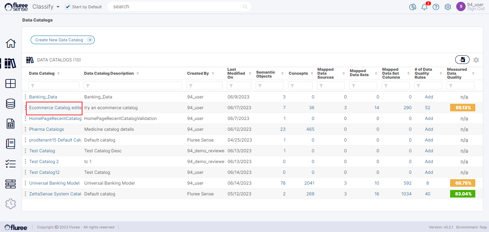
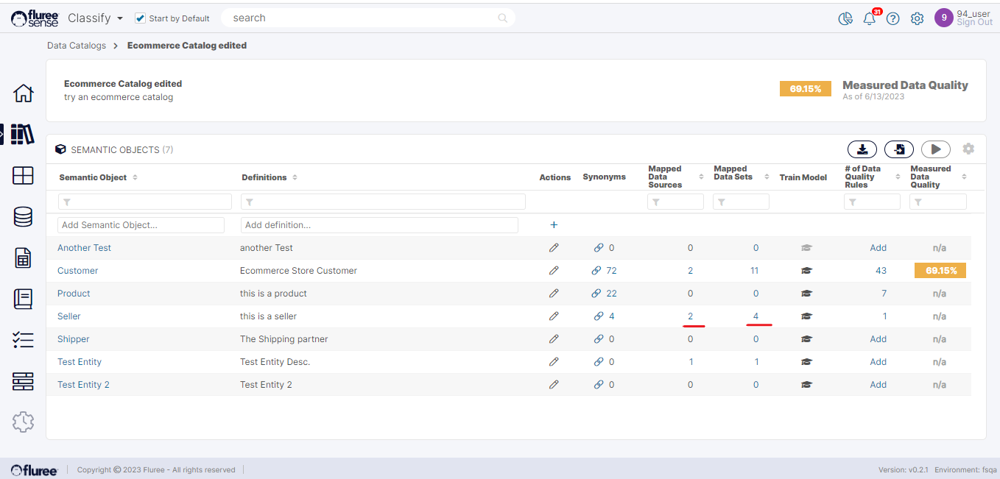

All the active _Catalogs_ appear in the _Catalog List_ screen with their names and some other useful information as shown below. Users can access this screen from the ‘_Catalog_’ option in the left nav of _Classify_.

A user can view:

1. The Name and Description of each _Catalog_.

2. The last time the _Catalog_ was updated, and who created it.

3. The number of Objects that the _Catalog_ contains.

4. The number of _Concepts_ that the _Catalog_ contains.

5. The number of Data Sources mapped to each _Catalog_.

6.  The number of High Confidence datasets mapped to each _Catalog_.

7.  The number of High Confidence Dataset Columns mapped to each _Catalog_.

8.  The no. of Data Quality Rules for that _Catalog_ and the Data Quality Score as well.

From this screen, you can click on a specific _Catalog_, and it will take you to the main _Semantic Object_ page for that _Catalog_. In this case, as an example, let’s say we clicked on Ecommerce _Catalog_, it’ll take you to the list of _Semantic Objects_ associated with that _Catalog_. Another way to reach a specific _Catalog_ is from the ‘_My Data Catalogs_’ list on the home screen. It shows the top 3 last modified _Catalogs_.

In the _Semantic Objects_ screen, the user can see the counts of Data sources and Datasets that are mapped to each object within the _Catalog_. We will take up the implications of these counts and learn how to view the tagged (or mapped) Data Sets and columns in [another section](/docs/sense/Classify%20Module/Catalogs/Viewing%20Ad%20Hoc%20Mappings%20To%20Catalogs/index.md).
