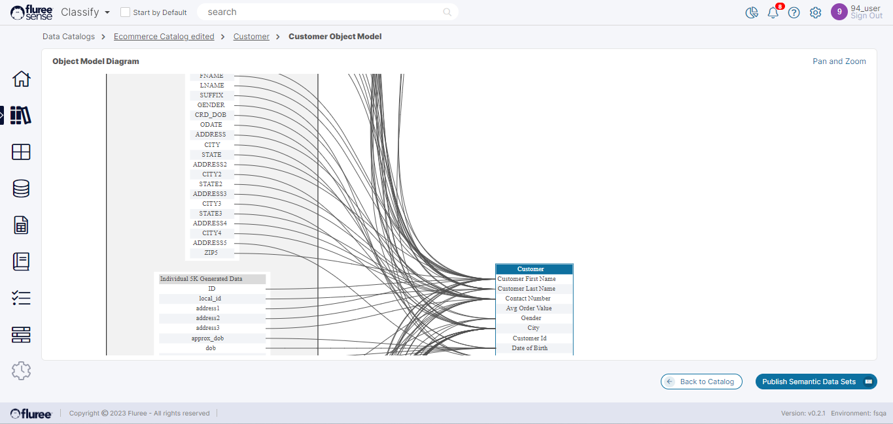

The user can also view the _Semantic Object_ Model from the Technical View tab of the Semantic Object. This is a powerful feature which allows you to understand the emerging Data Model by providing a view of how the physical data or tables map to the Business Object, which in this case is ‘Customer.’  
  
The Data Model is rendered as an image which can be right-clicked and saved for further analysis and viewing. Users can use their trackpad/mouse to pinch or expand to zoom out or zoom into the image.

