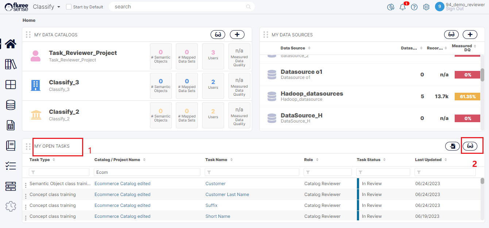
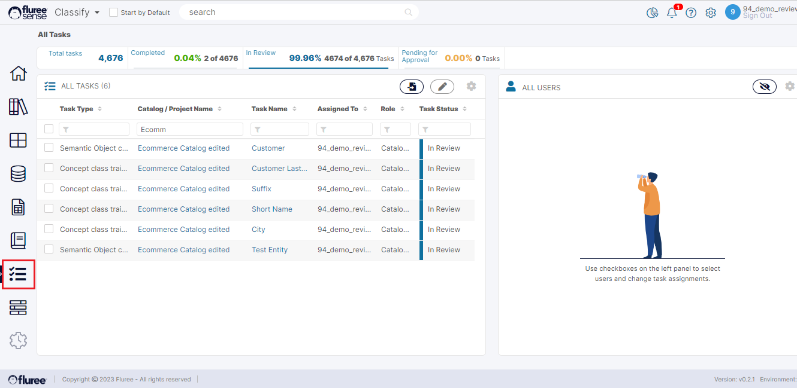

_Catalog Training Tasks_ can be seen either in ‘My Open Tasks’ or ‘All Tasks’ or ‘All My Tasks’ area.  
  
This is different from _Project Tasks_ in _Resolve_ or _Classify_, which are available in these screens as well as their specific Project-related Task Training and Task Managing screens.

Three Common Areas where we can see _Catalog Tasks_ (and other type of Tasks):

| **Screen / Section** | **Tasks it Displays** | **Status of displayed Tasks** |
| --- | --- | --- |
| 1\. My Open Tasks | Any ‘Open’ Task assigned to the logged-on User.  | Displays ‘Open’ Tasks i.e.  tasks which have not been completed yet. |
| 2\. All My Tasks | Any Task assigned to the logged-on User  | It may be a Task, which is now in Completed Status as well. User cannot make changes to a Completed Task but can view its details |
| 3\. All Tasks | Any Task assigned to the Logged-in user AND any Task belonging to the Project or _Catalog_ of which the logged-on user is having an Admin role. | It may be a Task, which is now in Completed Status as well.   |

The images below show how they can be accessed in these 3 common areas either from _Classify_ or _Resolve_, corresponding to their serial number in the table above.  
  
However, _Catalog Tasks_ will only show in _Classify_ as that is a _Classify_ module feature.

