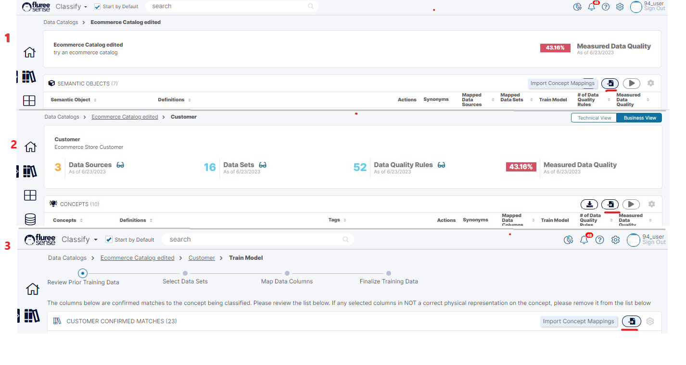
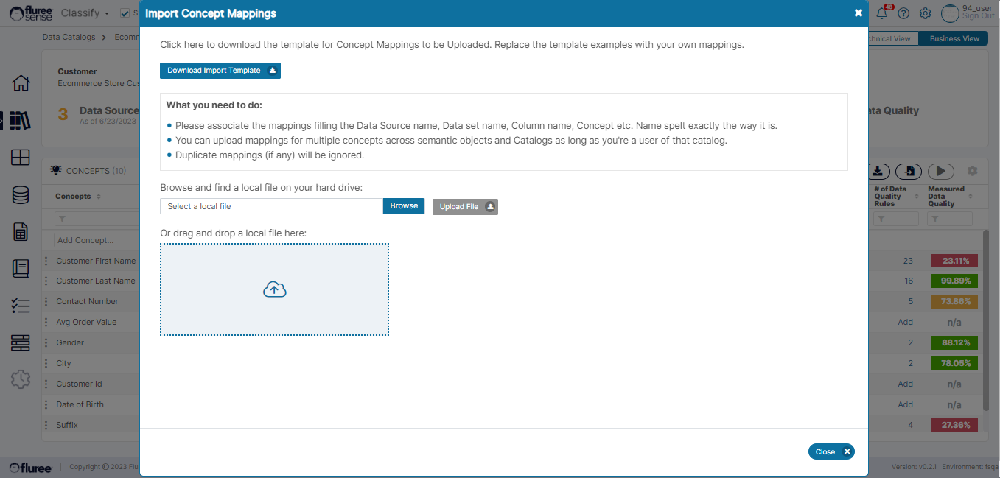
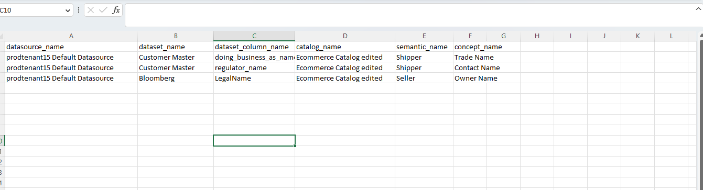
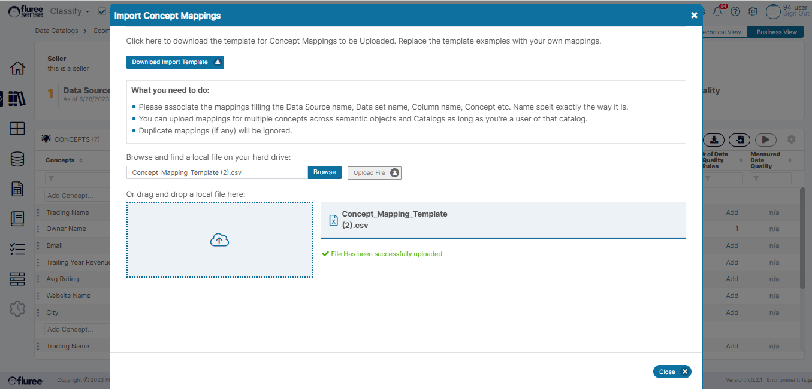

In the earlier sections, we saw how a user can provide feedback and mappings through various means, including the most recent case where the user can provide training through a workflow.  
  
However, when we’re dealing with a large number of _Concepts_ and _Semantic Objects_, it may make sense to provide training in bulk by importing concept mappings.  
  
Please note, currently this feature enables the user to associate new mappings (and not remove prior ones), but there are plans to extend it to provide negative feedback / or removal of mappings as well.

_Concept Mappings_ can be imported from the following 4 types of screens:

1. In the main _Catalog_ Screen

3. In the _Semantic Object Screen_ (containing List of Concepts)

5. Any of the workflow screens in Training at _Semantic Object_ _Level_ workflow

7. Any of the Workflow screens in Training at _Concept Level_ workflow

The below image shows where the _Import Concept Mapping_ icon is placed in the first three screens mentioned above with the 4th being quite similar in look & feel.

  
To import _Concept Mappings_, the following quick set of steps should be followed:

**Step 1:** Click on the _Import Concept Mappings_ icon  
  
This will open the import pop-up, which has the relevant instructions and download template, which can be used and edited.

**Step 2:** Download & Edit the Concept Mappings Template

Click on the Download link to download the Template for import.

This will mainly be in CSV file format throughout the application. Note that example Mappings may be shown in the template; please delete them before using the template. As long as the names are spelt correctly and the user has _Catalog Admin_ rights, the user can import the mappings from any of the four types of screens mentioned earlier.  
  
In the image below, you can see that the user has edited the template for concepts of Shipper and Seller Semantic Objects of a Catalog.

Please refer to the System Validations below for other applicable rules for uploading.

**Step 3:** Upload the Edited Template and Resolve any error(s)

Upload the edited Template from your local directory and resolve errors if any. Error(s) if at all are likely to be there if the System Validations are violated. This will be displayed as a red error message on the screen indicating the error.  
  
The error message will only be shown if none of the rows of the file meet the validations, else the in-validated rows will just be ignored.  
  
Close the pop-up by pressing the Close button.

**Step 4:** Review the uploaded Mappings & run the model (if required)

You can now review the Uploaded Mappings and run the model if required. If you’ve uploaded the template within the _Semantic Object_ _Training_ or _Concept Training_ flow, only the mappings for that specific object/concept will show there within the workflow.  
  
You will also be able to see these mappings in the _Mapped Dataset Columns_ to a _Concept_ \- as upvoted items and updated in its history log pop-up.

**System Validations**

1. Only _Catalog Admin_ can import _Concept Mappings_ for that _Catalog_.

3. Names of each object/concept/column/dataset/data source in the template should be correctly spelt else that item will not get resolved and be ignored.

5. If you add a mapping already present (for that concept – data set column combination), it will be ignored to avoid duplication.

7. If all the mappings in the template are invalid for any of the above reasons, an error will be displayed, else no error will be shown but invalid ones ignored.

9. You need to be within that Catalog related screens, whose mappings you are trying to import.
