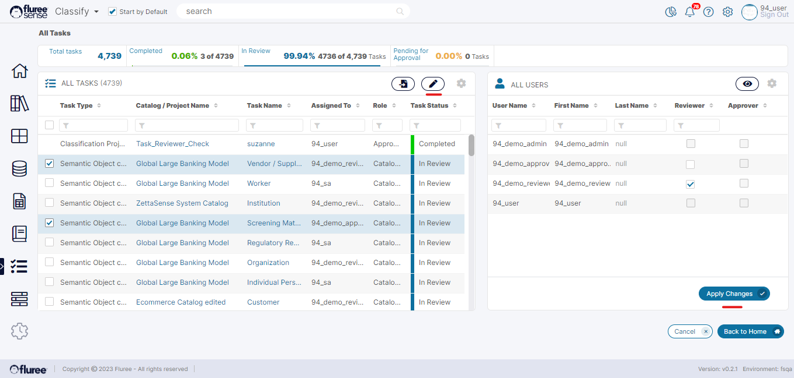

Imagine a situation where a Task is assigned to a specific user, but that user is on leave or unable to work on those tasks. You’d probably re-assign it to a team member if a co-worker from the same department was there, right?  
  
To cater to scenarios like these, Fluree Sense provides the _Re-assign Task_ feature. Re-assigning of Tasks is available for both Projects - such as _Resolve_, _Concept Parser_ and _Semantic Object Projects_, and _Catalog Tasks_. Let us check this feature out in the context of Catalog Tasks although the validations will be the same – we’ll point out if there is something specific to one type of task only.

**Step 1:** Go to the _All Tasks_ common area and view the List of Tasks

The ability to Re-assign _Catalog Tasks_ is only available on this screen. In the case of project Tasks, this feature is also available in the _Manage Project Tasks_ screens for those corresponding Projects.

**Step 2:** Choose the Tasks which you wish to Re-assign after filtering for a _Catalog_

You will notice that in some rows, there are no checkboxes to select the Tasks for assignment. This will be the case if you’re **not** the _Catalog Admin_ for those Tasks OR the Tasks are already in completed State. Therefore, only tasks in Review or Pending Approval state can be re-assigned.  
  
Remember to filter for ONE specific _Catalog_ name, as you cannot assign tasks to multiple _Catalogs_ at a time.

**Step 3:** Click on the ‘Assign Users to Tasks’ icon on the grid header to Open the right panel

The users associated with that _Catalog_ will be available in the right panel split between the columns of Reviewer and Approver as per the initial set-up of the Catalog. This means that while the Re-assignment does allow for assigning to a new user, the user does have to be the one with the appropriate role for THAT _Catalog_.

**Step 4:** Choose the Alternate (one at a time) User to Re-assign and click Apply Changes.

In the right panel, you will find that many of the checkboxes are disabled. This can be due to various reasons explained in the System Validations section below.

**Step 5:** Repeat as required for Other _Catalogs_, Users

**System Validations**

1. Only a user having admin rights to that _Catalog_ can re-assign Tasks. Otherwise, the Checkbox to select the Task is not available.  
    

3. A Task, which is already completed, cannot be re-assigned.  
    

5. A Task which is ‘In Review’ state can only be assigned to an individual with a Reviewer role - other than the individual to whom it has been assigned currently.  
    

7. You can assign Tasks to one user at a time and then need to press ‘Apply Changes’ to repeat this step again for different users.  
    

9. A Task, which is in a ‘Pending Approval’ state, can only be assigned to an individual with an Approver role - other than the individual to whom it has been assigned currently.  
    

11. The task assignment feature is available in areas such as Manage Project Tasks (not applicable for Catalog Tasks) or All Tasks.  
    

13. If you choose two different _Catalogs_ during the assignment, the “Assign Tasks to Users” button will remain disabled; that’s because- two different Catalogs can have different entitlements, and it isn’t feasible to provide an eligible user set in the right panel. Hence, only Tasks from the same Catalog should be chosen at one time by filtering on the _Catalog_ name etc.
