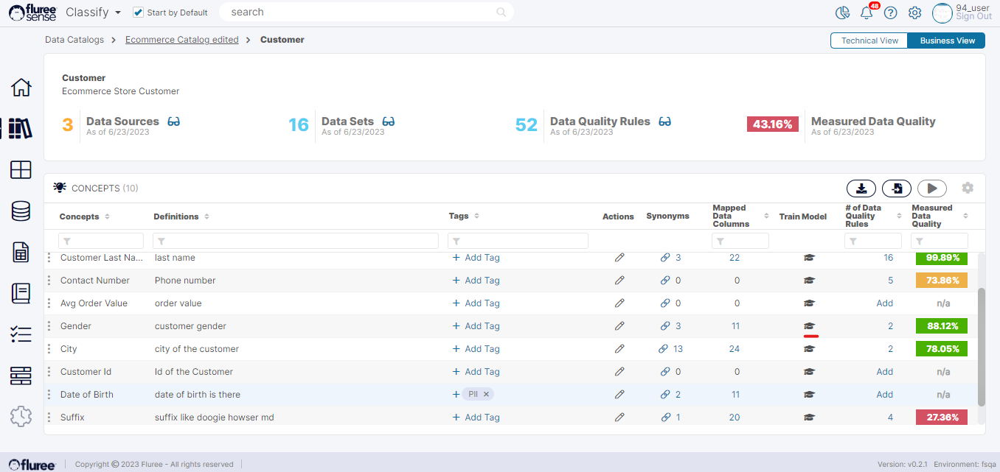
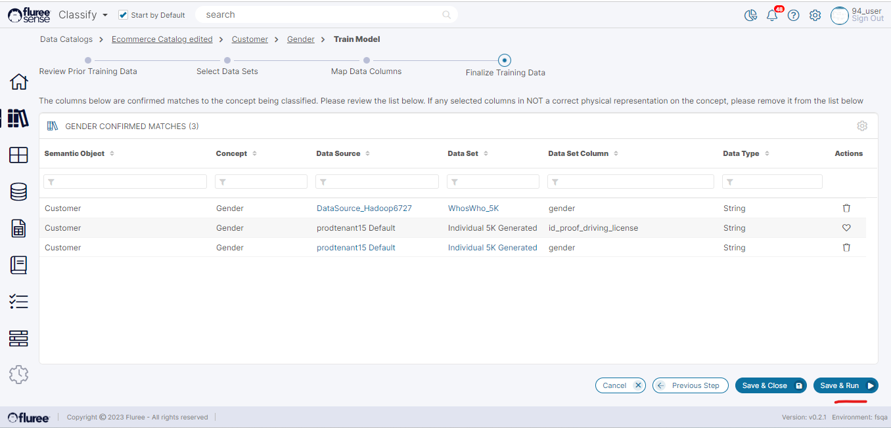

Training the Model at Concept Level - through workflow

**Step 1:** Click on the _Semantic Object Name_ which contains the _Concept_ you wish to train.

Then click on the Train Model Icon in the _Train Model_ column corresponding to that Concept as shown in the image below.

When the user clicks on the ‘Train Model’ icon, as marked in the image above, they will be redirected to a screen similar to the 'Review Prior mapping' screen of _Semantic Object_ flow.  
  
Since these are almost similar screens to the earlier section, we’ve not added them below but just listed the steps.

**Step 2:** Review the Prior Mappings – remove any unnecessary ones  
  
**Step 3:** Select Data Sets for New Mappings  
  
**Step 4:** Drag and Drop Columns associated with that specific _Concept_  
  
**Step 5:** Make any final Adjustments and Run the Model

The image below shows what the final screen of the workflow would look like. Notice the breadcrumb on top which indicates we’re training a model for the Gender concept of Customer Semantic Object.

To summarize, these Steps are the same as in the case of workflow for _Semantic Objects_ in the [earlier section](https://sensedocsdev.wpengine.com/training-at-semantic-object-level/), except for the fact that in this case, we’re doing the mapping for a single _Concept_ instead of all the concepts of a Semantic Object.  
  
Clicking on ‘Save & Close’ will take the user to the parent _Semantic Object_ screen, whereas ‘Save & Run’ will trigger the _Tenant_\-wide _Classification_ model.
