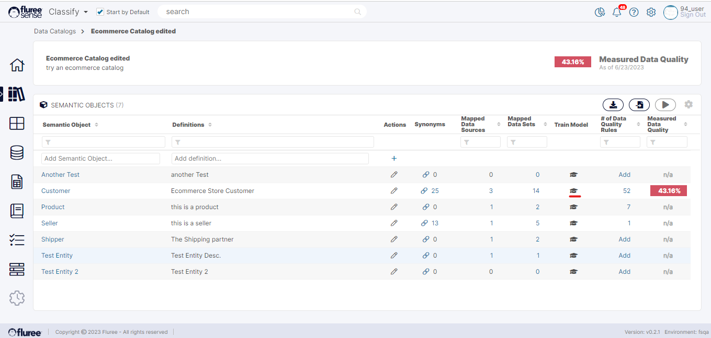
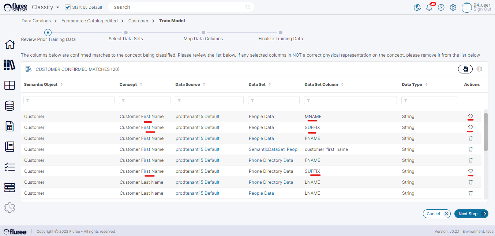
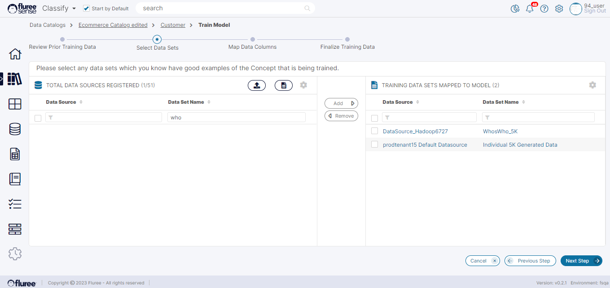
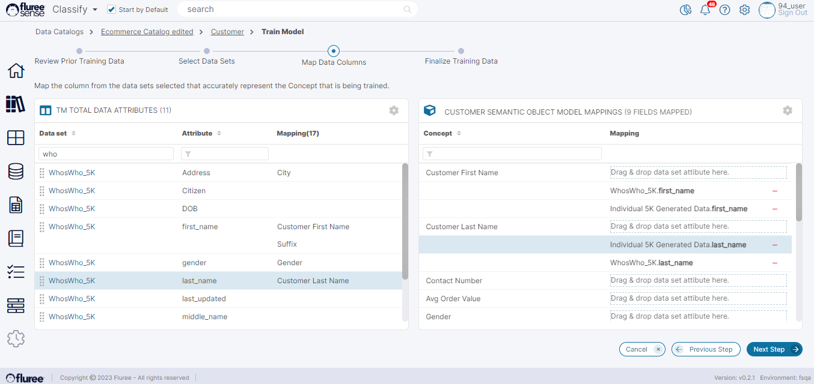
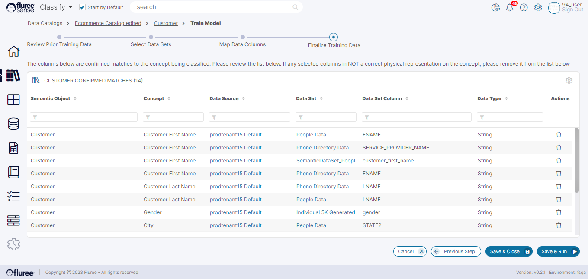

Training the Model at Object Level - through workflow:

**Step 1:** Click on the _Catalog Name_ which contains the _Semantic Object_ you wish to Train  
  
Click on the _Train Model_ icon in the column titled Train Model corresponding to that _Semantic Object_ name.

**Step 2:** Review the Prior Mappings – remove any unnecessary ones  
  
This will allow the user to see any existing mappings for each object and delete any if they don’t seem to fit by clicking on the trash icon. However, the moment the user clicks on the trash icon, it converts to a heart shape which means that this mapping is marked for deletion. But the user can still toggle back to the final step.  
  
In the image below, as a practical example, see the red-marked concepts and the corresponding Data Set Columns. Since the items in each of the red-marked concept-column pairs don’t fit with each other, we clicked on the trash icon. Once clicked, the trash icon turns to the heart icon.

The user can now click on the ‘Next Step’ button to move to the next screen.

**Step 3:** Select Data Sets for New Mappings

The user will arrive at a screen displaying the list of datasets available to them to classify and tag with the _Semantic Object_ that they are training. These are Data Sets to which they at least have the read entitlement. Users can use the filter so that only those Data Sets that they want are displayed in the right panel.

Once the user selects the Data set(s) that they want to use for _Classifying_ the _Semantic Object_, the Next Step button will be enabled in the bottom right of the screen. The user can click it to move to the next screen.

**Step 4:** Drag and Drop Columns to the appropriate _Concepts_ of that _Semantic Object_

This screen displays the Data Set columns (of the Data Sets selected in the last step) on the left side and the list of concepts from the chosen Semantic Object on the right side. The user will also be able to see pre-existing predictions corresponding to these Data Sets' columns and all the concepts of the _Semantic Object_ we’re training.

One distinction we need to make here is that the pre-existing mappings that we see in the ‘Review Prior Training Data’ screen of the workflow are Confirmed Mappings i.e., those which some user has manually mapped or upvoted as High Confidence whereas what you’ll see here are pre-existing predictions which may be more in number and will include High Confidence predictions as well.

The user can use the minus symbol to remove any unwanted prediction here and drag and drop from left to right to add any additional concept mapping.

This is equivalent to the user giving ONE upvote to a mapping in the Discovered Data Columns pop-up opened from the ‘Mapped Data Columns’ column in _Catalog_ or the 3rd way of Classification we’d talked about earlier.

On clicking the ‘Next Step’ button, the user is directed back to the original training page, which now will show all the mappings of the _Semantic Object._

**Step 5:** Make any final Adjustments and Run the Model  
  
If the user agrees with these consolidated mappings, he/she can:

- Click on the bottom-right button labeled ‘Save & Run’. This will trigger the _Classify Model_ as a job with this new mapping information and be able to form better predictions since the model has been trained.  
    

- Click on ‘Save & Close’ which simply closes the workflow and redirects the user back to the parent _Catalog_ screen containing the list of Semantic Objects.

If the user does not agree with any of the mappings, She/he can still make changes from the Action column and go for either ‘Save & Run’ or ‘Save & Close’.

Please note that this shall be a _Tenant_ wide execution (as in the case of the other 4 _Classification Model_ runs).  
  
Through this, the user has just completed the task of training the _Classify Model_ on an object level.
