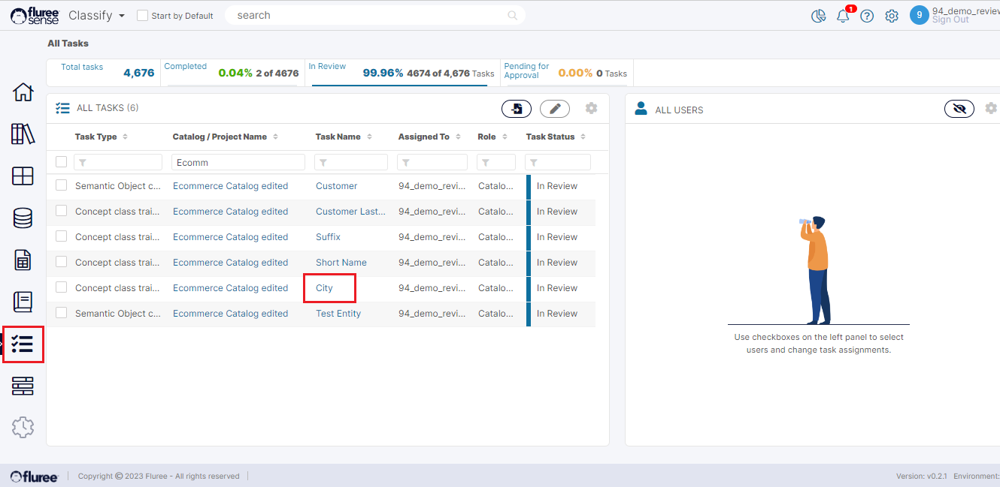
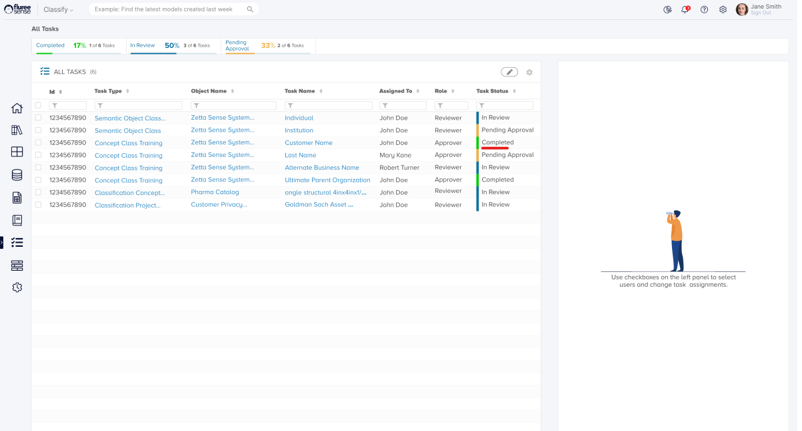

_Catalog_ _Task_ Training is somewhat like _Project Task_ Training. However, there are some key differences and intricacies. So, let’s look at them.  
  
Firstly, we need to understand that we’re going for _Catalog Training Tasks_ (essentially mapping at Concept or Semantic Object Level) whereas we can already upvote or downvote mappings on an Ad-hoc basis, as these are the specifically chosen feedback items by the algorithm with the potential to improve the ML model.  
  
Ad-hoc mappings feedback can be provided by multiple users with access to the _Catalog_ whereas _Training Tasks_ feedback can be provided only by the user to which it is assigned (or _Catalog_ Admin).  
  
Here is the stepwise workflow for completing a _Catalog Training Task_ (without Import)-

**Step 1:** Open the Task as a Reviewer

The user can access the Task from _My Open Tasks_, _All My Tasks_, or _All Tasks_ areas in the application. These have already been indicated in the prior section. In this case, let us consider the scenario where a Reviewer has come to ‘All Tasks’ from the left navigation menu. In the image below, we see that the user has applied a filter to search for a specific set of Tasks.  
  
The user should click on the Task name, which is the _Concept_ name in _Concept Class Training Tasks_ - to open the Task.

**Step 2:** Provide Feedback to the appropriate _Mapping_ (Upvote)

In the Task pop-up, the user should upvote at least one of the mappings. You can upvote more than one, but at least one is required for the Finish button to get activated. You will not see any prior mappings/anyone else’s mappings, which is deliberate to remove bias from feedback.

**Step 3:** Finish the Task and Review the Change in Status

Once the _Catalog Reviewer_ has completed their feedback for that Task, they can click on the _Finish Task_ button in the footer to mark it as complete.  
  
If the _Catalog_ has Four-eyes check OFF, then there is no further step in the workflow and the Task Status updates to: ‘Completed.’ If the _Catalog_ has Four-eyes ON, we move on to Step 4.

**Step 4:** Review & Approve / Change feedback (by the Approver)

In this step:

1. The system displays whatever the Reviewer had selected for that task, the name of the Reviewer, and when they reviewed the task, as shown in the image below.  
    

3. There will be a separate Approve button at the bottom of the screen (during Approval). The Approver can keep the Reviewer's thumbs up or down or change it and press the ‘Approve’ button to mark approval.  
    

5. On this, the Approval will be acknowledged with a message on the screen and the Finish Task button will be enabled to complete the process.

With this, the Task should be completed and updated with the status in the grid. In the image below, we’re taking an example of another _Concept_ which was in review and is now being Approved.

Finally, this leads to the Task getting completed.

**System Validations**

1. _Catalog Training Tasks_ are visible in My Open Tasks, All Tasks and All My Tasks as per the conditions provided in the earlier section: such as which type of user they are visible to, and other such conditions.  
    

3. The _Catalog Training Task_ workflow in All Tasks, which are in ‘Completed’ status and available to the _Catalog Admin_ related to that task, will not allow the feedback to be changed and simply display the details.  
    

5. At least one upvote is required to complete the Review / Approve process for any Task. Approve step of the workflow is ONLY needed if it’s a _Catalog_ with Four-eyes ON.
