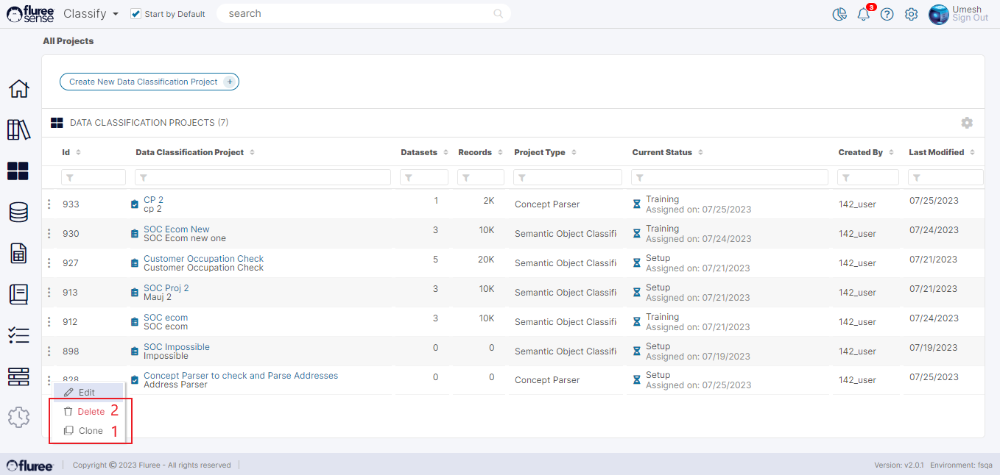

A _Classification_ Project can be Cloned to provide the user with a means to tweak or change the inputs on the project and re-run it keeping the original project intact. This can be thought of as an A/B experiment option provided to users to experiment with their project.  
  
Cloning a _Classification_ project will replicate all the input Data of the Project i.e. - the users, the Training and Project Data Sets etc. However, it will keep the name of the Project unique by changing the name as follows.  
  
Example: Let 1873 be the unique Id of the original Project:  
  
Original Project Name: _Widget Project C_  
  
Cloned Project Name: _Copy\_of\_Widget Project C\_1999_  
  
Here 1999 is a random number to maintain uniqueness.  
  
You can Clone a _Classify_ Project that you are the _Project Admin_ of, through the ellipsis side menu next to each Project in the Project List screen. Clicking on the ‘Clone’ link will create a copy of the Project as per the explanation and example above with the ‘create project’ workflow opened.

**Deleting a Concept Parser Project**

You can Delete a Classify Project that you are the _Project Admin_ of through the ellipsis side menu next to each Project in the Project List screen. Clicking on the Delete link will provide a warning message, which when confirmed, deletes the project.  
  
The Project will disappear from the screen and not be available for any _Classification_ etc. process. The mappings of the Project shall not be in use further.
