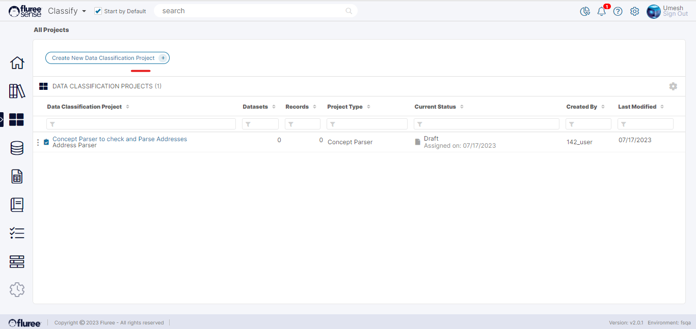
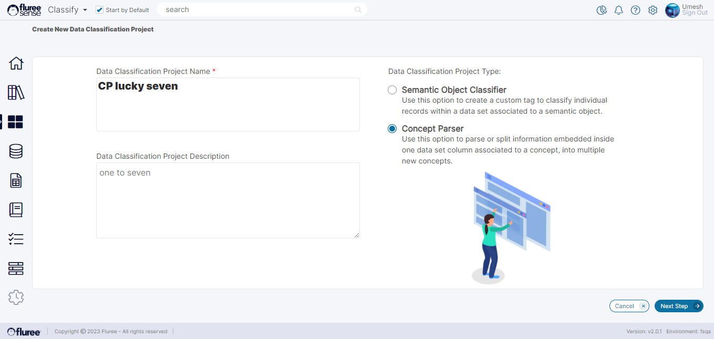
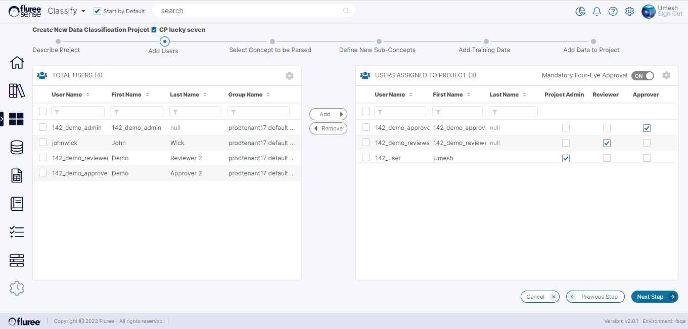
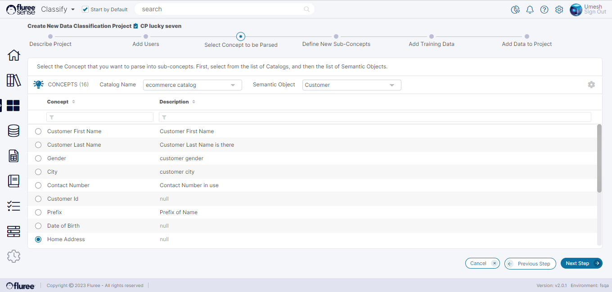
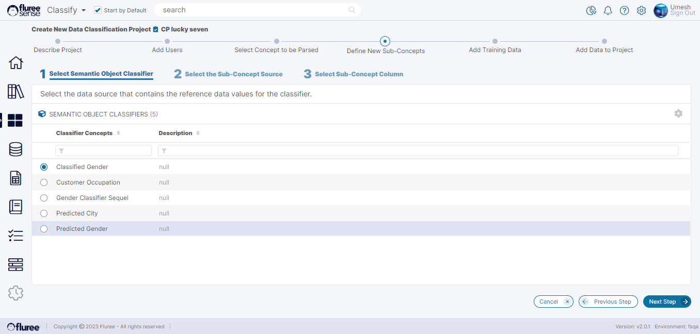
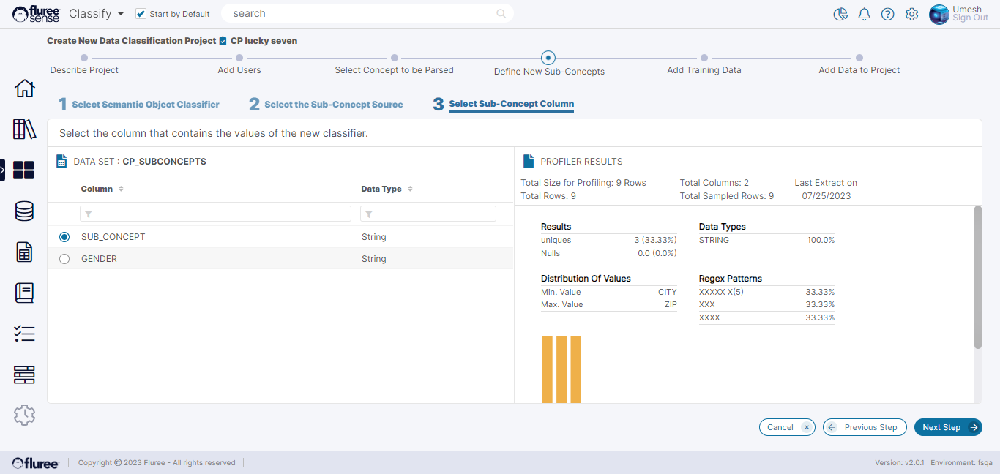
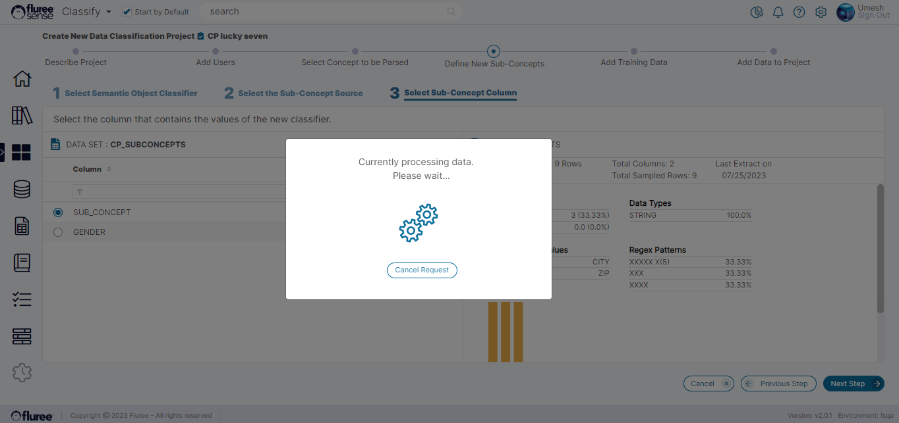

The prerequisites for creating a Concept Parser are the following:

1. A _Classifier_ or category determiner on which the SOC Project would've run (or at-least a _Classifier Concept_ with values).

3. Datasets for training and actual Project Data based on which the _Concept_ shall be Parsed.

So, let us look at a typical _Concept Parser_ project creation flow:

From the ‘All Project’ listing screen, the user needs to start the flow by clicking on the ‘Create New Data Classification Project’ button.

**Step 1:** Provide the Name & (Optionally) the Description  
  
In the first screen, as in the case for _Semantic Object Classification_ Projects, the user needs to provide the name and optional description of the Project. The user must also choose the correct _Project Type_ and press the ‘Next Step’ button.

**Step 2:** Add Users and specify their Entitlements

This step is also the same as in _Semantic Object Classification_ Project flow. The logged-on user will be treated as the default Admin and can add Reviewer(s) and Approver(s) as per the Four Eyes check. Once the entitlements have been added, press the ‘Next Step’ button.

**Step 3:** Select the _Concept_ to be Parsed

In this step, the user must first select a _Catalog_, then- one child _Semantic Object_ and finally, one _Concept_ from the list of _Concepts_ which is to be parsed into _Sub-Concepts._ Then the ‘Next Step’ is to be pressed once the selection is made.

  
**Step 4:** Select the _Sub-Concept Classifier_, it’s _Source_ and _Column_

Now, the user must select the _Classifier_ (remember the prerequisites we’ve mentioned in Introduction) in the _Catalog_ and its Data Set source. So for this step to be completed, the user needs to complete these small sub-steps / tasks:

1. Select the _Classifier_ type _Concept._

Note that you will only see a value here IF there is a _Concept_ in the _Semantic Object_ that you selected earlier which is a ‘_Classifier_,’ which essentially means that SOC project should’ve run successfully on it to provide relevant values to that _Classifier._ It is based on this Classifier that the _Sub-Concepts_ would vary, whose values are to be predicted eventually in this project.

2\. Then, select a single Data Set which contains the reference values for this Sub-Concept.

3\. Once the Data Set is decided, the user must select a single column, which contains the values of the _Sub-Concept_.

Selecting a column here will show the profiler information on the right so you can re-verify if it is indeed the correct data column.  
  
On pressing ‘Next Step,’ a Progress box will appear. In the background, it will load the values from the selected column. The loading may take a little time due the job queueing process.

