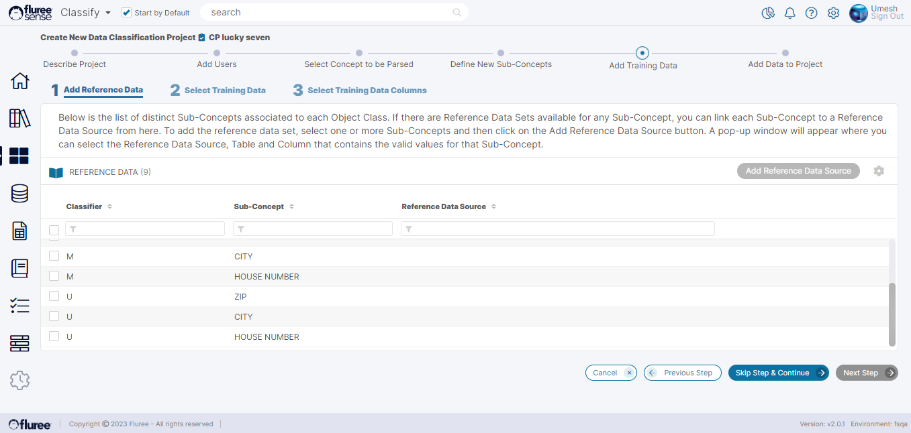
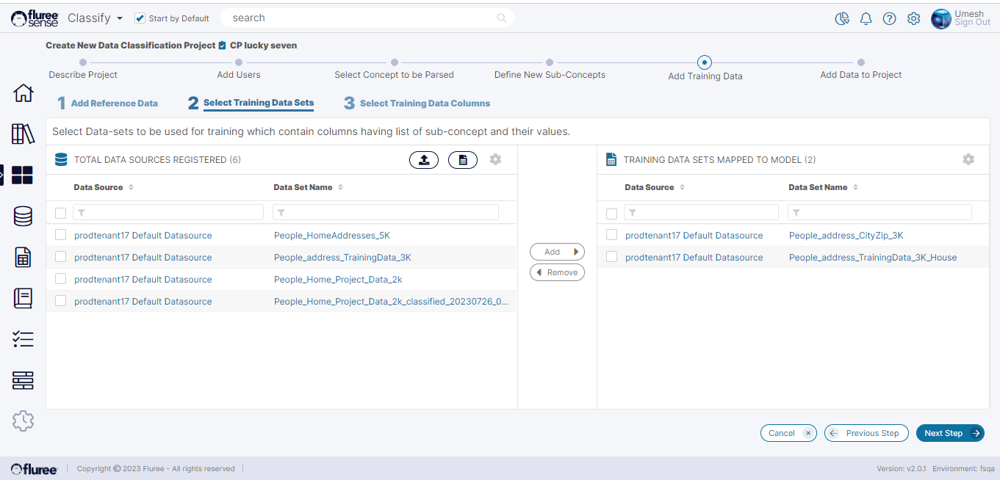
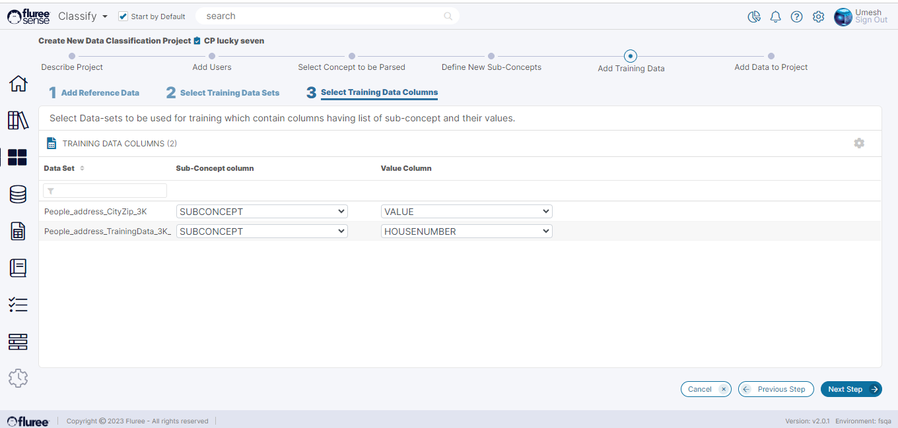
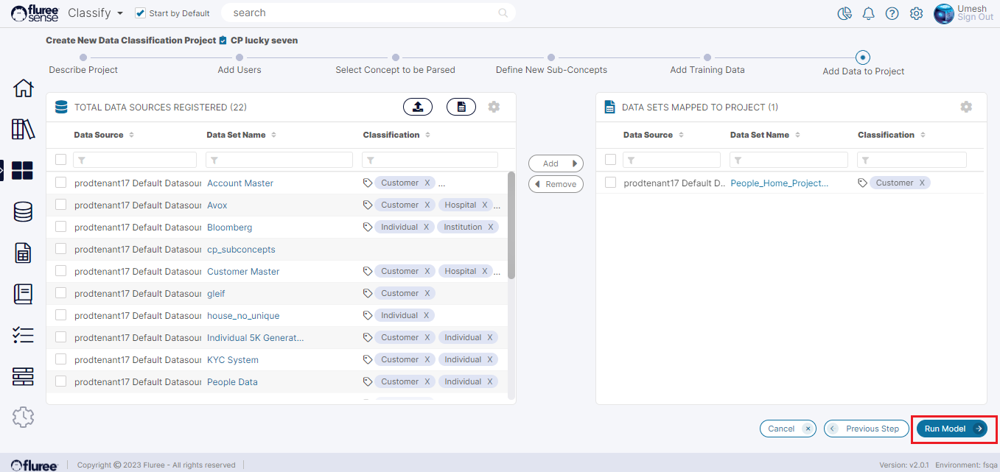

Now that the 4-step initial set-up is done, let’s examine the next steps.

**Step 5:** Add Reference Data to _Sub-Concepts_

Continuing from Step 4, once the records containing a list of _Sub-Concepts_ have been loaded, the user needs to add Reference Data - basically Data Set Columns - for these _Sub-Concepts_. This list may take a little time to appear as it runs as a small job. Please do not close the screen while the job runs.

You can now optionally add Reference Data for these _Sub-Concepts_ or ‘Skip Step & Continue’ to simply add the training Data if you don’t have additional Reference Data for the _Sub-Concepts_.  
  
Adding Reference Data is simply a process of adding Filtered Data Columns corresponding to the selected Sub-Concepts from the above screen by selecting using checkboxes and clicking on the ‘Add Reference Data Source’ button. This opens up a modal to add Data Columns that populate in the Reference Data Source column on the same screen.

**Step 6:** Select Training Data Sets

In this step, the user needs to provide one or more Training Data Sets which contain the _Classifier Sub-Concept_ and corresponding _Sub-Concept_ values. This will act as the training data because it already contains the parsed key value pairs for each _Sub-Concept_.

**Select Training Data Columns**

Once the user has selected the Training Data Sets, these will now appear in the next screen with the option for the user to choose:

1. The Column which contains the _Sub-Concepts_

3. The Column which contains the _Sub-Concept_ values

This means if there are 2 Data Sets as we see above, we will have 2 rows to select the above 2 items from, as shown in the image below.

**Step 7:** Add Data to Project

As we do in SOC projects as well, the last step is to add the actual _Project Data_ on which the model will run. This _Project Data_ needs to be exclusive of Training Data as per the rules of ML.  
  
Therefore, this screen will show the Data Sets to which the user has, at least, read rights, and which contains the _Concept_ to parse (as High Confidence tagged concept), but with the already used Training Data shown disabled in the list.  
  
The user should move those Data Sets which have high confidence mapping to the: **Concept to be Parsed**. Once at least one Data Set is moved to the right panel, the user can click the _Run Model_ button to trigger the _Concept Parser_ project which runs a Job that can be viewed from the Jobs Link in the left navigation.

This finishes the _Concept Parser_ creation Process, which will generate a project summary, Task, etc. in the _Project Home_ screen once the Job is completed.

**System Validations**

1. The user cannot create a _Classifier_ with the same name as an existing concept lying within that _Semantic Object_ in which the _Classifier_ is being created.

3. Prerequisites mentioned at the beginning of the section need to be completed.

5. The system will disallow the same Data set(s) that are used in training to be used in _Project Data_

7. In the _Project Data_ screen, only Data Sets containing the _Concept_ to be parsed and _Classifier_ can be moved to the right panel otherwise the system will prompt a warning.
