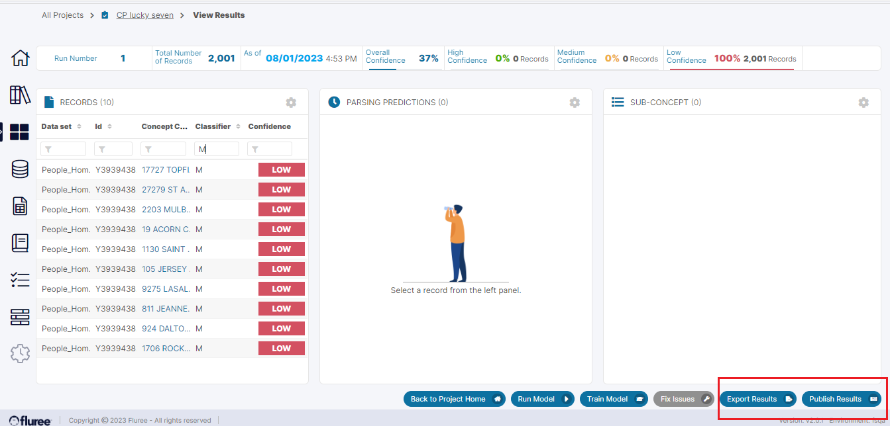

Once the Project has reached a requisite level of confidence and the predictions are ready to be used, the User may want to export or publish them.

1. The User can export the complete set of predictions by clicking on the ‘Export Result’ link from the View Results screen. A download prompt opens up and these are downloadable as a CSV file. The User can also Publish results from the Project Home screen by clicking on the Publish icon marked \[7\] in the image in that section.

3. When the user clicks on the ‘Publish Results’ button from the above screen, it triggers a system job, which, when completed, will create a Data Set of Published results that will also contain columns with the final predictions pertaining to Sub-Concepts and their values.
