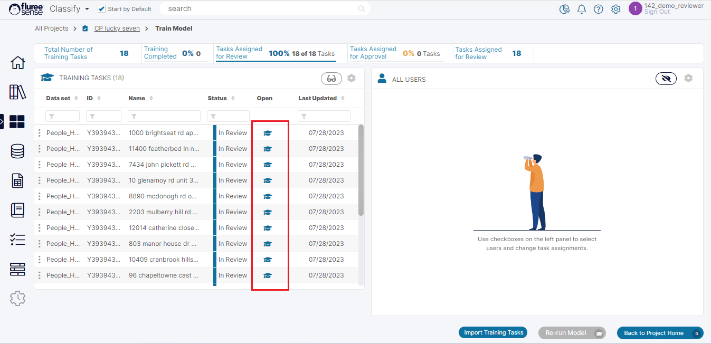
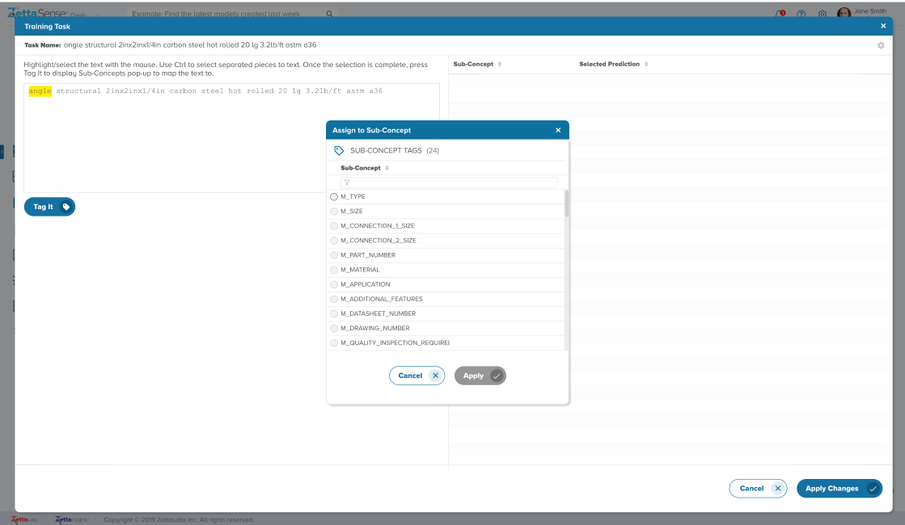
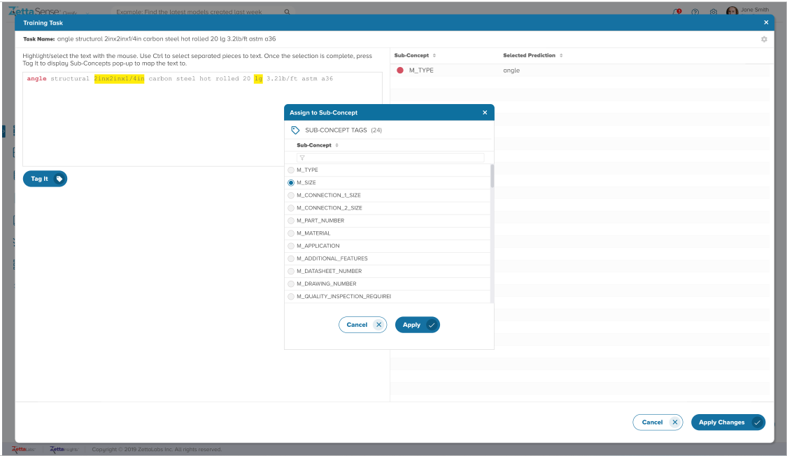
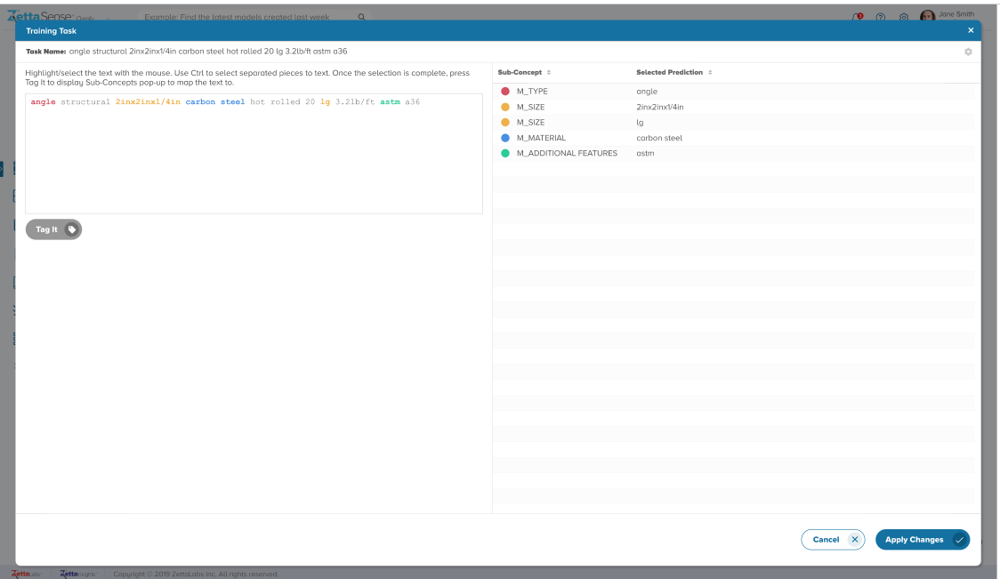

Once the Project has completed its first ‘run’, the initial results will be available for viewing. Details of these are available in the section on Project Home Screen and Project Result. The important thing to note is that most projects won’t achieve a sufficient level of confidence in just the first run.  
  
To get the required level of prediction confidence, we will need to ‘Train’ the Project. Let’s look at how we can train the Project through On-screen Feedback.  
  
To Train the Task(s) or feedback items that the Project has generated:

**Step 1** Open the Train Model Screen by clicking its icon in Project Home (marked # 5)

The user will see the Task assigned to them as a Reviewer or Approver in this screen – as shown below. If the user is logged in as a Project Admin, they will see all the Tasks. However, it is more useful for a Project Admin to give feedback from the ‘Manage Project Tasks’ screen – as that is a dedicated view built for that role.

**Step 2** Open a specific Task that you would like to Train by clicking on the Graduation Cap icon.

Clicking on a graduation cap will open a pop-up showing the concept being parsed from where the user has to select ‘tokens’ or texts – contiguous or non-contiguous and assign it to a specific _Sub-Concept_ for that _Concept._

**Step 3** Select values from the _Concept_ to be Parsed & assign them to Sub-Concepts one by one.

The above image shows an example of the Task pop-up in action. After highlighting text snippets and following the instructions, click ‘Tag it’ to open the _Sub-Concept Selection_ panel and assign the snippet to a specific _Sub-Concept_. Click ‘Apply’ in the selection panel to close it, and the assigned key-value pair will appear on the right Panel.

Finally, you will be led to something like what is shown in the image below. Notice the color coding to indicate the tagged text in a prominent manner. Once all this is done – the user needs to click on ‘Apply Changes’ to Save it.

The User can also change their mind and re-select an assigned value or even delete it from the right-side grid if they’re unsure of the feedback provided.  
  
In this way, the user can work through the various generated Tasks one by one like this as a Reviewer, and then a different user will Approve the same Tasks - if it is ‘Four eyes’ ON project. The Tasks will thus move from ‘In Review’ to ‘Completed’ OR from ‘In Review’ to ‘Pending Approval’ to ‘Completed Status’.  
  
The _Project Admin_ can provide feedback both as a Reviewer and an Approver as is the convention with other projects as well.  
  
This feedback can also be provided from the ‘All My Tasks’, or the ‘My Open Tasks’ screen by the user whom the Task is assigned. Or, the feedback can be provided from the ‘All Tasks’ screen by the assigned user / ‘Project Admin’.
