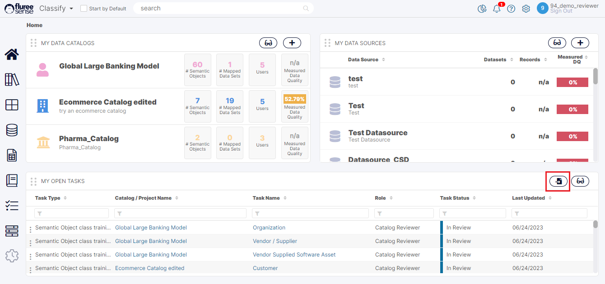
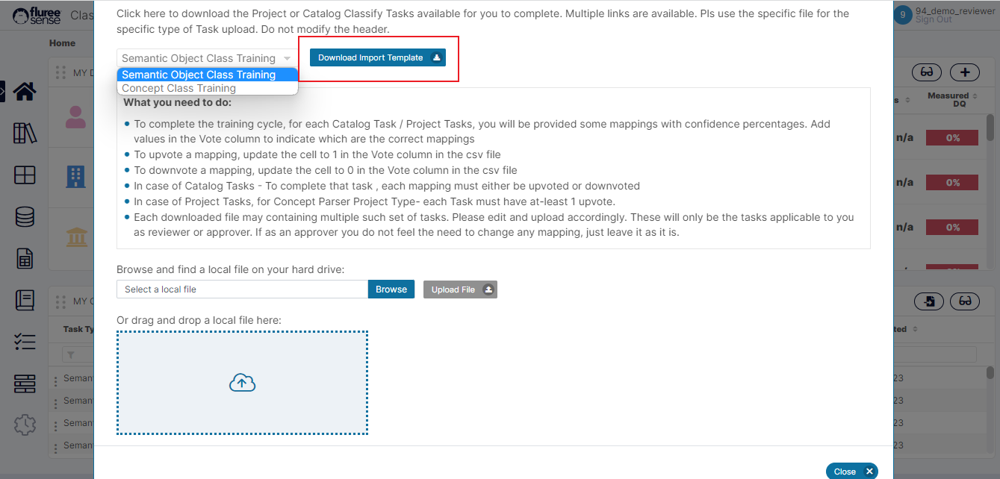

As we have seen in earlier sections, for bulk updates, importing tasks or feedback is the best method. In the case of _Catalog Tasks_, as well, we are providing the ‘Bulk Import ‘ feature. To use this feature:

**Step 1:** Open the Import pop-up by clicking the Import Task icon.

The import Icon is available in all common areas (All Tasks, All My Tasks and My Open Tasks section) from where _Catalog Tasks_ can be viewed. In the image below, we can see how it’s opened from the My Open Tasks section.

**Step 2:** Choose the type of _Catalog Training Task_ & Download the Template

The user needs to choose the _Training Task_ type from the drop-down provided in the pop-up and then download the template. The template is different for both Task types, so please use it accordingly.  
  
The other aspect to note here is that since Tasks are only assigned to Reviewers or Approvers of relevant _Catalogs_, the template will already contain the Tasks assigned to you.

**Step 3:** Edit the Template with upvotes and downvotes.

Let’s check out the image below. In this case, let us assume that the user wants to focus on a specific _Catalog_. The user can filter the _Catalog_ and provide the upvote - as 1 or downvote as 0 in the respective rows. As a best practice, the user should also remove _Catalogs_ (delete rows in the file) if he is not working on them, to keep things clean.  
  
In this particular case, you will notice that for the _Semantic Object_, Organization and _Concept_ Full Name, we have multiple rows. Why is that?  
  
That is because each row corresponds to one mapping.

You may also notice that columns K, L, and M have not been updated. These are optional and correspond to: Expected _Catalog_, Expected _Semantic Object_, Expected _Concept_. These can be filled when, while giving a downvote we want to provide an alternative mapping – as in the on-screen downvote pop-up. This works exactly the same way.  
  
Please remember to save the file once all changes are done.

**Step 4:** Upload the File and correct any errors

On uploading the file, you will receive the standard successful upload message in green if there is no error OR an error message. If there is an error, please examine the error message and try to re-edit the file to solve it. Some key System Validations have been listed below.

**Step 5:** Review that the Tasks have moved on to the Next Stage

Once all of this is done, the screen should refresh and show that the Task has moved on to the next stage depending on whether Four-Eyes Check is ON or not. This is exactly as in the case of individual Task completion without bulk upload.  
  
So if the _Catalog_ has Four-eyes check OFF, then the Task is considered Completed, else the Task needs to pass through the same cycle, either on-screen or through Import by the Approver to move it to completion.  
  
The only thing to note about the Approver is that they see the upvotes/downvotes provided by the reviewer in the downloaded template and need NOT make any edits but just upload the file if they consider some or all the Tasks correctly voted.

**System Validations**

1. Each Task needs at least one up-vote for the file to be uploaded properly. But you can always remove the Task completely (all rows corresponding to it) in case you do not wish to review it just yet.  
    

3. Remember to Select the drop-down corresponding to the actual Task type being Uploaded otherwise, it shall prompt an error.  
    

5. If you provide Expected _Catalog_, Expected Semantic Object, Expected _Concept_ details, please ensure the spellings are correct otherwise it will not prompt.  
    

7. Adding /Editing a Task assigned to another user OR a task not in the correct state, in the file, will simply cause it to be ignored.
