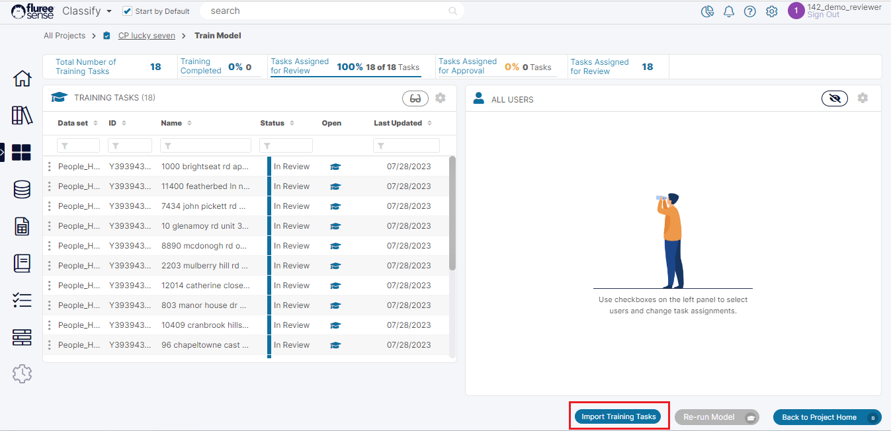
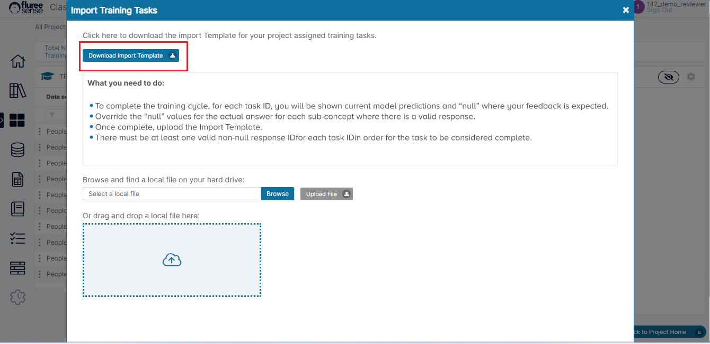
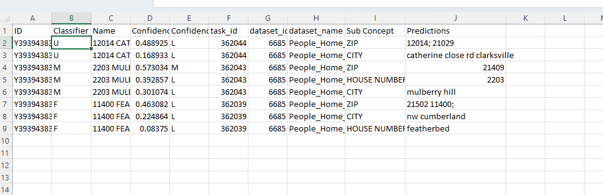

Like the <em>Semantic Object Classification</em> project, we can also Train Tasks in bulk, for the <em>Concept Parser</em> type Project through Import.

In the earlier section, we saw the actual process of Training Tasks from the Task grid, one by one. But there is a quicker and better way if you want to provide feedback to the Tasks in bulk.

**Step 1:** Click on the Import Tasks button or Icon to open the Import pop-up.

This Import Task button is available in the Train Model screen.

**Step 2:** Download the Import Tasks Template

As in the case of SOC Project and other such Tasks, the downloaded file will contain only the Tasks assigned to you on which you can provide feedback. However even if you try to add a task for which feedback is complete or has not been assigned to you, the same will be ignored. As a Project Admin you can provide feedback for any Task of-course, as in the case of on-screen workflow.

**Step 3:** Edit the template carefully providing feedback for your Tasks.

Please follow the instructions in the pop-up when making changes to the Template. Delete a complete row of any set of Tasks you may not wish to work on at a given time but make sure that any specific task’s rows are fully deleted – because each task may have multiple rows corresponding to multiple predictions.

Remember to save your work after all the edits. Example of the Template can be seen below:

**Step 4:** Upload the Template and review the Changes.

After uploading, check if there are any errors and resolve them. Also verify if any Tasks missed getting updated which may be due to violation of any validations.

**Step 5:** Repeat the same Steps described above as an Approver (If four-eyes Check is ON)

All approvers can similarly approve their tasks in bulk by downloading and re-uploading the file. To do this, they can just keep the prediction as it is OR change if they want to. Please note there is no 0 or 1 in use here and instead, we’re just providing the prediction directly in the rows.

The Approver need not make changes if they approve of the existing feedback by the Reviewer OR can change the feedback if they want. Once done, they can re-upload the file and review the results.

In this manner, once all the Tasks are completed, the ‘Run Model’ button may be pressed to re-run the Project which will now take this supervised training in account for generating the next round of Predictions.

**System Validations**

- The CSV will contain various columns such as the Task Id, Classifier, Data Set, Sub-Concept, Sub-Concept’s prediction.
- The user needs to enter a value against the <em>Sub-Concept’s</em> prediction if it is ‘null’ OR can even override it if it’s not null.
- There must be at least one Sub-Concept to which a non-null Prediction is assigned for that Task to be considered valid.
- Voting for tasks which are not assigned to you (except as Project Admin), or not in the correct state will just lead to the system ignoring them in the upload.