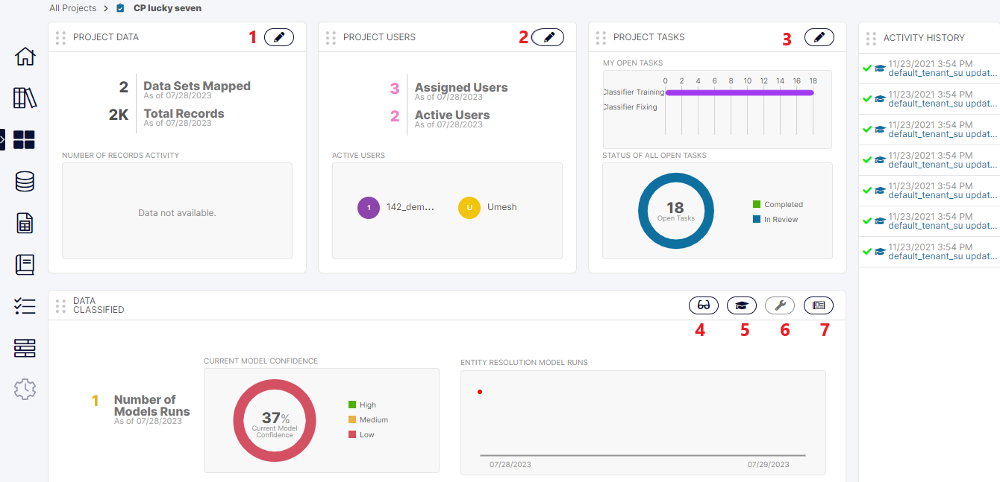

Once we’ve run the Project, it is sent as a job to the Cluster. It may take up to a minute for the Job to be moved to the processing queue and the progress display to appear on the screen. Once the Job starts, the user can see the progress through various stages of the 'Concept Parser' through progress bars with text information in the result areas.

Let’s understand the various sections of the Home Screen, marked with the serial numbers in the image below.

1. **Project Data:** This icon is enabled only for the *Project Admin*. Clicking on this icon allows the *Project Admin* to make changes to the *Training* and *Project Data* i.e. from Step 5 onwards of the Create Project flow.

    Let us take a quick look at this one here itself.

2. **Project Users:** This icon is enabled only for the *Project Admin*. Clicking on this will allow the user to Edit the users and their entitlements for this Project.

3. **Manage Project Tasks:** This allows the *Project Admin* to view the Tasks across all the reviewers and approvers (if 4-eyes is ON) associated with the Project, re-assign them and even provide feedback for any task if required.

4. **View Results:** This allows any of the users associated with this Project (Reviewers, Approvers, Admin) to view predictions for any of the records of the Project Data Set and not just the ones which are Tasks. Any user of the Project can provide feedback here.

5. **Train Model:** This allows the Reviewers and Approvers to provide feedback on their specific Training Task as generated by the Project and assigned to them.

6. **Fix Issues:** This is just to fix a limited number of Final Training Tasks at which point the system is at a confidence level where the gains are limited. It is at this stage that this link becomes enabled and the users can complete the remaining limited number of Tasks to finalize the Project and move it to production.

7. **Publish Results:** Once the Project has reached the required level of confidence, the result of the Project can be published as a Data Set by clicking the link [ 7 ] in the Home screen image. This triggers a Job for the Publish project which in turn publishes the results- basically the Project Data Set along with the high confidence predicted values. This will appear as a normal Data Set of the Application in the Data Set screen once it is complete.