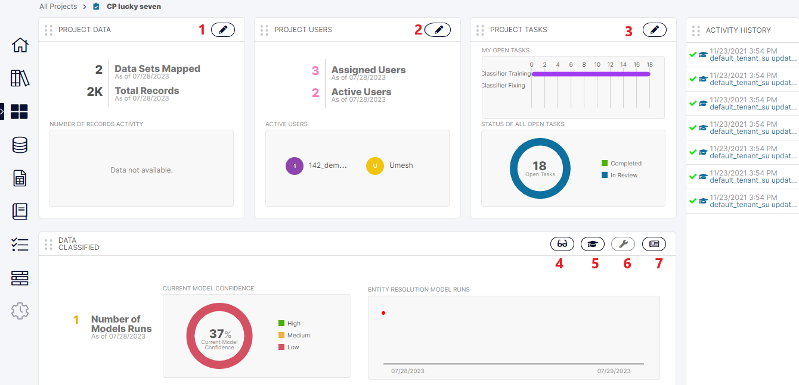

Click on the icon marked [4] in the Project Home Screen to come to the Project Results screen.

This screen shows all the results of the project which are really the model’s predicted values for the Sub-Concepts of the Project.

Notice the three panels where in the first, the user selects a specific record. In the second panel – the user can see the highest prediction for each Sub-Concept as a key-value pair whereas on clicking a specific such prediction in the second panel, the user will see all the predictions corresponding to that Sub-Concept’s value in the third. The user can provide feedback to any of the predictions here which are considered in the next run.

In the screen below, let us see how a downvote on a prediction looks like – whether it is at the Result level or for a specific Task.

