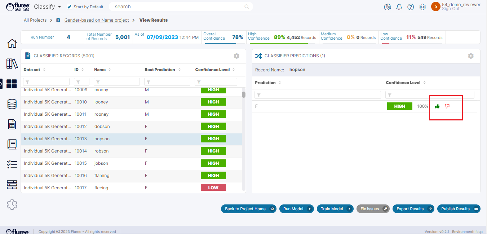

Click on the icon marked \[4\] in the [Project Home Screen](#) image to come to the Project Results screen. This screen shows all the results of the project which are really the model’s predicted values for the Classifier.

It’s important to note that any user can provide feedback here, and these aren’t the model generated _Tasks_ but ALL the predicted records. Naturally, it is unlikely that a user will want to provide feedback to all Tasks but the flexibility and capability is there to filter specific input(s) and provide the feedback for such predictions, which may or may not be present in the generated Tasks.
