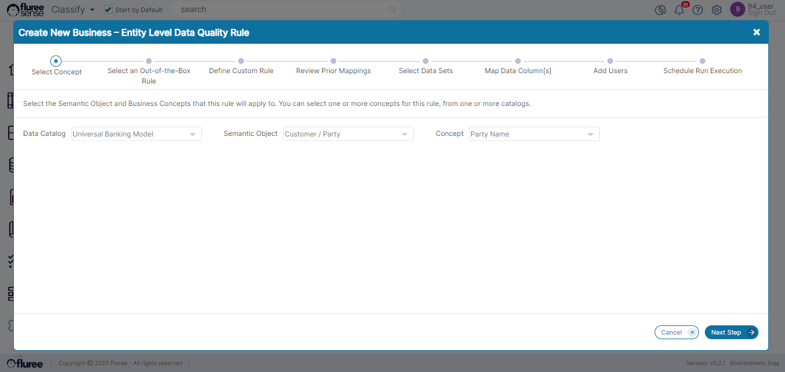
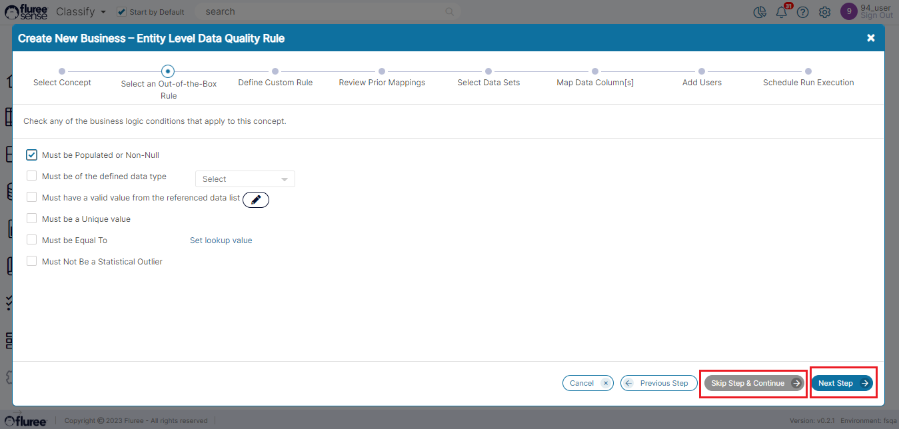
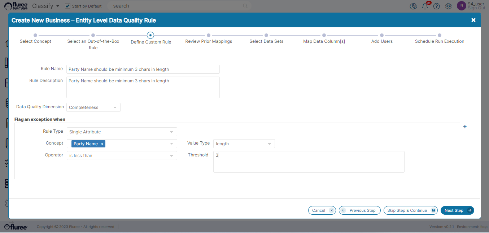
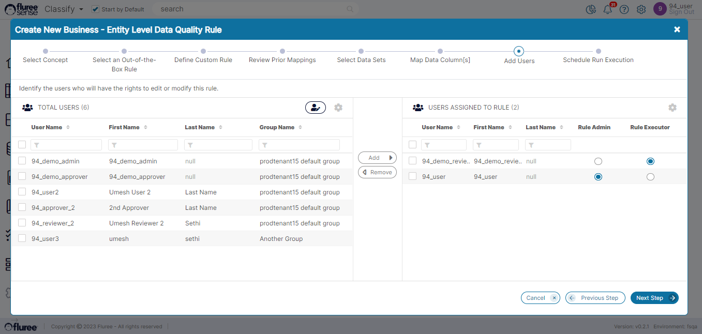

We’ve talked about _Technical Rule_ creation in detail, but imagine a scenario where you’re a Fintech company, which has Data about a customer’s account spread across multiple tables. Suppose you want to run a rule, which says do not provide Credit to the customer if the sum of his liabilities is greater than or equal to twice the assets.  
  
If the Liabilities and Assets are the ‘_Concepts_’ here, then using the power of our _Classification_ system in tandem with the power of our Data Quality Rule management system, a _Business Rule_ can be created across the concerned tables, columns and Data Sets even if they are spread across different source systems.  
  
**Useful Note:** It is important to note here that when a _Business Rule_ is run, it gets converted internally into one or more _Technical rule_(s) which are then run across the identified columns / Tables.  
  
Let us take a look at the process of creating a Business Rule:

**Step 1. Click on the Add Rule icon & Select the Concept**

A user can create a rule either from the _Main Business rule Grid_ screen or one of the Manage Rule screens at _Catalog_ / _Semantic_ _Object_ / _Concept_ or Data Set Level. The workflow is essentially the same with minor differences.  
  
In this example, let us assume the user is creating from the main rule screen.  
  
On Clicking the Link, the first screen of the modal workflow will display the following fields:

| **Fields / Inputs** | **Usage / Examples** | **Validation** |
| --- | --- | --- |
| Data Catalog | Before creating rules, we need to provide the Catalog first. | Mandatory |
| Semantic Object | Next, we decide specify the Semantic Object | Shows _Semantic_ _Objects_ of Selected Catalog. Mandatory |
| Concept | Finally, we narrow down to the Concept on for which the Exceptions are counted (the _‘Primary Concept’_) | Mandatory |
| Next Step |  | Enables only after all Validations |

Let’s assume we’ve filled it with the details below, following the rules above:

**System Validations**

1. No other validations other than the ones mentioned above.

**Step 2. Provide any OOB Rule Details**

We’re not discussing _OOB rules_ in details in this section, but just to give a brief overview - OOB is an acronym for _Out of the Box_, which means that certain aspects of these _OOB rules_ come pre-configured based on widely used exception criteria and the user just needs to make some selection to create them.  
  
In this step, the user needs to choose whether they want to create any _OOB rule_ in the workflow. It is important to note that choosing an _OOB rule_ does NOT mean that the user can’t create a custom rule as well. A user can create both in the same workflow which means that at the end of the process, you could have created two or even three rules together on the same concept – one or more _OOB rules_ and 1 custom rule.

**System Validations**

1. If you choose an **OOB rule,** you cannot deselect it after pressing the Next button because following a system-wide convention of workflow saving; **OOB rule** inputs are saved on the press of the ‘Next Step’ button, and it is already generated.

3. This is why, after adding the _OOB rule_ option in workflow, if you come to the same screen, you will find that option is selected and disabled as now it can’t be undone. You can of-course delete that _OOB rule_ from the main Rule grid if it has been created by mistake.

5. You can click ‘Skip Step & Continue’ if you do not wish to create an _OOB rule._ However, if you select something in this screen, the ‘Skip Step & Continue’ button logically gets disabled and you have to press ‘Next Step’ to save and move forward.

**Step 3. Provide Custom Rule Details**

In this step, the user needs to provide the custom rule details which include the fields below.  
  
Of these, the Exception details are especially important as these are the actual conditions on the basis of which the data quality rule will be processed.

| **Fields / Inputs** | **Usage / Examples** | **Validation** |
| --- | --- | --- |
| Rule Name | Name of the rule (example: Customer name cannot be null) | 1\. Required Field2. Checks if the same named rule already exists. |
| Rule Description | Long text Description  | Optional |
| Data Quality Dimension | Selection \| Completeness, Uniqueness, Validity, Timeliness | 1\. Mandatory   No Other validation as such but please try to select logically. Example: ‘T_wo users can’t have same Id’_  rule probably fits Uniqueness more than Completeness. |

In ‘Flag an Exception when’ section

| **Fields / Inputs** | **Usage / Examples & Validations** |
| --- | --- |
| Rule Type | 1\. Single Attribute - when rule condition is relevant to a single concept2. Multi Attribute - generally when comparing more than one concept      **Validations**   \-Based on the Rule Type chosen, the Value Type and other fields change - for example for Multi Attribute: the display automatically changes to provide for two sets of Concepts.   \-Mandatory |
| Concept  | The difference between the Concept in the upper section (mentioned in Step one, aka _‘Primary Concept’_) of the screen and the Concept in the exception section is that the first one is the one against which the DQ score / stats will be counted whereas exceptions conditions may include multiple concepts.       **Validations**   \-At least one of the exception conditions needs to have the primary concept in it.   \-Defaults to the concept selected in the upper part of the screen (Step 1.).     Filters to the Concepts of the Semantic Object chosen in first screen |
| Value Type | 1\. value            2\. length        3\. regex     4\. max   5\. min    6\. sum    7. average   8\. product   9\. Standard deviation, frequency, Precision   10\. sum between, difference between and product between   11\. custom calculation   12\. datatype     **\* Validations are listed in system validation section** |
| Operator | 1\. equals / does not equal3. is greater than / is less than4. is null/ is not null5.  is greater than or equal to / is less than or equal to6. begins with / does not begin with7. ends with / does not end with 8. contains / does not contain9. between10. is Luhn / is not Luhn11. is within / is not within   **\* Validations are listed in System Validations section** |
| Threshold | Appears only in some combinations of rule type, value type and operator =- - such as when operator is equal to, not equal to, contains, does not contain, begins with, does not begin with, is greater than, is less than etc.   **Validations**    \-This is mandatory in most cases when it appears, except in the ‘Multi Attribute’ rule.  |
| Next Step (Button)  | Click ‘Next Step’ to save the inputs and move to the next step of workflow–    **Validations**   Next Step remains disabled till all validations, required fields are completed – in any screen. |

**Useful Note:** It is a useful practice to name the rule in an understandable, brief and standardized way. It should also be noted that the condition which is being applied in the ‘_Flag an exception when_’ should be the reverse of what the correct data expectation is (which is why it is the ‘exception’ section).

**For example:** Let’s say you have a rule where the Customer Age needs to be at least 13 years for some kind of banking products. So you’d perhaps name the rule as “Customer age should be 13 years or more”. This means that the rule needs to raise an exception if the age is less than 13 years. This means the ‘operator’ used in the condition would be ‘less than’ with a threshold of 13.

**System Validations**

1. On pressing the _Next Step_, the basic details of the rule get created in the system even if all details are not yet filled and it is not ready for running. Thus a ‘draft’ of the rule gets created and even if you press Cancel in the next screen onwards, you can come back later and complete the rule details in [Editing of rules](/docs/sense/Classify%20Module/Data%20Quality%20Rules/editing-a-rule-definition/index.md) which we’ll take up separately.

2. Following are some of the validations required to be completed for Next Step to enable:

- Fields such as _Name, Dimension, Operator, Value Type_ are mandatory.

- If Threshold field is shown for the ‘’_Single Attribute_’ rule, it is mandatory.

- For the ‘_between_’ operator (where applicable) - both lower and higher values need to be filled.

- If the Exception condition operator is: "is within" or "is not within" and the "Data set Name", "Data set Column" and "Filter" fields appear, then the first two are mandatory.

- If Rule type changes to ‘Multi-Attribute’ or is ‘Multi Attribute’, both Concept & Comparison Concept, need to be filled apart from the other mandatory fields.

- At least one exception condition is required but there can be multiple joined by AND or OR operator.

- If ‘Value Type’ is ‘Custom Calculations,’ then a Custom Calculation textbox field appears and that is mandatory.

- At least one of the Concepts used in the Exception Conditions should be the same as the primary concept.

- In case of ‘Multi-attribute’ rules, the operator gets restricted to some specific options relevant for comparison.

**Step 4. Review Prior Mappings**

Since this is a rule on one or more _Concept_(s) – across exceptions, if there are any prior high confidence mappings on these _Concepts_ , they will get shown here. The user can remove any false or unnecessary mapping(s) here. However, if there are no prior mappings, as is the case below, the user should just move on to the ‘Next Step’.

**System Validations**

1. If there are no prior Mappings, a placeholder guidance image like the one above will appear on the screen. However, if there are prior Confirmed Mappings (not predicted ones) to any of the _Concepts_ in _Exception_ _conditions_, they will be listed from which the ones which don’t seem right can be removed.

3. In case of no prior mappings, the user can just add some mappings in the forthcoming steps.

**Step 5. Select Data Sets (for any new Mappings)**

Select Data Sets for any new columns to be associated with _concept_(s) in the exception OR the primary concept for the Rule. This feature is available so that there is flexibility before running of the rule for the user to review and add additional mappings if felt required, which can then be considered during running of the rule.

**System Validations**

1. If there is at least one prior mapping, **only** then can this step and the next one (for adding new mappings) be skipped. Therefore, if there are no prior mappings, the ‘Skip Step & Continue’ button will remain disabled otherwise it is enabled and can be pressed if the user wants to skip the step and apply rule to concept(s) with only their existing mappings.

3. Only the Data Sources and Data Sets to which the user has rights are visible. At least one needs to be moved to the right panel for ‘Next Step’ to be enabled.

**Step 6. Map Data Column(s)**

Based on the Data Set(s) selected in the earlier step, Data Columns get listed on the left side for all those Data Sets. On the right side, the _Concepts_ related to the exceptions in the _Custom_ _Rule_ _Definition_ screen are listed. The objective here is to allow users to map columns to the Data Set through drag and drop operation as can be seen here.

Existing mappings between that Data Set and concept will be shown as well.

**System Validations**

1. _Next_ _Step_ button will only be enabled if there is at-least one mapping on the right.

3. This whole screen along with the earlier screen can be skipped if there were prior mappings.

5. Existing mappings of the Data Sets which the user chose from the last screen will also be visible here for ready reference and to avoid duplication.

Step 7. Add Users: As we’ve seen with other Objects / Elements of the system, it is important to define the entitlements for specific users in terms of data quality rules.  
For rules, there are two types of entitlements: _Rule_ _Admin_ and _Rule_ _Executor_

**Step 8. Schedule Run Execution**

This works exactly like the Schedule Run Execution screen for Technical rules so we’ll not repeat the details again.  
  
In this case, assume that the user chooses to Run the Rule just once and immediately. Hence, he or she keeps the default ‘Once’ option selected and just presses the ‘Save & Run’ button.

**System Validations**

1. Fields and validations are exactly the same as the ‘Schedule Run Execution’ step of [Technical Rule creation](/docs/sense/Classify%20Module/Data%20Quality%20Rules/creating-technical-rule/index.md) flow. Please check out the images and tabular listing of validations there.
