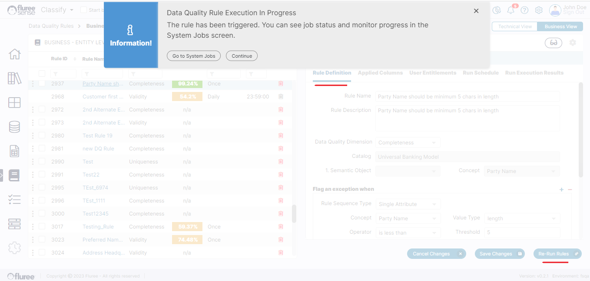
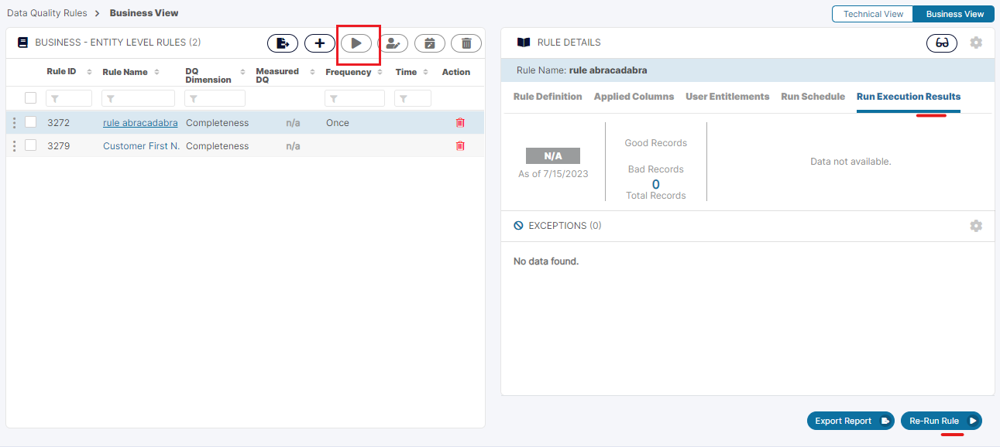

If you recall, during rule creation we had the option to just Save the rule or Save & Run. So what happens if we just Save the rule? How do we run it – especially if it is scheduled as ‘Once’ or as a manually triggered rule?

Fluree Sense provides the **‘Re-run Rule’** button to run a rule immediately or on an ad-hoc basis once it has been created. This may be needed if you’ve updated the rule and saved it, or if some concept mappings have changed and you wish to review the changes sooner rather than as per schedule.

It needs to be noted that after editing a rule, Saving Changes is separate from Re-run.

1. Re-run does NOT save the rule, so it needs to be saved first if we want the edits to be considered during the Running of the Rule.

3. Re-run Rules can be applied to any type of ‘Scheduled’ or ‘Once’ rules to run them immediately.

This feature is available in the footer from the following two tabs in both _Business_ & _Technical_ _rules_:

The ‘Rule Definition’ Tab can be seen in the image above and the ‘Run Execution Results’ tab is seen below.

The user can also run multiple rules simultaneously by selecting the rules in the grid and pressing the 3rd icon in the top control bar for running rules in bulk.

We advise using this with care as there is no hard limit on the no. of rules you can select but all the rules process as jobs in a queue, and so as to keep queue size and computation reasonable, perhaps avoid running more than 10 rules at a time.

Other than this, ‘Re-run Rule’ option is also available in some of the other views related to _Data Set_, _Concept_ etc. in the results grid, providing a lot of flexibility.
