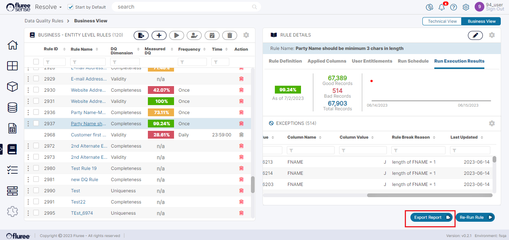
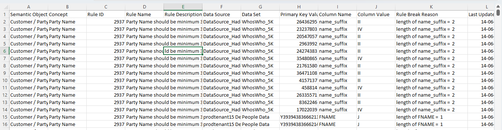

Exceptions are essentially the results of the rule. If the rule is broken for any record of the concerned Data Set, an exception record is generated. This is available for view once the Rule Run is complete and the Score appears in the Rules List grid, for that rule.

You can check the exceptions at any time during or after the rule has run from the Exceptions tab, after selecting the rule in the Left Panel.

There are three possibilities when you do this:

1. Rule executes (called a ‘run’) and there are exceptions.

2. Rule executes (called a ‘run’) and there are no exceptions.

3. Rule is unable to complete its run due to some error.

Let’s look at the screen below to see how the exceptions are shown in the main view in case of the first scenario.

In the second scenario, the main difference is that the lower part of the right panel will not show any exceptions and the Quality score will understandably be 100 %. Case 3 will also not show any exceptions but will have a different look as is detailed in [this section](/docs/sense/Classify%20Module/Data%20Quality%20Rules/rule-validations-&-error-handling/index.md).

When the user clicks the ‘Export Report’ button, a CSV with all the generated exceptions is shown looking the below snapshot:

Any registered user of the Tenant can view the rule and check out the exceptions or export them.

**Useful Note:** It is important to understand that we’re working in a cloud environment and the exceptions are not stored in our meta-data database where the application resides but in the Databricks (or other Data Lake) cluster. Therefore, there may be a slight delay of a minute or two while the cluster wakes up (if not in active state) and returns the exceptions, when we try to view them the first time around.

For this reason, you may see an information message like the one below. This does not mean there is a system error or problem, but just indicates that the cluster is in the process of waking up.

