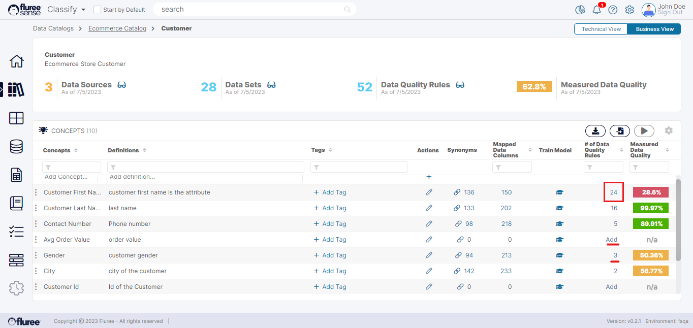

Let us check out the Data Quality Rule Views at the Catalog Level. These include:

- View for the Whole _Catalog_

- View for a specific _Semantic_ _Object_ in a _Catalog_

- View for a specific _Concept_ of a _Semantic_ _Object_

We’ll take an example at Concept level to understand this better. Let’s look at the images below:

In this case, assume that the user is within a _Semantic_ _Object_ (‘Customer’) and sees the list above. Notice two of the concepts : ‘Avg Order Value’ and ‘Gender’. In the ‘# of Data Quality Rules’ column we can see the word ‘Add’ displayed for the ‘Avg Order Value’ row. This indicates there is NO rule linked to this specific Concept as of now and the user can create a row from here rather than from the main grid.

**Useful Note:** The small benefit of creating a rule from this level by clicking ‘add’ is that the Catalog, _Semantic_ _Object_ and _Concept_ get chosen and the flow starts from the 2nd screen of ‘_Create_ _Business_ _rule_’ flow.

Now consider the 2nd marked _Concept_ ‘Gender’ which shows 3 rules are already available for that _Concept_ and that the Data Quality score at that _Concept_ level is 50.36 % as you can see. Hence, the user can view aggregate scores at a specific _Concept_, _Semantic_ or even _Catalog_ Level like this _Concept_ listing, _Semantic_ _Object_ listing and _Catalog_ listing screens.

Moving on, let’s assume the user clicks on the rule count ‘24’ for another concept of interest in the image above: ‘Customer First Name’. Upon clicking this count, the user will be redirected to a screen providing all the Data Quality Rules and Score Summary for that _Concept_, as per the image below.

This seems like a very busy screen so let us go by the numbering to understand what each element signifies.

1. Aggregate DQ score at that level (with an as of Date signify when last updated)  
    

3. Records summary: Records are aggregated as the distinct good or bad records over all the Data Sets on which the exceptions occur for that concept.  
      
    Before you ask – why are we talking about Data Set’s here? This is a _Concept_ after all. Let us recall what we learned during the introduction to _Business_ rules that ultimately every business rule gets converted to a technical rule which is applied on records in Data Sets.  
    So here the user can see: Total Records, Good Records and Bad Records.  
    

5. This section shows the Data Quality score for various dimensions which are sliced views based on what was selected during rule set-up.  
    

7. This shows the run summary chart with DQ score trend at this very level across various run-time dates. This is very helpful in understanding the trend of Data Quality for a _concept_, _Object_ or _Catalog_.  
    

9. This is the edit icon where the user can manage Data Quality rules for this concept. Remember our main grid for Creating the _Business_ or _Technical_ Data Quality rules. Clicking this will lead to a screen like that view BUT filtered to that specific _Concept_ / _Object_ or _Catalog_.  
    

11. Finally, the user can obviously select a rule from the left lower panel and view the result on the right.

Upon clicking the edit icon as mentioned in # 5, the user can see the view as shown below:

This works exactly like the main grid of Data Quality rules available from the left navigation. It even has the same control icons on the top. A user will see this kind of filtered view.

Rule View Aggregation at these higher levels is calculated as: (Records without any Exceptions mapped to that _Semantic_ _Object_ / _Catalog_ – aggregating across the concepts) / Total Records.
