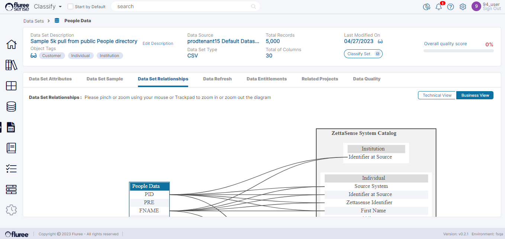

Data Set Relationships can be accessed through the namesake tab (i.e., ‘Data Set Relationship’) after opening a Data Set. Access to this tab requires a minimum of _Data Read Entitlement_ for the Data Set.  
  
If the Data Set has been _Classified_ at least once, then the user will see a _Relationship Diagram_ of relations between that Data Set’s Columns and different _Concepts_ across the Semantic Objects of the System in the _Business View_. The user can also see _column-to-column_ relationships in the ‘Technical View’.

**System Validations**

1. If a Data Set has not yet undergone the Classification process for the first time, the user will be able to run the Model from this tab itself from a placeholder image.

3. If the user has access to a Tenant without Classify licensing, the Business View will remain disabled.
