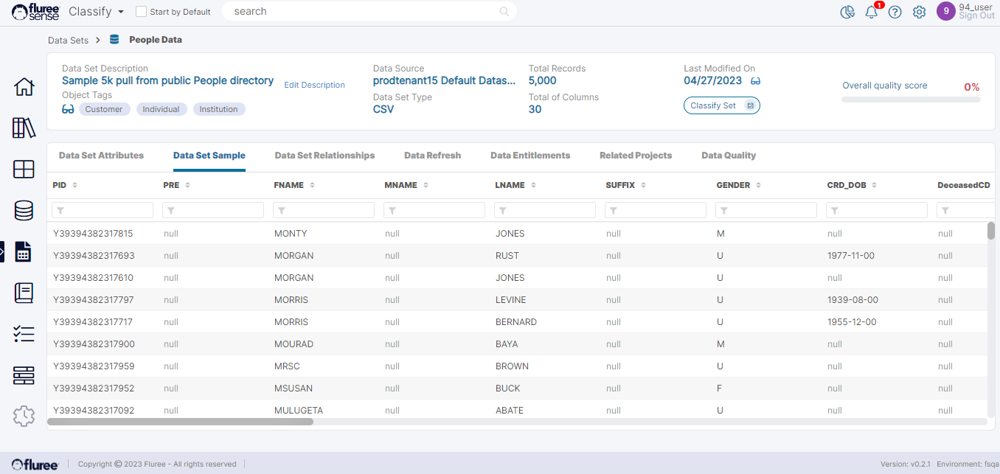

By clicking on the _Data Set Sample_ tab, the user is taken to a screen where a sample of all the columns of the Data Set is shown. Note that Data Set Columns tagged as PII, (Personally Identifiable Information) will be masked. Columns are tagged PII not directly but by their concepts in Catalog which we’ll talk about in another section.

The Data Sample, along with the profile information, which shows as a section in the _Data Set Attributes_ tab, is useful to understand the features and properties of the data.

**Useful Note:** You will find the sample information also available as a popup through links in many screens- within projects, rules, etc. It will also have a second tab for the profile along with it. These tabs show the kind of Data available from the sample as a quick and easy check. This can help the user make a judgment about the mappings, quality, etc., of that Data.
