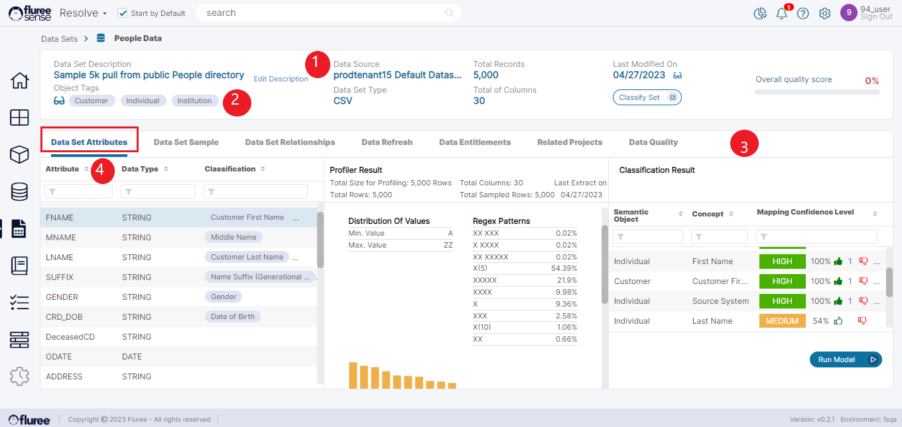

After the user creates and registers a Data set, they can click on a dataset to be redirected to the main Data set page. This page will give key information about the Data Set.

Here's a brief explanation of the sections in the page which are marked with numbers -

1. Key dataset information, such as the Data Source, the file type, the number of rows, the number of columns, and the last modified date.

3. Any _Semantic Objects_ this dataset has been tagged or predicted with.

5. A panel, which can show the dataset attributes, dataset sample, the refresh schedule, the user entitlements, and any projects that are using this dataset.

7. The list of attributes of this dataset along with any concepts that have been tagged or predicted to those attributes.

9. The Data Set profile snapshot. The profile is important to analyze the kind of data – such as how many nulls, maximum and minimum, Regex patterns etc.

Let’s also take a quick look at the second panel called ‘Profiler Result,’ which includes:

1. Percentage Unique

3. Percentage null

5. If it is a primary key candidate

7. Min/Max values

9. Data type

11. Regex patterns

13. Top 10 most/least frequent

Lastly, in this screen, the user can provide feedback on the mapped attributes in the third panel and run the _Classification_ model. We’ll take that up in a detailed manner in this section.
