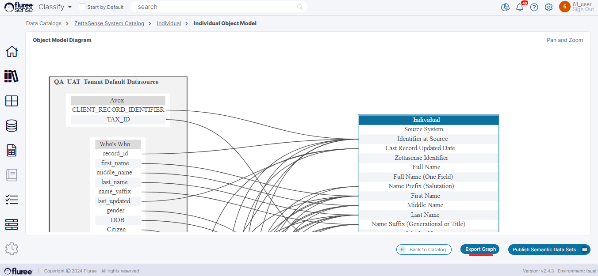
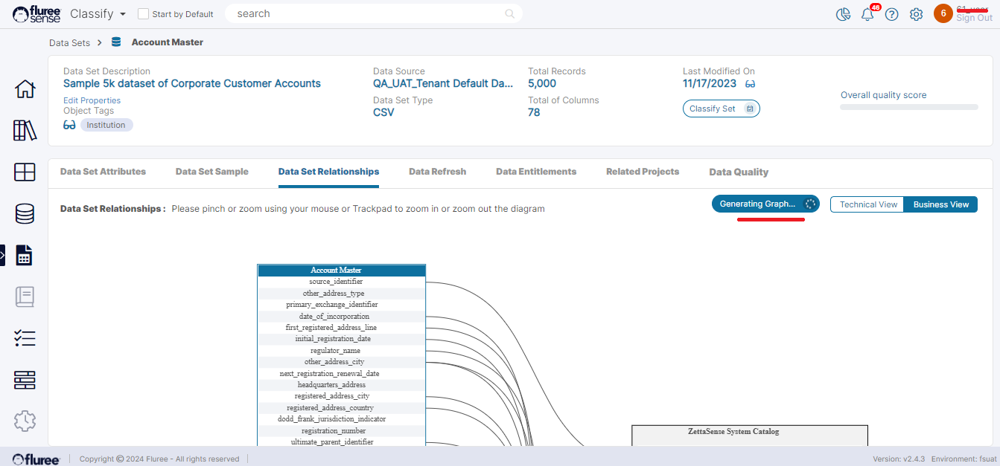

In our discussions with clients, we recognized Exporting Data Set details and relationships as a Semantic Graph as an important feature they were looking out for. Fluree Sense now provides for this feature of publishing and exporting out data in Semantic Graph (JSON-LD format) from two different screens.

This is available in a) View Semantic Object Model screen as well as b) Relationships tab of the Data Set screen. This feature is available by following the below steps:

**Step 1**: Open the specific Dataset from the Dataset List and browse to the 'Data Set Relationships' tab

As seen [here](https://sensedocsdev.wpengine.com/data-set-relationships/) , we have Data Set Relationships tab for every Data Set. A user with Read-Write or Admin rights, apart from seeing the Data Set Relationship diagram , will also be able to see the 'Export Graph' button in enabled state. Otherwise it shall be disabled. Since this feature is in a Data Set Screen, it is available in both Classify & Resolve.

**Step 2**: Alternately initiate this process from _View Object Model_ screen for a specific Semantic Object

In this case also we are generating the exporting the same graph , but between a specific Semantic Object and it's mapped Data Sets rather than at Data Set level (across multiple Semantic Objects).

**Step 3**: Click on the 'Export Graph' button

The user needs to click on the 'Export Graph' button to start exporting the graph. Like the import, this process also triggers an ad-hoc job which could take from a few seconds to few minutes depending on the Data Set size. The button will change label to 'Generating Graph' while it is processing. In the image above, we're showing the process initiated from _Data Set Relationships_ screen but as explained in Step 2, this feature is also available from Catalog > Semantic Object > Technical View > View Object Model

**Step 4:** Browse away from the screen , waiting for the Download

As explained above, the process may take time so it is fine to browse away and take care of other pending tasks will the graph is generated in the background.

**Step 5:** The files will be automatically downloaded to the 'Downloads' directory in your local machine as zip file.

If the graph is successfully generated, it'll be automatically downloaded to the 'Downloads' folder of your local machine as a zip file because it contains multiple files. Please note that for now there shall be no further alert or notification of download. The above image shows the typical folder structure.

**Step 6**: Review the various files from the Zip

Once the zip is downloaded, the user may unzip to review the exported graph. This zip will typically contain:

1. The Catalog files - This has sub-folders for each Catalog and a file for each Semantic Object

3. The Data Set file containing the classes and properties and even the Data (instances) - There is a folder for each Data Source.

5. The Classification file - The file containing the mapping between the properties and Data Set columns.

The above image shows an example Classification file.
