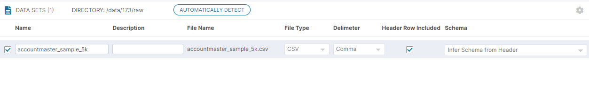

In our help section, we have already covered the very useful topic of Data Set registration which is a pre-cursor to doing anything useful with a Data Set. Just to recap, this brings in the Data Set meta data, profiling information etc. into the system and makes it ready for ML analysis. As part of this process, Data Set classification is also triggered which tags Data Set columns which to one or more Catalog concepts using ML models.

However there is a slightly different use-case as well, where the Business schema and the Dataset Schema i.e. the Data Set column are known to have a 1-1 relationship with exactly the same names - and extended classification process is not required. Consider for example the case of lets say _SAP_ or some other ERP with very specific names, for which a custom business schema: i.e. - a Catalog with Semantic Object concepts matching the column names - already exists in the system. This use case can be achieved now, thanks to a new feature (Released with v2.4.5) in Data Set Registration screen.

This is shown in the screen working in the image below.

In this case, the system would run a quicker classification process - simply mapping the concepts to the columns of the Data Set on a 1:1 basis. The key point to note here is that a user can still register multiple Data Sets, of which some may use the 'Map to Existing Catalog Schema' option which corresponds to the new process.

Here the user would also need to choose the Catalog and Semantic Object name where the matching column names are supposed to exists. However, other Data Sets may still use the standard Classification where the drop-down would default to : "Infer Schema from Header" as shown in the image below.

A third case may be where the user does not check the "Header row Included" checkbox at all, and may add the schema in the input box. All of these can be pushed for registration together.

**System Validations**

1. If 'Header Row Included' checkbox is checked, the Schema input box transforms to a dropdown containing 2 options : "Map to Existing Catalog Schema" & "Infer Schema from Header" with the latter as the default one.

3. The new Classification process is triggered only when 'Map to Existing Catalog Schema' is selected and this opens up 2 dependent drop-downs : first to choose a Catalog and second to choose a Semantic object. The 'Next' button in the screen does not enable till all these dropdowns have valid selections.

5. If 'Infer Schema from Header' is selected as the option, then no further drop-downs show up and the row is complete.

7. If 'Automatically Detect' option is chosen then the system tries to automatically detect the header etc. as was being done in the past . This may be time consuming and there is no option to trigger the new classification process from here.

9. During re-profiling, these options chosen during Registration are re-considered.
