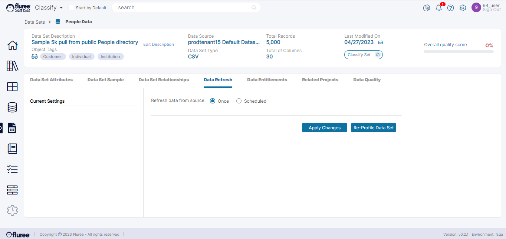

A Data Set undergoes _Registration_ and _Profiling_ the first time it is registered. This is explained in detail in the [Editing a Data Set](https://sensedocsdev.wpengine.com/editing-a-data-set/) section. However, in the practical world, data never stays constant. Often, a Data Source will be a changing one which will get updated periodically. Provided certain conditions are met, Fluree Sense provides the capability of being able to refresh your data and get the delta (changed) records ad-hoc or as per a pre-set schedule.

This brings us to the scenario where Data may need to be refreshed and/or re-profiled as per a schedule. In this screen, the user can either set Scheduled Refresh or do the same thing on an ad-hoc basis.

- To re-profile the Data for your Data Set immediately, simply click on the ‘Re-Profile Data Set’ button, as can be seen in the screen below.

- To refresh and re-profile your Data Set according to a schedule, you can instead click on the Scheduled radio button, which will open the alternate view as below. This is an emerging feature and may be available in beta initially.

