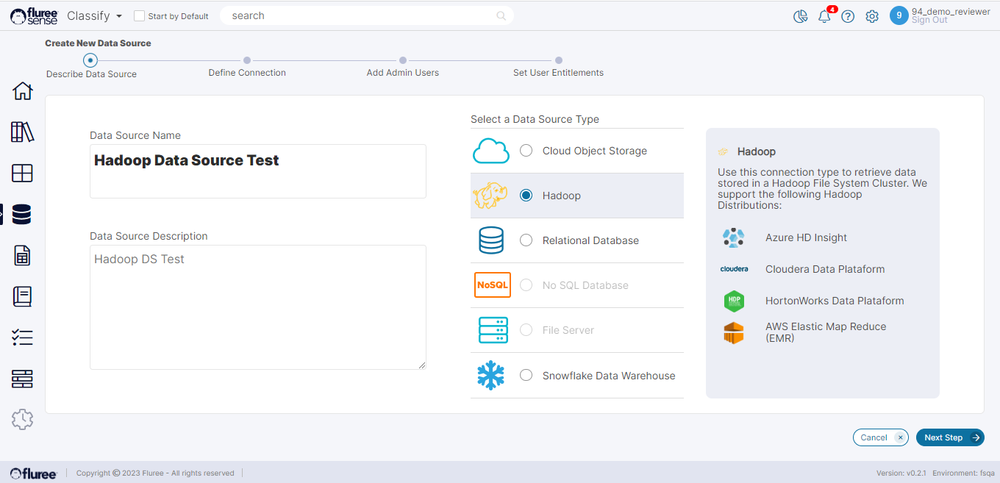

Creating a new Data Source connection begins with choosing the Data Source Type and some other details as shown in the screen below. You can have multiple Data Sources feeding into the _Classify_ product. This also requires entering the:

- Name of the Data Source (Mandatory)

- Description

- Data Source Type and

- Sub Type in some cases

On clicking the Next button, the user can enter the connection details which will depend on the Data Source type chosen in the previous screen. To move ahead, the user needs to add the connection parameters and click on the ‘Test and Validate’ button to make sure that the connection-string is valid.

These details may depend on the Data Source type and subtype but will generally contain the name of the Cloud Account, Access Key, Container and Path.

If valid, the connection string is saved for future use and the Next Step button gets enabled. This can be seen in the screen below:

The Path of the Data Source is the relative path to where your files are placed in case this is a _File Type_ Data Source. These files can be Parquet, CSV etc. The container name is provided for the cloud container name. Our support team can assist you in creating and connecting with data sources for the first time and then the same process can be followed for other Data Sources.
