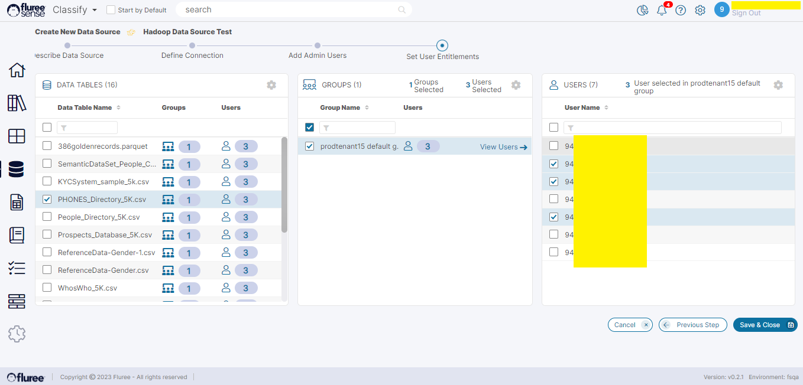

In the previous section, we assigned _Data Source Admin_ rights but that is not the end of the matter. Each Data Source contains content files or Tables. To use the Data from these files or Tables, it is also required to provide their entitlements to selected users.

**To recap**: A user having the _Data Source Admin_ role gets default entitlements to all the files. But there may be some Files or Tables which are relevant and supposed to be accessed by a certain set of users. For example, customer-related files are accessible by one set of users, Account related files are accessible by another set. In this case, the _Data Source Admin_ user can grant other selected users access to specific content. This is done in the ‘_Set User Entitlements_’ step as follows:

**Step 1:** Select the specific Data Tables/ Files from the left Panel to which you wish to provide access.

**Step 2:** In the middle panel, choose the group and then the users to whom you wish to grant access.

**Step 3:** Finally complete the assignment in the 3rd panel as can be seen below. The user needs to press ‘Save & Close’ to complete the process.

**Useful Note**: As will be seen in the Data Sets section, a user will not see the files to which they don’t have access, and hence not be able to create Data Sets out of them.

With this, the Create New Data Source workflow is complete. Although you can stop at any step of the workflow after saving the information as a draft, a Data Source with incomplete information is unlikely to be useful. So, be sure to complete the steps.

**System Validations**

1. A User with the _Data Source Admin_ by default will get access and usage rights to all the contained files or tables of the Data Source.  
    

3. A User with the _Data Source Admin_ role will be able to assign others to specific files or tables providing them usage rights to it.  
    

5. Only the _Data Source Admin_ and any User(s) entitled to that File / Table shall be able to use it to create a Data Set from it.  
    

7. You cannot Edit a Data Source Type once it has been set for a Data Source. Just create a new one if you wish to use another type. This is because of the fact that a Data Source type changes the whole identity and structure of the source essentially making it a different source and disallowing useful follow-on edits.
