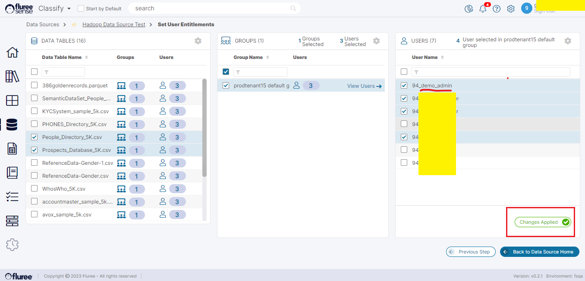

We’ve seen in earlier sections that a user can only modify or access the details of a Data Source where they are the _Data Source Admin._

There are two ways to manage Data Source entitlements -

- Using the Edit Data Source workflow (already explained in the previous section)

- Using the detail view for a specific Data Source. You can access the detail view by clicking on the Data Source name.

Since the first method has already been discussed in the previous section, let’s examine the second method.

Let’s say you have _Data Source Admin_ entitlements to a Data Source titled ‘Hadoop Data Source Test’ and you wish to change the Entitlements. You can change both the users with Admin access as well as Content Entitlements starting from the screen below.

On clicking the ‘Manage Access’ icon marked on the screen, you will come to the ‘Add Admin User’ screen. This is essentially the same screen as the one that is accessible in the Edit Data Source flow but you can access it directly through the Data Source Detail screen shown above.

Save the changes made to the Data Source by clicking the Apply Changes button. In case you wish to Edit Content Entitlements as well, you will need to click on the Next Step button. Else, you can return to the Data Source Home screen by clicking the ‘Back To Data Source Home’ button.

As seen in the screen below, a new user has been granted access to the selected Data Source content.

