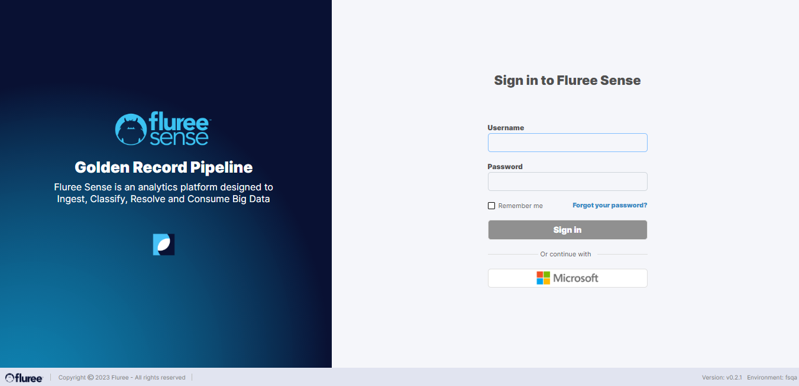

Login to your account by accessing the URL provided to you and enter the provisioned User ID and password as shown below.

From here, you are taken to the home screen. Here you will see all the pipelines that you - as the user - have access to. There are four main areas of focus on the home page:  

1. **My Data Catalogs:**  
    The last three of the Data Catalogs that you have access to will be listed in this panel. You can access the catalog directly or go to the full list of catalogs. From there you can see all catalogs that you - the user - have the rights to access.  
      
    

3. **My Data Sources:**  
    These represent the current systems that _Classify / Resolve_ has been given access to for acquiring raw data from the source system for Classify or Resolution. The source systems that appear under Data Sources are only those that an Administrator has granted you access to. If you do not have access to a specific Data Source, the Source System will not appear in this panel.  
      
    

5. **My Open Tasks:**  
    These represent the learning tasks that are currently assigned to you that are still awaiting your feedback. You can quickly traverse and complete your tasks from this panel. These tasks are important to train the model for a Project or Catalog.  
      
    

7. **Navigational Menu:**  
    This allows the user to access all other system functionality. This menu displays icons for other functionality that you may have access to depending on the rights you have been granted in the system. You can access:  
      
    - List of all **Catalogs**
    
    - List of all **Data Sources**
    
    - List of all **Projects**. This will show the list-view of all Projects, be it the Concept Parser or Semantic Object Classification type projects.
    
    - List of all **Data Sets.** In this case, Data Sets represent different files or tables that may be under a Data Source. In other words, a Data Source may have one or more Data Sets within them.
    
    - List of all **Data Quality Rules.** This shows the list of all Data Quality rules for your tenant. This will only be available if your subscription includes the ‘Data Quality’ add-on – which is a very powerful feature.
    
    - List of all **Tasks**. This will show all the tasks that are either assigned to you - the user, or part of a project where you are the Project Admin.
    
    - **System Jobs**. This is where you can see system functions that are running. For example, you can see which unsupervised or supervised projects are running.
    
    - **Admin** rights. This is only available if you have Administrator access, and this lets you manage users and other application-level configurations.

You can expand the left menu to see the full title description, next to each icon.

**Useful Note:** The prerequisite to being able to view and use these features as a _Classify_ module user is that a _Tenant_ has been created, and you have been set up as a user on that. The process of Tenant Creation, User set up etc., has been covered in detail [here](#).
