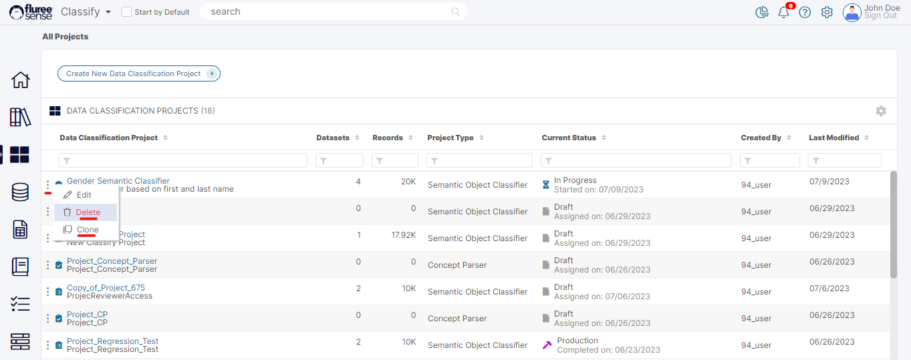

A _Classification Project_ can be Cloned to provide the user a means to tweak or change the inputs of the project and re-run it keeping the original project intact. This can be thought of as an A-B experiment feature provided to users, to experiment with their project features.

Cloning of a _Classification_ project will replicate all the input Data pertaining to the Project i.e. - the users, the Training and Project Datasets, etc. However, it will keep the name of the Project unique by changing the name as follows.

**Example:** Let 1873 be the unique Id of the original Project:  
  
Original Project Name: _Widget Project B_  
  
Cloned Project Name: _Copy\_of\_Widget Project B\_1973_  
  
Here 1973 is the new project’s Id.

You can Clone a _Classify Project_ that you are the Project Admin of.  
  
To clone a Classify project, open the ellipsis side menu next to each Project in the Project List screen. Clicking on the ‘Clone’ link will create a copy of the Project as per the explanation and example above with the ‘create project’ workflow opened.

**Useful Note:** Another thing which is required to be changed in a Cloned Classification Project is the Classifier name, if the same Semantic Object is being used. So, be sure to change it and any required Concept, Training or Project Data before running it.

**Deleting a Semantic Object Classifier Project**

You can Delete a _Classify Project_ that you are the Project Admin of, through the ellipsis side menu next to each _Project_ in the _Project List_ screen. Clicking on the Delete link will provide a warning message, which when confirmed, deletes the project.  
  
The Project will disappear from the screen and not be available for any Classification or other such processes. The mappings of the Project shall not be in use further.  
  
The _Classification Project_ also ends up creating a concept (the ‘Classifier’); so please Note that Project deletion does **not** delete this Concept as the concept belongs to a Catalog.
