A user can view the current projects in the _Tenant_ by going to the _Data Classification Projects_ listing screen from the ‘_Project’_ option in the left navigation panel of the _Classify_ module.

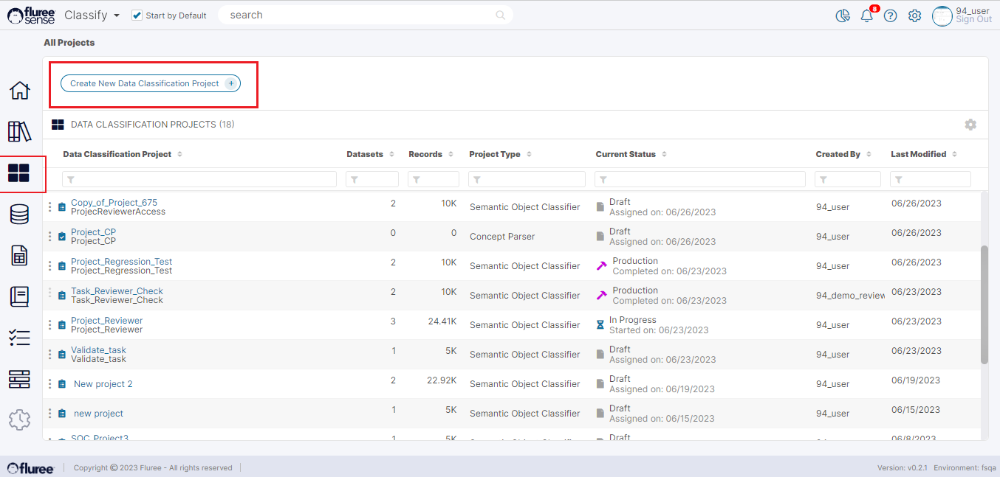

Once you’re in the _Data Classification Projects_ screen - as seen above, just click on ‘_Create New Data Classification Project_’ button in the header to begin the workflow for creating a new _Project_.  
  
**Step 1. Define the Type, Name and Description of the Project**  
  
On clicking the button, the workflow modal opens. The user needs to:

1. Choose the _Project Type_

3. Provide a unique _Project Name_

5. Add an optional description of the _Project_

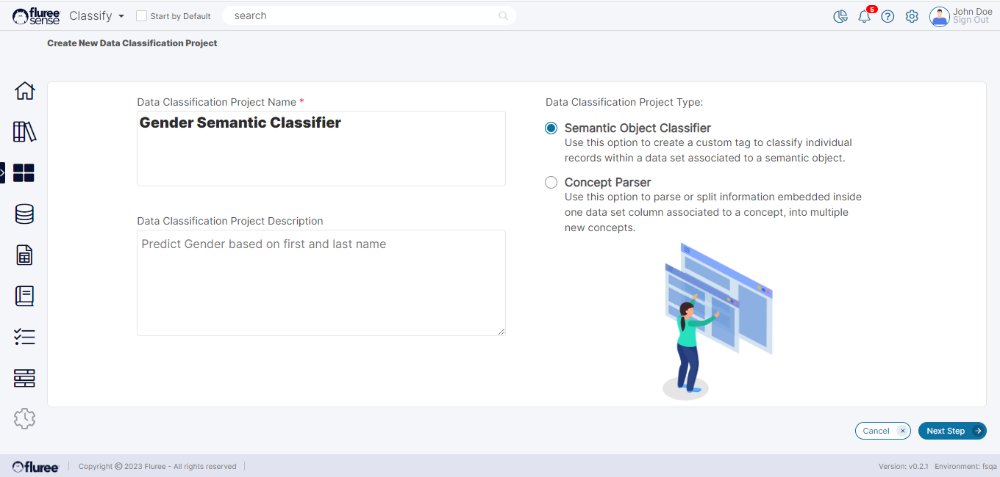

**System Validations**

1. _Project Type_ is required.

3. The _Name_ is required and should be unique.

5. In the case of duplicate names, an error is shown, and the user needs to change the name.

**Step 2. Add Users to the Project**  
In this step, you can list the users which will have various roles for the _Project_. There are three roles- The Rule Admin, Reviewer, and Approver. Please check the section on ‘[Four Eyes Check and Entitlements](#)’ to understand them better.

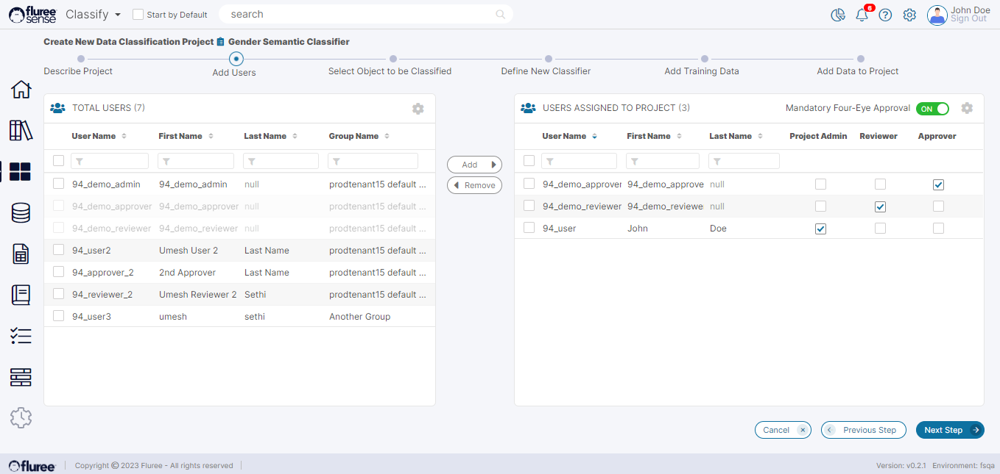

Once you’ve added the required users for the project according to the Four Eyes check, you can move to the next Step by clicking the ‘Next Step’ button.

**System Validations**

1. When the _Project_ is being created, the logged-on user is defaulted to the _Project Admin,_ but can add more Admins.

3. A _Project_ with 4 eyes check OFF requires one Reviewer other than the Admin and with 4 eyes check ON requires one Approver other than the Admin and the Reviewer.

5. Remember to always check the checkbox for the role after moving the user from left to right otherwise it may prompt a warning.

**Step 3. Select the Semantic Object to be Classified.**

In this step, please choose the Semantic Object, which is to be _Classified_. For example, let's assume we’re trying to predict/classify the customer’s Gender based on certain aspects, and the Semantic Object is named: _Individual Person_. This should already be available in the Catalog.  
  
In the image below, we select the _Catalog_ from the drop-down and subsequently - a single _Semantic Object_ from the list of _Semantic Objects._

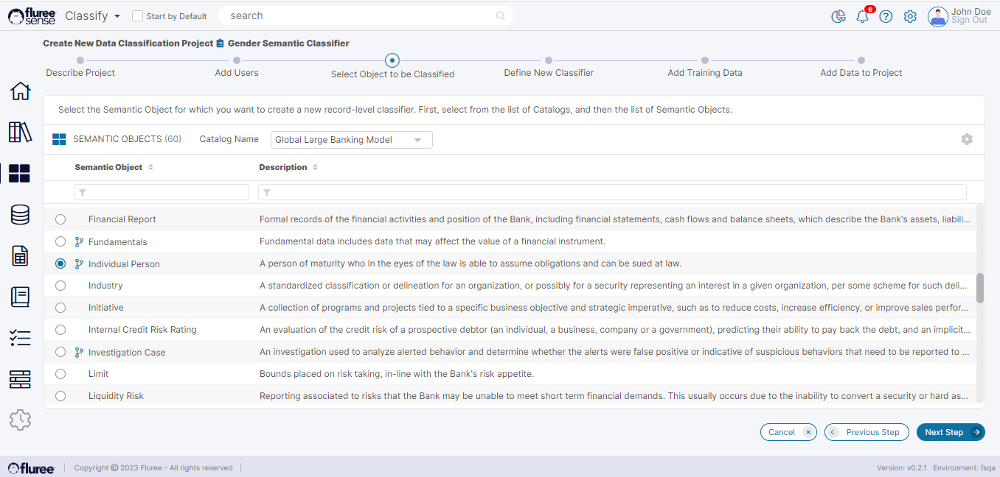

  
**Step 4. Define the New Classifier & its Reference Data  
**The _Classifier_ is the property which will contain the predicted values of the _Classification_. Continuing with the example of Step 3, if _Individual User_ is the _Semantic Object_ and we’re trying to predict/categorize by gender, we can name the new _Classifier_ as _Predicted Gender_. So, Predicted Gender becomes the _Classifier_ and is attached as property (we can call it ‘Concept’ as well) to that Semantic Object.

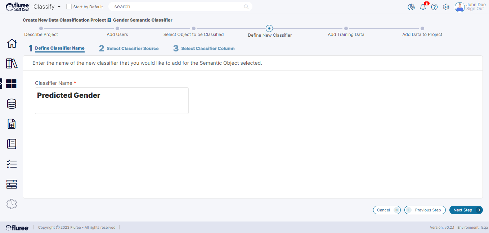

And once we’ve provided the Classifier name, we must provide where to pick its possible values from.  So, we zero in on a single Data Set first:

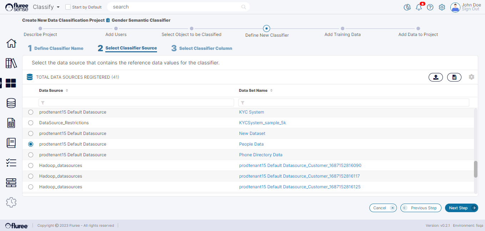

… And then the single column which contains the values of this Classifier.

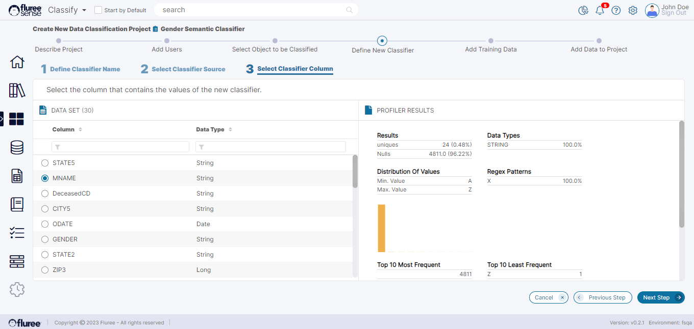

**System Validations**

1. _Classifier Name_ is required and should be unique within that Semantic Object.

3. A Classifier, which you declare here, essentially becomes a _Concept_ for that Semantic Object - but a special one, which is being predicted as part of this project.

**Step 5. Add Training Data to Train the Model for Classifier Prediction**

As we know, Machine Learning models need to be trained to get the correct result. This is what we do in this step by providing the Data Set and the actual columns on which we feel that the Classifier is dependent. Taking forward the example of Step 3: _Predicted Gender_ as a _Classifier_ could be dependent on the user’s _First, Middle, Last Name_ and so on.  
  
This is a very simple example, of course.

There is another powerful aspect of the _Classify_ module that we use here. We have covered how a user can classify Data Sets or discover Data Set columns in earlier sections; so in the next steps, the user doesn’t provide the columns directly as the features, but instead, provides **Concepts of the same Semantic Object**. Let’s see how that looks on the screen below.

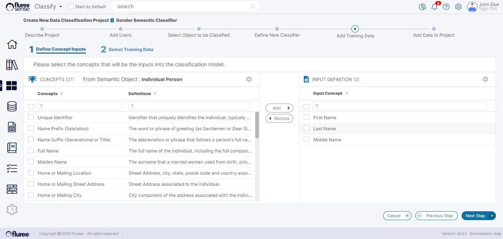

Since we need to split Data into Project vs. Training Data, we now choose specific Data Sets, which should have columns mapped with HIGH confidence to these Data Sets.

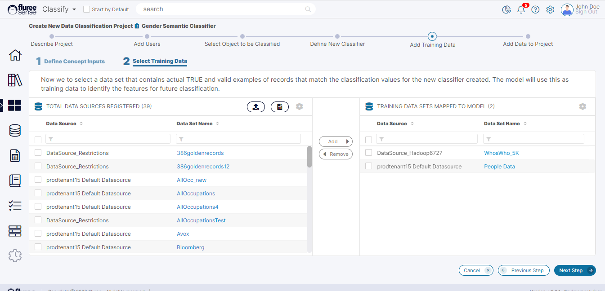

If the Data Set(s) being selected do NOT contain all the Features decided in the prior step, the system will display an error and disallow moving those Data Set(s).

**Step 6. Add Project Data For the Model to Run on**

After providing the Training Data, the final step is to provide the Data Sets on which the Model will run to deliver the results. This is what we call the ‘_Project Data._’ Therefore, in this step, the user simply needs to provide the Data Sets which should be mapped to the concepts pre-defined for Training in earlier steps. As the laws of Machine Learning dictate, the Training and Project Data Sets cannot be the same and the system ensures we don’t choose the same Data Set(s) as what is chosen in the Training step.

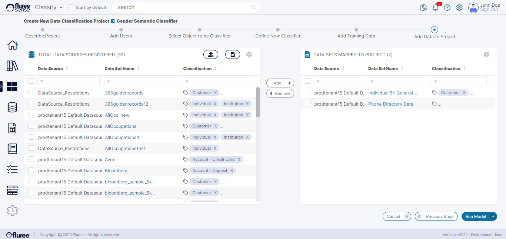

Finally, we can Run the Model. As done in the case of any such Job, we can check the progress in the Jobs tab from the left navigation menu while continuing with our work in the system.

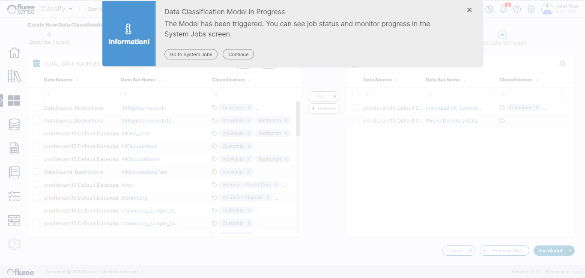

**System Validations**

1. When moving a Data Set from the left to the right panel, the system will warn if you’re selecting a Data Set to which you don’t even have read rights. You can still go ahead as this isn’t an absolute restriction.

3. The system will disallow you to select a Data Set as Project Data Set which has already been selected as a ‘Training’ Data Set.

5. The system will check that the Data Set being moved has columns mapped to the Concepts considered as Features for Training / Project or will raise an error disallowing you to move it.
