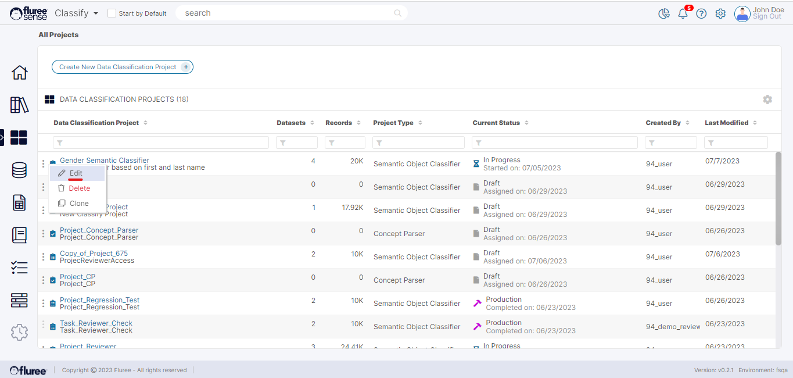

A Classification Project can be edited by any user who has Project Admin rights for that Project. To edit a Classification Project please follow the steps below. Remember that you do NOT need to make changes in all the steps but a specific workflow typically gets saved on pressing the ‘Next’ button unless it has an ‘Apply Changes’ or similar kind of button available in it.

**Note:** We’ve not added images to most of the steps, as they are nearly the same for the create workflow with the obvious difference that the screens load showing the pre-existing values to be edited.

**Step 1. Click on the Edit link associated with the Project from the Ellipsis menu to Edit**

You can edit a Project from the Edit link or you can do that just by clicking on the Project name in the list if it is in Setup mode. You do require _Project Admin_ entitlements to edit a _Project_.

**Step 2. Edit the name and other Basic Details**

The ‘Project Admin’ can edit the name and description of the Project and simply needs to press ‘Next Step’ to Save and move ahead.

**Step 3. Edit the users of the Project**

The Project Admin can add or remove users for that _Project_. The only prerequisite is to follow the validations related to that Project depending on whether the Four-eyes check is ON or OFF.  
  
It should also be noted that if the Project has run, its four-eyes state cannot be changed.

**Step 4 to 6. Edit the Classifier Details, Training Data & Project Data**

The Classifier name can be edited but cannot be changed to another pre-existing Classifier in that Semantic Object. The other aspects, such as Column for Classifier, Training and Project Data can also be changed as required with the same screens and guiding principles, as shown during the Create flow.
