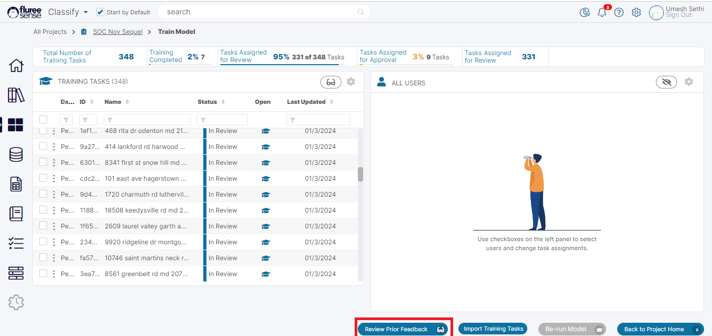
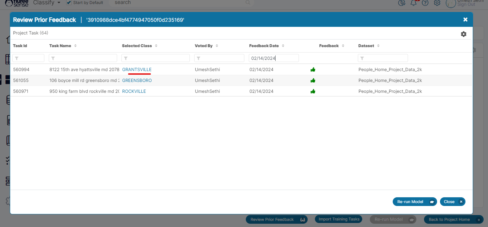
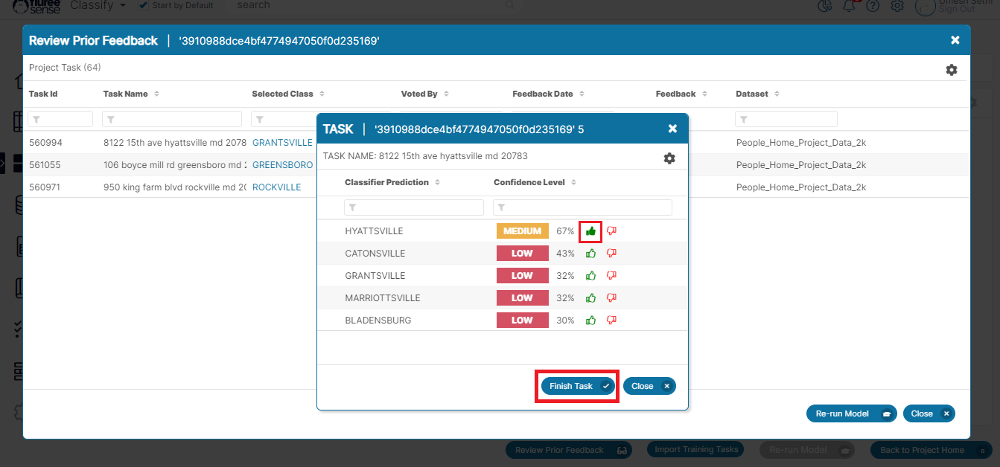

Based on customer feedback, a new useful feature has been integrated to SOC projects which allows users to review and change their prior feedback, subject to certain conditions across multiple runs of the Project.

The rationale behind this is the scenario, where even after multiple project runs we're having the classifier showing a value which may still not be right, and we just want to get that changed immediately.

**Entitlements and Pre-Conditions** : This feature is available to both Project Admin and other member's of the project with the caveat that the Project Admin is able to change any feedback whereas a member shall only be able to change the feedback given by them. However, all the members of the project can view all the prior feedback given.

Currently this feature is only available in 'Semantic Object Classifier' projects.

**Let us look at the Steps to utilize this feature**:

**Step 1** Click on the 'Review Prior Feedback' button if it is Enabled: User can click on the 'Review Prior Feedback' from the footer in the Train Model screen or the 'Manage Project Task' screen (if user has access to that screen).

**Step 2** Review the earlier Feedback shown with the original 'Selected Class' : In this screen, the user will see all the prior feedback across multiple runs of the Project showing the original selected class. The User may find feedback where the selected Class is incorrect. These are the ones that can be corrected.

**Step 3** Click on the 'Selected Class' : Continuing from the earlier Step, wherever the User has found a Class which does not seem correct, they can click on the class name and open it to edit the feedback. As outlined above, if the user is the Project Admin, they can click any row's _'Selected Class'_ but other project members can only click on the feedback that they had originally given.

**Step 4** Press Finish and Close _Edit Feedback_ popup to Review Changes: Once the user has edited feedback by Selecting some other Class from the options provided, they can click 'Finish' and close the popup to update the changes. This will immediately display the newly updated Class in the parent screen on top along with the current Date as the 'Feedback Date' .

Note that this does not have a specific bearing on a Task or will follow any sort of Four-eyes approval logic. It is a simple replacement of a Feedback with another feedback.

**Step 5** Re-run the Model: The 'Review Prior Feedback' screen also contains the 'Re-run Model' button in the footer to allow user's with 'Project Admin' entitlement the ability to re-run the model for the project to take into account changes to existing feedback.

