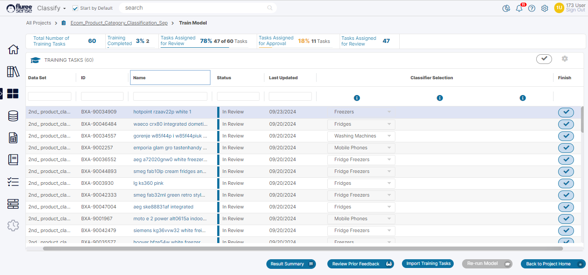
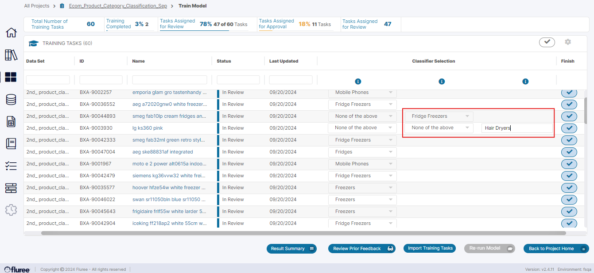
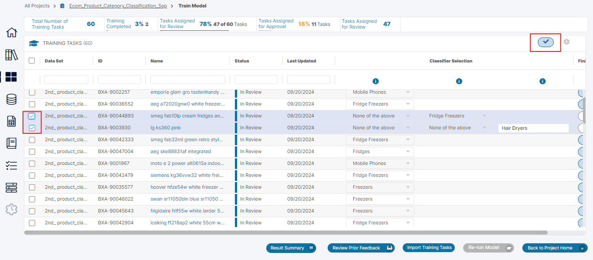
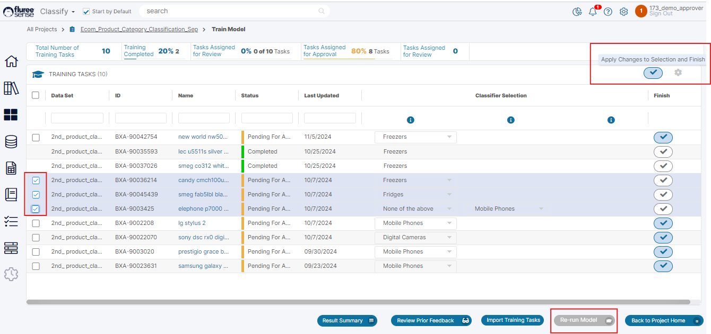

Once the Project has completed its first ‘Run’, the initial results will be available for viewing. Details of these are available in the section on the Project Home Screen and Project Result. The important thing to note is that most Projects won’t achieve a sufficient level of confidence in just the first run.

To get the required level of prediction confidence, we will need to ‘Train’ the Project. Let’s look at how we can train the Project through on-screen feedback.

**Step 1.** Open the Train Model Screen by clicking its icon in Project Home (marked # 5)

Alternately you can open the Task from:

- _My Open Tasks_ section in the home screen where only Pending tasks assigned to you are shown.

- _All My Tasks_ section from the eyeglass icon in _My Open Tasks_ section where the _Tasks_ that are in any status but assigned to you are shown.

- The _All Tasks_ section where the _Tasks_ that are either assigned to you OR for which you’re a Project or Catalog Administrator are displayed.

**Note**: The 'Train Model' training screens differ from the 'Manage Project Tasks' training screens or ad-hoc feedback in 'View Results' . One of the main changes is that the Train Model screen has been recently redesigned to allow providing bulk training and quicker feedback by extending the panels across the screen and avoiding use of opening up any modal windows etc. In the 'Manage Project Tasks' or 'View Results' screen of Classification project, training is provided through the familiar upvote and downvote icons with modal-popup opening, whereas here it is provided through a series of drop-downs as seen and explained below.

**Step 2.** Edit or Confirm Classifier in Specific Training Tasks as a Reviewer

The screen opens as a single extended panel (in contrast to the look in 'View Results', 'Manage Project Tasks') . As a consequence of this , an earlier functionality of providing 'Admin' users the ability to re-assign tasks is now removed from this screen and only available in 'Manage Project Tasks'  

**Option A**: Keeping the Default Classifier  
In this screen, as a 'Reviewer' (as per the user roles allocated during set-up) , review each Task from the list. By default, the system shows the classifier with highest confidence pre-selected in each row in the first column of 'Classifier Selection' . Keep this selection and just press the tick icon on the right if you feel it is the right selection. Alternately , you can change the classifier and select another from the default list of up-to 5 provided in that column.

**Option B**: Select another Classifier or input a Manual Classifier  
If none of the Classifiers seem correct, select 'None of the above' and you will get another drop-down appearing in the 2nd column. This contains the list of 'all' the classifiers found for the project. IF even here , none of the available classifiers seems to fit, you always have the option of selecting 'None of the Above' here as well and providing a manual new classifier in the 3rd column. This is shown in the screen below.

**Option C**: Use Bulk Selection to quicken things up.  
This is how you can give feedback in individual rows as as 'Reviewer' . You can also give bulk feedback by performing any of the above operations i.e. keeping the default classifier, or selecting a different one, or selecting one from list of 'all' Classifiers , or even a manual input , in multiple rows and then selecting all these rows through the checkboxes on the left. Finally , complete the bulk operation by pressing 'Finish' icon in the upper part of the screen.

Note that you can save the changes done in a row, without pressing Finish . This is explained in 'System Validations' point # 4 below. This means that your progress will be saved if you come back to the screen - but the task will still remain pending with you , till the time you commit / confirm the change by pressing Finish.

**Some things to keep in mind:**

- The assumption is that the logged-in user has the Reviewer role for the _Project_, although even the _Project Admin_ can provide feedback irrespective of whether the Task is assigned to them or not.

- On providing Feedback (up-votes / downvotes), the summary in the header will reflect the change as well as the grid containing the _Task_. The _Task_ will move to the next logical state which will be shown as ‘Completed’ in case the Four-eyes check is OFF or it will be shown as ‘Pending Approval’ in case the Four-eyes check is ON.

- Note that the same _Task_ shows as ‘Pending Approval’ to a user with Approver rights but as ‘Reviewed’ to a user with just Reviewer rights so as to avoid any confusion.

- Prior feedback counts for the same mapping through an ‘Ad-hoc mapping’ or prior feedback displayed in any other way are not displayed so as to remove bias.

- Hence, it is important to note that the mapping i.e. Classifier selected in 'View Results' , Prior feedback may be the same - but in this case, it is a Task based mapping vs. an ad-hoc mapping in which multiple users can give feedback. Therefore, you will not see feedback history and counts against upvote and downvote in this screen. Those are only visible in 'View Results' and 'Review Prior Feedback' screens.

**Step 3.** Approve / Change feedback as Approver to Complete Task  
(\*_Only if Four-eyes check ON_)

- The assumption here is that the logged-in user has the _Approver_ role for the _Project_, although even the _Project Admin_ can provide feedback/approval, irrespective of whether the Task is assigned to him or not.

- Once the screen opens, the _Approver_ will be able to see the list with Tasks in 'Pending for Approval' as the ones, relevant to the Approver to confirm or edit the selections already done by the Reviewer.

- Here the approver needs to click on the right side Tick icon i.e. the 'Finish' button or do a bulk selection and click the Finish button on top , after making any changes to the Reviewer's selection

- As soon as the button is pressed, the grid containing the Task, get updated to indicate the changes. The completed Tasks get moved to the bottom so that any Pending ones are easily visible for the 'Approver' to Finish.

**Step 4.** Rinse, Repeat for all Tasks and then, Re-Run the Model

The users to whom these tasks are assigned should quickly go through their respective tasks and complete them. Finally, press the ‘Re-Run Model’ button in the _Train Model_ Screen to re-run the Project. This button will be disabled till all Tasks are completed.

**System Validations**

1. Only the user to whom these tasks are assigned will be able to provide feedback except if the user has the role of Project Admin in which case, they can provide feedback for their specific project for any incomplete task.

3. Only Tasks, which are not yet _Complete_, can be given feedback. Otherwise, the row will show labels instead of editable input and finish button will be disabled.

5. During Classifier selection, if the user selects 'None of the Above' in the first column, the 2nd column will show the list of all classifiers in a drop-down for that row. If the user selects 'None of the above' here as well, they have to provide a manual input in the 3rd column. Providing manual input is mandatory to press 'Finish' button in this scenario.

7. Users can save their progress in a row before completing by pressing 'Finish' button except in case of selecting 'None of the above' selection, in which case it'll revert to the default classifier displayed if the screen is refreshed. This is because 'None of the Above' is not an actual classifier.

9. The system disallows and shows error indication if a user tries to provide a duplicate manual classifier input.

11. In case of bulk selection and changes made to multiple rows, the validations still apply and error indication is given if any of the rows has incomplete input.

13. After pressing the Finish button, the Task moves to the next stage. No different feedback can be given by that user in that Stage.

**Useful Note:** Unlike Ad-hoc _Classification_ aka _Tenant Classification_ aka _Catalog Classification_ which run across the Tenant, this _Classification_ runs for a specific purpose just for _Classifying_ the specified Concept of the Project. Thus, for solving targeted _Classification_ problems, use SOC Projects.
