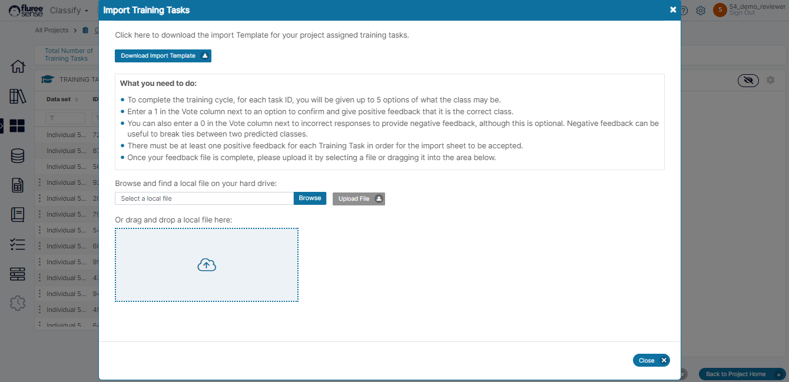
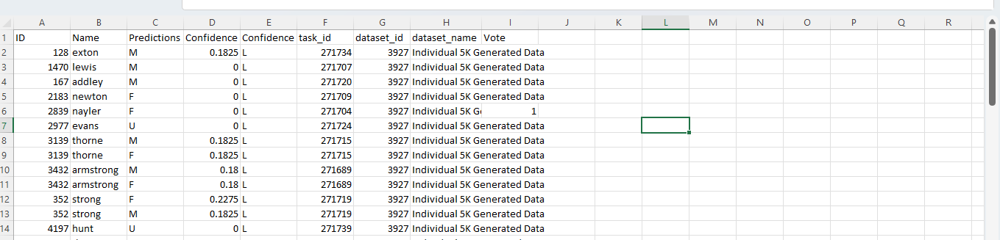

In the earlier section, we saw the actual process of _Training Tasks_ from the Task grid, one by one. But there is a quicker and better way - if you want to provide feedback to the _Tasks_ in bulk.

**Step 1.** Click on the Import Tasks button or Icon to Open the Import popup

**Step 2.** Download the Import Tasks Template

As in the case of Catalog Tasks etc., the downloaded file will contain only the Tasks assigned to you on which you can provide feedback. However, even if you try to add a task for which feedback is complete or has not been assigned to you, the same will be ignored.

As a Project Admin downloading the file, there are two scenarios: a) You've only been assigned the Project Admin role - In this case you will be able to download all Tasks b) You've been assigned Project Admin role and another role (either Reviewer or Approver) - In this case you'll be able to download only the Tasks assigned to you (\* as the Reviewer or Approver) . This makes it easier for the user to download and complete their relevant tasks if having multiple roles. _\[ Scenario b) has been implemented as feature enhancement in 2024\]_

**Step 3.** Edit the Template carefully providing feedback for your Tasks

Please follow the instructions in the pop-up as the validation rules when making changes to the Template. In the image below, for example, the Vote column is the one where the user needs to fill Zero or 1.

As we can see, the Task 3139 in column A spans two rows: the user would choose the one which is correct and provide feedback as one and can leave the other blank or provide feedback as 0.  Obviously there can be more than two rows if the feedback options are more.

**Step 4.** Upload the Template and review the Changes.

On uploading, check if there are any errors, and resolve them. Also, verify if any Task missed getting updated which may be due to violation of any validations.

**Step 5.** Repeat the Steps above as an Approver (If four-eyes Check is ON)

All approvers can similarly approve their tasks in bulk by downloading and re-uploading the file. The Approver need not make changes if they approve of the existing feedback by the Reviewer.

**System Validations**

1. To complete the training cycle, for each task ID, a user will be given up to 5 options of what the class may be, in the import Template.

3. The user needs to Enter 1 in the Vote column next to an option to confirm and give positive feedback that it is the correct class.

5. The user can also enter a 0 in the Vote column next to incorrect responses to provide negative feedback, although this is optional. Negative feedback can be useful to break ties between two predicted classes.

7. There must be one positive feedback for each Training Task being uploaded, for the import sheet to be accepted. Therefore, if the user has not been able to provide feedback to some tasks, it is best to delete the whole set of rows (for all option rows) for such tasks before uploading.

9. Once your feedback file is complete, please upload it by selecting the file or dragging it into the area below.

11. You will only be able to provide feedback to a task assigned to you, which has not yet been completed.

13. Inputting anything other than 1 or 0 for feedback in the csv will prompt an error during file upload.
