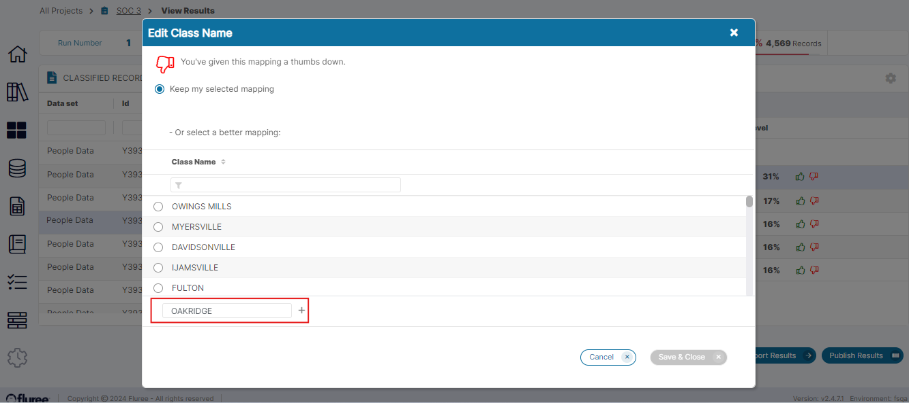
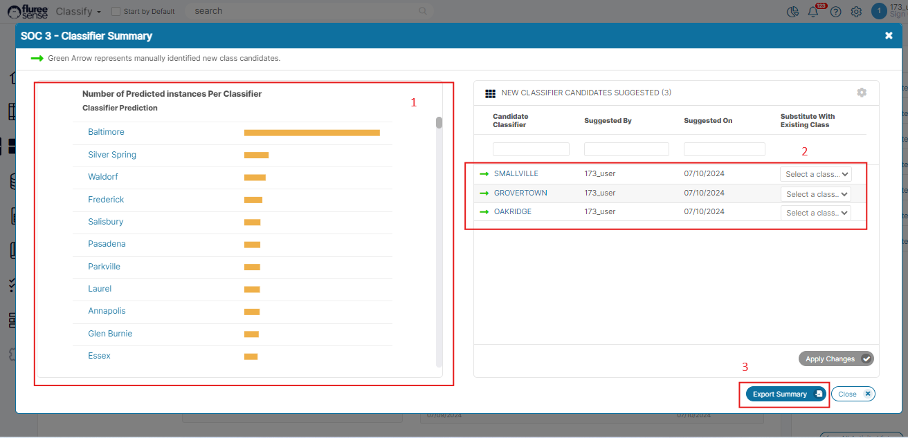
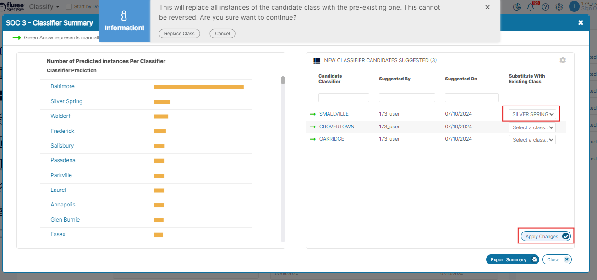

As we've seen in the _Semantic Object Classification_ projects; through Training, View Result screen or Import , a user can provide upvote to a prediction (from those already displayed). We call these 'System' predictions and the selected one becomes the 'System' Classifier. Alternately, a user is also able to downvote a prediction and optionally provide a different manually input value as a 'Manual' Classifier.

This becomes part of the Classifiers set once the model is run and in the next run new predictions are generated. For instance, in the below image, the user did not find _'Oakridge'_ in the existing mappings when downvoting and providing an alternative so entered it manually as a 'Manual' Classifier.

Over time, the need was felt for a feature where the Admin for a SOC project may want to review all these distinct Classifiers with separate indication for the manual ones. A Manual Classifier will normally be provided if the user felt there wasn't a relevant 'System' one at that time. However, it's possible that the user may have made a mistake, which may become evident in this screen.

Therefore another feature required is the ability to substitute a 'Manual' classifier by an existing 'System' Classifier. Note that a manual classifier may become part of the pre-existing system classifiers when a model run happens as each run assimilates entered classifiers in the classifier set.

Based on all these needs, we have a provided for a 'Result Summary' screen which is available from: a) Project Home Screen b) Train Model Screen c) View Results screen.

This screen is a pop-up and has 3 key sections as shown below . Let's consider them one by one:

1. **Number of Predicted Instances per Classifier**: This displays all the distinct classifiers for the Project ordered in descending order of no. of predicted Instances. You can hover on the bar plot to view exact no. of instances.

3. **New Classifier Candidates Suggested**: This section shows any manual classifier that has been suggested by the user till now along with the user name, date last suggested and an option to substitute this back with existing Classifiers which are already a part of the model. These are available in the drop-downs shown in the image. Please note that these existing classifiers may be of 'Predicted' or 'Manual' type , just that they no longer candidates but actual classifiers to the project. A user can also click on the Classifiers in this section or even in the 1st section and to get redirected to the View Results screen with the specific classifier applied as a filter.

5. **Export Summary** button: Clicking on this button will export and download two CSV files containing the 'Predicted Instances per Classifier' and 'New Classifier Candidates Suggested', in the user's local machine.

**System Validations**

If the logged in user is having the 'Project Admin' role then they can substitute a 'manual' classifier , available on the right side of the screen, with an existing classifier as shown in the image below.

In this section, the following validations shall apply:

1. The 'Apply Changes' button is disabled till at-least one substitute value is selected for the classifier(s).

3. Once '_Apply Changes_' button is pressed, an info. type top-hat notification will show , informing the user that this substitution is irreversible and will change all instances of this classifier in the project. If the user confirms then the substitution will happen and a) the Classifier will disappear on the right side and get substituted with new value on the left section b) the _'Apply Changes'_ button shall revert to disabled state. However if the user does not confirm , then they are just closing the confirmation notification and coming back to the parent screen. Note that the actual substitutions across the project do require that the model is run again to propagate these changes.

5. Multiple Classifiers can be replaced and the 'Apply Changes' button shall substitute all classifiers where a substitution is provided for, in the drop-downs.
